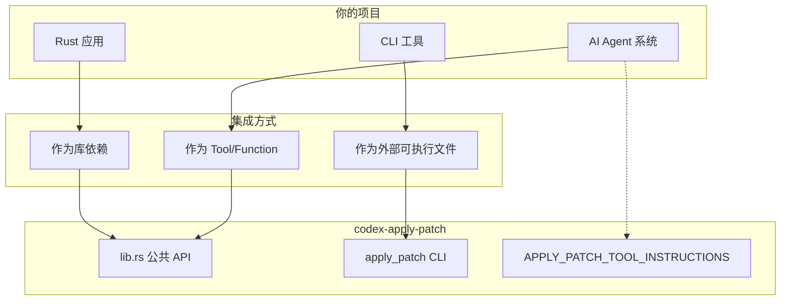
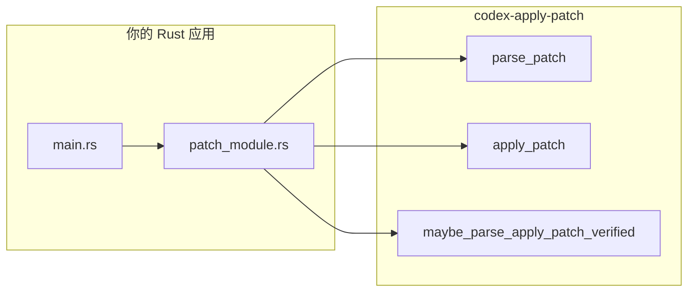
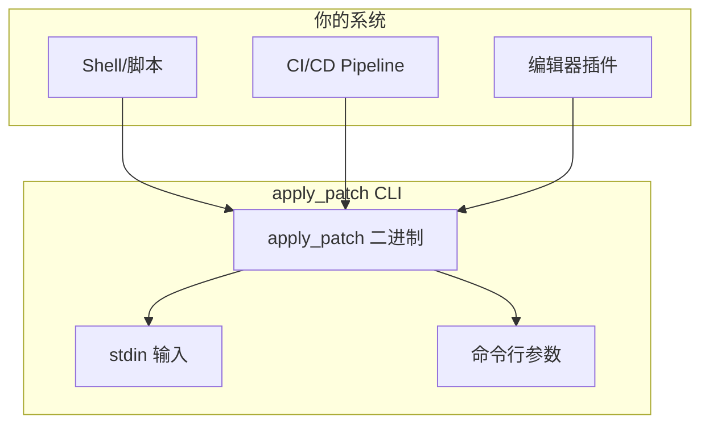
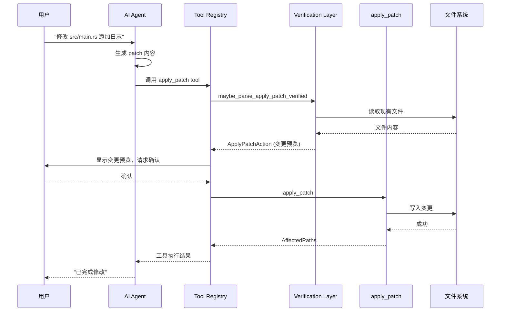
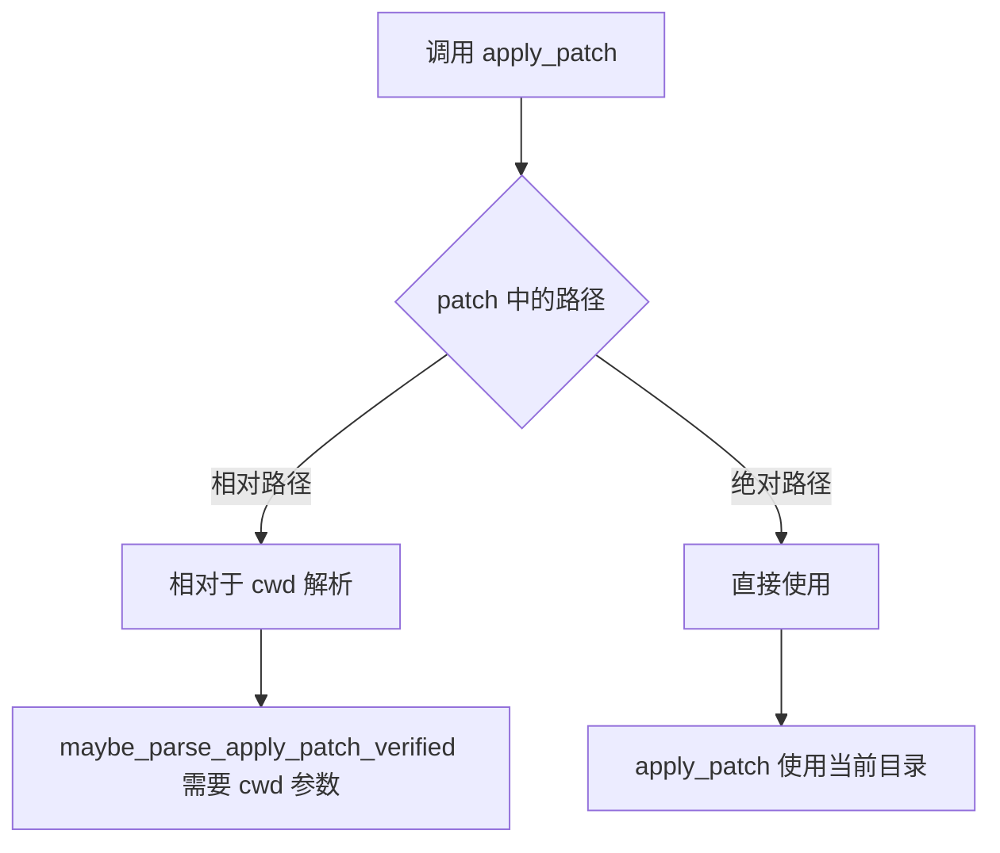

# Codex Apply-Patch 集成指南

> 本文档详细说明如何将 `codex-apply-patch` 工具集成到你自己的项目中，包括不同场景的实现步骤和代码示例。

## 目录

1. [集成场景概览](#集成场景概览)
2. [快速开始](#快速开始)
3. [场景一：作为 Rust 库集成](#场景一作为-rust-库集成)
4. [场景二：作为 CLI 工具集成](#场景二作为-cli-工具集成)
5. [场景三：集成到 AI Agent 系统](#场景三集成到-ai-agent-系统)
6. [公共 API 参考](#公共-api-参考)
7. [定制与扩展](#定制与扩展)
8. [常见问题与注意事项](#常见问题与注意事项)

---

## 集成场景概览



| 场景 | 适用情况 | 复杂度 | 推荐度 |
|------|----------|--------|--------|
| Rust 库集成 | 你的项目是 Rust，需要程序化应用 patch | 低 | 高 |
| CLI 工具集成 | 需要独立的 apply_patch 命令 | 中 | 中 |
| AI Agent 集成 | 构建代码生成/修改 AI 系统 | 高 | 高 |

---

## 快速开始

### 步骤 1：获取源码

```bash
# 方式一：作为 git submodule
git submodule add https://github.com/openai/codex.git venders/codex

# 方式二：直接复制 apply-patch crate
cp -r path/to/codex/codex-rs/apply-patch your-project/crates/
```

### 步骤 2：配置依赖

在你的 `Cargo.toml` 中添加：

```toml
[dependencies]
codex-apply-patch = { path = "venders/codex/codex-rs/apply-patch" }

# 或者如果你复制了 crate
codex-apply-patch = { path = "crates/apply-patch" }
```

### 步骤 3：基本使用

```rust
use codex_apply_patch::apply_patch;

fn main() {
    let patch = r#"*** Begin Patch
*** Add File: hello.txt
+Hello, world!
*** End Patch"#;

    let mut stdout = std::io::stdout();
    let mut stderr = std::io::stderr();

    match apply_patch(patch, &mut stdout, &mut stderr) {
        Ok(()) => println!("Patch applied successfully!"),
        Err(e) => eprintln!("Failed to apply patch: {e}"),
    }
}
```

---

## 场景一：作为 Rust 库集成

### 集成架构



### 依赖配置

```toml
# Cargo.toml
[package]
name = "my-code-editor"
version = "0.1.0"
edition = "2021"

[dependencies]
codex-apply-patch = { path = "venders/codex/codex-rs/apply-patch" }
anyhow = "1"  # 推荐用于错误处理
```

### 完整示例：代码编辑器

```rust
// src/patch_service.rs
use codex_apply_patch::{
    apply_patch, parse_patch, ApplyPatchError, Hunk,
    maybe_parse_apply_patch_verified, MaybeApplyPatchVerified,
    ApplyPatchAction, ApplyPatchFileChange,
};
use std::path::Path;

/// Patch 服务 - 封装 apply_patch 功能
pub struct PatchService {
    working_dir: std::path::PathBuf,
}

impl PatchService {
    pub fn new(working_dir: impl AsRef<Path>) -> Self {
        Self {
            working_dir: working_dir.as_ref().to_path_buf(),
        }
    }

    /// 解析 patch 文本，返回将要执行的操作列表
    pub fn parse(&self, patch_text: &str) -> Result<Vec<Hunk>, ApplyPatchError> {
        let result = parse_patch(patch_text)?;
        Ok(result.hunks)
    }

    /// 预览 patch 变更（不实际应用）
    pub fn preview(&self, patch_text: &str) -> Result<PatchPreview, String> {
        let argv = vec!["apply_patch".to_string(), patch_text.to_string()];

        match maybe_parse_apply_patch_verified(&argv, &self.working_dir) {
            MaybeApplyPatchVerified::Body(action) => {
                Ok(PatchPreview::from_action(action))
            }
            MaybeApplyPatchVerified::CorrectnessError(e) => {
                Err(format!("Patch verification failed: {e}"))
            }
            MaybeApplyPatchVerified::ShellParseError(e) => {
                Err(format!("Shell parse error: {e:?}"))
            }
            MaybeApplyPatchVerified::NotApplyPatch => {
                Err("Not a valid apply_patch command".to_string())
            }
        }
    }

    /// 实际应用 patch
    pub fn apply(&self, patch_text: &str) -> Result<ApplyResult, ApplyPatchError> {
        // 先切换到工作目录
        let original_dir = std::env::current_dir().ok();
        std::env::set_current_dir(&self.working_dir).ok();

        let mut stdout = Vec::new();
        let mut stderr = Vec::new();

        let result = apply_patch(patch_text, &mut stdout, &mut stderr);

        // 恢复原目录
        if let Some(dir) = original_dir {
            std::env::set_current_dir(dir).ok();
        }

        match result {
            Ok(()) => Ok(ApplyResult {
                stdout: String::from_utf8_lossy(&stdout).to_string(),
                stderr: String::from_utf8_lossy(&stderr).to_string(),
            }),
            Err(e) => Err(e),
        }
    }
}

/// Patch 预览结果
pub struct PatchPreview {
    pub files_to_add: Vec<FileChange>,
    pub files_to_delete: Vec<FileChange>,
    pub files_to_update: Vec<FileChange>,
}

pub struct FileChange {
    pub path: std::path::PathBuf,
    pub content_preview: String,
}

impl PatchPreview {
    fn from_action(action: ApplyPatchAction) -> Self {
        let mut preview = PatchPreview {
            files_to_add: vec![],
            files_to_delete: vec![],
            files_to_update: vec![],
        };

        for (path, change) in action.changes() {
            match change {
                ApplyPatchFileChange::Add { content } => {
                    preview.files_to_add.push(FileChange {
                        path: path.clone(),
                        content_preview: content.chars().take(200).collect(),
                    });
                }
                ApplyPatchFileChange::Delete { content } => {
                    preview.files_to_delete.push(FileChange {
                        path: path.clone(),
                        content_preview: content.chars().take(200).collect(),
                    });
                }
                ApplyPatchFileChange::Update { unified_diff, .. } => {
                    preview.files_to_update.push(FileChange {
                        path: path.clone(),
                        content_preview: unified_diff.clone(),
                    });
                }
            }
        }

        preview
    }
}

pub struct ApplyResult {
    pub stdout: String,
    pub stderr: String,
}
```

### 使用示例

```rust
// src/main.rs
mod patch_service;
use patch_service::PatchService;

fn main() -> anyhow::Result<()> {
    let service = PatchService::new("./my-project");

    let patch = r#"*** Begin Patch
*** Update File: src/lib.rs
@@ fn hello
 fn hello() {
-    println!("Hello");
+    println!("Hello, World!");
 }
*** End Patch"#;

    // 1. 预览变更
    match service.preview(patch) {
        Ok(preview) => {
            println!("Files to update:");
            for file in &preview.files_to_update {
                println!("  - {}", file.path.display());
                println!("    Diff:\n{}", file.content_preview);
            }
        }
        Err(e) => {
            eprintln!("Preview failed: {e}");
            return Ok(());
        }
    }

    // 2. 确认后应用
    println!("\nApply patch? [y/N]");
    let mut input = String::new();
    std::io::stdin().read_line(&mut input)?;

    if input.trim().to_lowercase() == "y" {
        match service.apply(patch) {
            Ok(result) => println!("Success!\n{}", result.stdout),
            Err(e) => eprintln!("Failed: {e}"),
        }
    }

    Ok(())
}
```

---

## 场景二：作为 CLI 工具集成

### 集成架构



### 方式一：直接编译使用

```bash
# 编译 apply_patch 二进制
cd venders/codex/codex-rs/apply-patch
cargo build --release

# 安装到 PATH
cp target/release/apply_patch ~/.local/bin/

# 使用
apply_patch '*** Begin Patch
*** Add File: test.txt
+Hello
*** End Patch'
```

### 方式二：嵌入到你的 CLI 工具

```rust
// src/main.rs - 你的 CLI 工具
use clap::{Parser, Subcommand};

#[derive(Parser)]
#[command(name = "my-tool")]
struct Cli {
    #[command(subcommand)]
    command: Commands,
}

#[derive(Subcommand)]
enum Commands {
    /// Apply a patch to files
    Patch {
        /// Patch content (or use stdin)
        patch: Option<String>,
    },
}

fn main() -> anyhow::Result<()> {
    let cli = Cli::parse();

    match cli.command {
        Commands::Patch { patch } => {
            let patch_content = match patch {
                Some(p) => p,
                None => {
                    // 从 stdin 读取
                    let mut buf = String::new();
                    std::io::stdin().read_to_string(&mut buf)?;
                    buf
                }
            };

            let mut stdout = std::io::stdout();
            let mut stderr = std::io::stderr();

            codex_apply_patch::apply_patch(&patch_content, &mut stdout, &mut stderr)?;
        }
    }

    Ok(())
}
```

### 方式三：arg0 技巧（单一二进制多入口）

这是 Codex 采用的方式，允许一个二进制文件根据调用名称执行不同功能：

```rust
// src/main.rs
use std::path::Path;

fn main() -> anyhow::Result<()> {
    // 检查调用名称
    let exe_name = std::env::args()
        .next()
        .and_then(|s| Path::new(&s).file_name().map(|n| n.to_string_lossy().to_string()))
        .unwrap_or_default();

    match exe_name.as_str() {
        "apply_patch" | "applypatch" => {
            // 直接调用 apply_patch 的 main，不返回
            codex_apply_patch::main();
        }
        _ => {
            // 正常的主程序逻辑
            run_main_app()
        }
    }
}

fn run_main_app() -> anyhow::Result<()> {
    // 创建 symlink 使 apply_patch 可用
    let temp_dir = setup_apply_patch_symlink()?;

    // 你的主程序逻辑...
    println!("Main app running...");

    // temp_dir 在作用域结束时自动清理
    drop(temp_dir);
    Ok(())
}

fn setup_apply_patch_symlink() -> std::io::Result<tempfile::TempDir> {
    let temp_dir = tempfile::TempDir::new()?;
    let exe = std::env::current_exe()?;

    #[cfg(unix)]
    {
        use std::os::unix::fs::symlink;
        symlink(&exe, temp_dir.path().join("apply_patch"))?;
    }

    // 更新 PATH
    let new_path = format!(
        "{}:{}",
        temp_dir.path().display(),
        std::env::var("PATH").unwrap_or_default()
    );
    std::env::set_var("PATH", new_path);

    Ok(temp_dir)
}
```

---

## 场景三：集成到 AI Agent 系统

### 集成架构



### 完整实现示例

```rust
// src/tools/apply_patch_tool.rs
use codex_apply_patch::{
    maybe_parse_apply_patch_verified, MaybeApplyPatchVerified,
    ApplyPatchAction, ApplyPatchFileChange, apply_patch,
    APPLY_PATCH_TOOL_INSTRUCTIONS,
};
use serde::{Deserialize, Serialize};
use std::path::{Path, PathBuf};

/// AI 工具调用的参数
#[derive(Debug, Deserialize)]
pub struct ApplyPatchToolArgs {
    /// Patch 内容
    pub input: String,
}

/// 工具调用结果
#[derive(Debug, Serialize)]
pub struct ToolResult {
    pub success: bool,
    pub message: String,
    #[serde(skip_serializing_if = "Option::is_none")]
    pub changes: Option<Vec<FileChangeInfo>>,
}

#[derive(Debug, Serialize)]
pub struct FileChangeInfo {
    pub path: String,
    pub operation: String,  // "add", "delete", "update"
    pub diff: Option<String>,
}

/// Apply Patch 工具处理器
pub struct ApplyPatchTool {
    working_dir: PathBuf,
    require_approval: bool,
}

impl ApplyPatchTool {
    pub fn new(working_dir: impl AsRef<Path>, require_approval: bool) -> Self {
        Self {
            working_dir: working_dir.as_ref().to_path_buf(),
            require_approval,
        }
    }

    /// 获取工具说明（用于 AI 模型的 system prompt）
    pub fn get_instructions() -> &'static str {
        APPLY_PATCH_TOOL_INSTRUCTIONS
    }

    /// 获取工具定义（用于 function calling）
    pub fn get_tool_definition() -> serde_json::Value {
        serde_json::json!({
            "type": "function",
            "function": {
                "name": "apply_patch",
                "description": "Apply a patch to modify files. Use the specialized patch format.",
                "parameters": {
                    "type": "object",
                    "properties": {
                        "input": {
                            "type": "string",
                            "description": "The patch content in apply_patch format"
                        }
                    },
                    "required": ["input"]
                }
            }
        })
    }

    /// 预览 patch 变更（不实际执行）
    pub fn preview(&self, patch: &str) -> Result<ApplyPatchAction, String> {
        let argv = vec!["apply_patch".to_string(), patch.to_string()];

        match maybe_parse_apply_patch_verified(&argv, &self.working_dir) {
            MaybeApplyPatchVerified::Body(action) => Ok(action),
            MaybeApplyPatchVerified::CorrectnessError(e) => {
                Err(format!("Verification error: {e}"))
            }
            MaybeApplyPatchVerified::ShellParseError(e) => {
                Err(format!("Parse error: {e:?}"))
            }
            MaybeApplyPatchVerified::NotApplyPatch => {
                Err("Invalid apply_patch format".to_string())
            }
        }
    }

    /// 执行工具调用
    pub async fn execute(
        &self,
        args: ApplyPatchToolArgs,
        approval_callback: impl FnOnce(&ApplyPatchAction) -> bool,
    ) -> ToolResult {
        // 1. 验证并预览
        let action = match self.preview(&args.input) {
            Ok(a) => a,
            Err(e) => {
                return ToolResult {
                    success: false,
                    message: e,
                    changes: None,
                };
            }
        };

        // 2. 收集变更信息
        let changes: Vec<FileChangeInfo> = action
            .changes()
            .iter()
            .map(|(path, change)| {
                let (operation, diff) = match change {
                    ApplyPatchFileChange::Add { content } => {
                        ("add".to_string(), Some(format!("+++ {}", content.lines().take(5).collect::<Vec<_>>().join("\n"))))
                    }
                    ApplyPatchFileChange::Delete { .. } => {
                        ("delete".to_string(), None)
                    }
                    ApplyPatchFileChange::Update { unified_diff, .. } => {
                        ("update".to_string(), Some(unified_diff.clone()))
                    }
                };
                FileChangeInfo {
                    path: path.display().to_string(),
                    operation,
                    diff,
                }
            })
            .collect();

        // 3. 请求批准
        if self.require_approval && !approval_callback(&action) {
            return ToolResult {
                success: false,
                message: "User rejected the changes".to_string(),
                changes: Some(changes),
            };
        }

        // 4. 实际应用
        let original_dir = std::env::current_dir().ok();
        if std::env::set_current_dir(&self.working_dir).is_err() {
            return ToolResult {
                success: false,
                message: "Failed to change to working directory".to_string(),
                changes: Some(changes),
            };
        }

        let mut stdout = Vec::new();
        let mut stderr = Vec::new();

        let result = apply_patch(&args.input, &mut stdout, &mut stderr);

        // 恢复目录
        if let Some(dir) = original_dir {
            let _ = std::env::set_current_dir(dir);
        }

        match result {
            Ok(()) => ToolResult {
                success: true,
                message: String::from_utf8_lossy(&stdout).to_string(),
                changes: Some(changes),
            },
            Err(e) => ToolResult {
                success: false,
                message: format!(
                    "Apply failed: {e}\nStderr: {}",
                    String::from_utf8_lossy(&stderr)
                ),
                changes: Some(changes),
            },
        }
    }
}
```

### AI Agent 集成示例

```rust
// src/agent.rs
use crate::tools::apply_patch_tool::{ApplyPatchTool, ApplyPatchToolArgs, ToolResult};
use serde_json::Value;

pub struct CodeAgent {
    apply_patch_tool: ApplyPatchTool,
    // ... 其他字段
}

impl CodeAgent {
    pub fn new(working_dir: &str) -> Self {
        Self {
            apply_patch_tool: ApplyPatchTool::new(working_dir, true),
        }
    }

    /// 构建 system prompt
    pub fn build_system_prompt(&self) -> String {
        format!(
            r#"You are a code editing assistant.

## Available Tools

### apply_patch
{}

## Usage Example
To modify a file, use:
```json
{{"name": "apply_patch", "arguments": {{"input": "*** Begin Patch\n*** Update File: src/main.rs\n@@\n-old_code\n+new_code\n*** End Patch"}}}}
```
"#,
            ApplyPatchTool::get_instructions()
        )
    }

    /// 获取可用工具列表
    pub fn get_tools(&self) -> Vec<Value> {
        vec![ApplyPatchTool::get_tool_definition()]
    }

    /// 处理工具调用
    pub async fn handle_tool_call(
        &self,
        tool_name: &str,
        arguments: &str,
    ) -> Result<ToolResult, String> {
        match tool_name {
            "apply_patch" => {
                let args: ApplyPatchToolArgs = serde_json::from_str(arguments)
                    .map_err(|e| format!("Invalid arguments: {e}"))?;

                Ok(self.apply_patch_tool.execute(args, |action| {
                    // 这里实现你的审批逻辑
                    println!("Changes to be applied:");
                    for (path, change) in action.changes() {
                        println!("  {} - {:?}", path.display(), std::mem::discriminant(change));
                    }
                    println!("Approve? [y/N]");

                    let mut input = String::new();
                    std::io::stdin().read_line(&mut input).ok();
                    input.trim().to_lowercase() == "y"
                }).await)
            }
            _ => Err(format!("Unknown tool: {tool_name}")),
        }
    }
}
```

### 与 OpenAI API 集成

```rust
// src/openai_integration.rs
use reqwest::Client;
use serde_json::{json, Value};

pub async fn chat_with_tools(
    client: &Client,
    api_key: &str,
    messages: Vec<Value>,
    tools: Vec<Value>,
) -> Result<Value, reqwest::Error> {
    let response = client
        .post("https://api.openai.com/v1/chat/completions")
        .header("Authorization", format!("Bearer {api_key}"))
        .json(&json!({
            "model": "gpt-4",
            "messages": messages,
            "tools": tools,
            "tool_choice": "auto"
        }))
        .send()
        .await?
        .json()
        .await?;

    Ok(response)
}

// 使用示例
pub async fn run_agent_loop(agent: &CodeAgent, user_message: &str) -> anyhow::Result<()> {
    let client = Client::new();
    let api_key = std::env::var("OPENAI_API_KEY")?;

    let mut messages = vec![
        json!({"role": "system", "content": agent.build_system_prompt()}),
        json!({"role": "user", "content": user_message}),
    ];

    loop {
        let response = chat_with_tools(
            &client,
            &api_key,
            messages.clone(),
            agent.get_tools(),
        ).await?;

        let choice = &response["choices"][0];
        let message = &choice["message"];

        // 检查是否有工具调用
        if let Some(tool_calls) = message.get("tool_calls") {
            for tool_call in tool_calls.as_array().unwrap_or(&vec![]) {
                let name = tool_call["function"]["name"].as_str().unwrap_or("");
                let args = tool_call["function"]["arguments"].as_str().unwrap_or("{}");
                let call_id = tool_call["id"].as_str().unwrap_or("");

                println!("AI wants to call tool: {name}");

                let result = agent.handle_tool_call(name, args).await?;

                // 添加工具调用结果到对话
                messages.push(message.clone());
                messages.push(json!({
                    "role": "tool",
                    "tool_call_id": call_id,
                    "content": serde_json::to_string(&result)?
                }));
            }
        } else {
            // 没有工具调用，对话结束
            if let Some(content) = message.get("content") {
                println!("AI: {}", content);
            }
            break;
        }
    }

    Ok(())
}
```

---

## 公共 API 参考

### 核心函数

| 函数 | 签名 | 用途 |
|------|------|------|
| `apply_patch` | `fn(patch: &str, stdout: &mut impl Write, stderr: &mut impl Write) -> Result<(), ApplyPatchError>` | 解析并应用 patch |
| `parse_patch` | `fn(patch: &str) -> Result<ApplyPatchArgs, ParseError>` | 仅解析 patch，不应用 |
| `apply_hunks` | `fn(hunks: &[Hunk], stdout, stderr) -> Result<(), ApplyPatchError>` | 应用已解析的 hunks |
| `maybe_parse_apply_patch_verified` | `fn(argv: &[String], cwd: &Path) -> MaybeApplyPatchVerified` | 验证并预览变更 |
| `unified_diff_from_chunks` | `fn(path: &Path, chunks: &[UpdateFileChunk]) -> Result<ApplyPatchFileUpdate, ApplyPatchError>` | 生成 unified diff |

### 核心类型

```rust
/// Patch 操作类型
pub enum Hunk {
    AddFile { path: PathBuf, contents: String },
    DeleteFile { path: PathBuf },
    UpdateFile { path: PathBuf, move_path: Option<PathBuf>, chunks: Vec<UpdateFileChunk> },
}

/// 文件变更类型
pub enum ApplyPatchFileChange {
    Add { content: String },
    Delete { content: String },
    Update { unified_diff: String, move_path: Option<PathBuf>, new_content: String },
}

/// 验证结果
pub enum MaybeApplyPatchVerified {
    Body(ApplyPatchAction),           // 验证成功
    ShellParseError(ExtractHeredocError),  // Shell 解析失败
    CorrectnessError(ApplyPatchError),     // Patch 验证失败
    NotApplyPatch,                         // 非 apply_patch 调用
}

/// 错误类型
pub enum ApplyPatchError {
    ParseError(ParseError),
    IoError(IoError),
    ComputeReplacements(String),
    ImplicitInvocation,
}
```

### 常量

```rust
/// AI 模型使用说明
pub const APPLY_PATCH_TOOL_INSTRUCTIONS: &str = include_str!("../apply_patch_tool_instructions.md");
```

---

## 定制与扩展

### 自定义 Patch 格式验证

```rust
use codex_apply_patch::{parse_patch, Hunk};

/// 自定义验证规则
pub fn validate_patch(patch: &str, allowed_paths: &[&str]) -> Result<(), String> {
    let parsed = parse_patch(patch).map_err(|e| e.to_string())?;

    for hunk in &parsed.hunks {
        let path = match hunk {
            Hunk::AddFile { path, .. } => path,
            Hunk::DeleteFile { path } => path,
            Hunk::UpdateFile { path, .. } => path,
        };

        let path_str = path.to_string_lossy();

        // 检查路径是否在允许列表中
        if !allowed_paths.iter().any(|p| path_str.starts_with(p)) {
            return Err(format!("Path not allowed: {}", path.display()));
        }

        // 禁止修改敏感文件
        if path_str.contains(".env") || path_str.contains("secrets") {
            return Err(format!("Cannot modify sensitive file: {}", path.display()));
        }
    }

    Ok(())
}
```

### 自定义输出处理

```rust
use codex_apply_patch::apply_patch;

/// 带进度回调的 apply
pub fn apply_with_progress<F>(patch: &str, on_progress: F) -> Result<(), String>
where
    F: Fn(&str),
{
    let mut stdout_buf = Vec::new();
    let mut stderr_buf = Vec::new();

    on_progress("Parsing patch...");

    match apply_patch(patch, &mut stdout_buf, &mut stderr_buf) {
        Ok(()) => {
            let output = String::from_utf8_lossy(&stdout_buf);
            for line in output.lines() {
                on_progress(line);
            }
            Ok(())
        }
        Err(e) => {
            let stderr = String::from_utf8_lossy(&stderr_buf);
            Err(format!("{e}\n{stderr}"))
        }
    }
}
```

### 扩展 Hunk 处理

```rust
use codex_apply_patch::{parse_patch, Hunk};
use std::path::Path;

/// 将 Hunk 转换为其他格式（如 git diff）
pub fn hunk_to_git_diff(hunk: &Hunk, base_dir: &Path) -> String {
    match hunk {
        Hunk::AddFile { path, contents } => {
            let full_path = base_dir.join(path);
            format!(
                "diff --git a/{0} b/{0}\nnew file mode 100644\n--- /dev/null\n+++ b/{0}\n{1}",
                path.display(),
                contents.lines().map(|l| format!("+{l}")).collect::<Vec<_>>().join("\n")
            )
        }
        Hunk::DeleteFile { path } => {
            format!(
                "diff --git a/{0} b/{0}\ndeleted file mode 100644\n--- a/{0}\n+++ /dev/null",
                path.display()
            )
        }
        Hunk::UpdateFile { path, chunks, .. } => {
            // 简化实现
            format!("diff --git a/{0} b/{0}\n...", path.display())
        }
    }
}
```

---

## 常见问题与注意事项

### 依赖要求

```toml
# 最低 Rust 版本
rust-version = "1.75"  # 需要支持 edition 2021 特性

# 必需依赖（会自动引入）
anyhow = "1"
similar = "2.7"
thiserror = "2"
tree-sitter = "0.25"
tree-sitter-bash = "0.25"
```

### 工作目录处理



**重要**：
- `apply_patch` 函数使用 `std::env::current_dir()` 作为工作目录
- `maybe_parse_apply_patch_verified` 需要显式传入 `cwd` 参数
- 在多线程环境中，避免使用 `set_current_dir`，改用显式路径处理

### 错误处理最佳实践

```rust
use codex_apply_patch::{apply_patch, ApplyPatchError, ParseError};

fn handle_apply_result(result: Result<(), ApplyPatchError>) {
    match result {
        Ok(()) => println!("Success!"),
        Err(ApplyPatchError::ParseError(ParseError::InvalidPatchError(msg))) => {
            eprintln!("Invalid patch format: {msg}");
            eprintln!("Tip: Ensure patch starts with '*** Begin Patch' and ends with '*** End Patch'");
        }
        Err(ApplyPatchError::ParseError(ParseError::InvalidHunkError { message, line_number })) => {
            eprintln!("Invalid hunk at line {line_number}: {message}");
        }
        Err(ApplyPatchError::ComputeReplacements(msg)) => {
            eprintln!("Cannot locate code to modify: {msg}");
            eprintln!("Tip: Check that context lines match the actual file content");
        }
        Err(ApplyPatchError::IoError(e)) => {
            eprintln!("File system error: {e}");
        }
        Err(ApplyPatchError::ImplicitInvocation) => {
            eprintln!("Patch must be passed as argument to apply_patch command");
        }
    }
}
```

### 安全注意事项

1. **路径验证**：验证 patch 中的路径不会逃逸到预期目录之外
2. **权限检查**：确保对目标文件有写权限
3. **敏感文件保护**：禁止修改 `.env`、凭证文件等
4. **回滚机制**：在生产环境中实现变更回滚能力

```rust
/// 安全应用 patch 的包装器
pub fn safe_apply_patch(patch: &str, sandbox_dir: &Path) -> Result<(), String> {
    // 1. 验证沙箱目录
    let sandbox_canonical = sandbox_dir.canonicalize()
        .map_err(|e| format!("Invalid sandbox dir: {e}"))?;

    // 2. 预验证所有路径
    let argv = vec!["apply_patch".to_string(), patch.to_string()];
    let action = match maybe_parse_apply_patch_verified(&argv, sandbox_dir) {
        MaybeApplyPatchVerified::Body(a) => a,
        other => return Err(format!("Validation failed: {other:?}")),
    };

    for path in action.changes().keys() {
        let canonical = path.canonicalize().unwrap_or_else(|_| path.clone());
        if !canonical.starts_with(&sandbox_canonical) {
            return Err(format!("Path escape detected: {}", path.display()));
        }
    }

    // 3. 应用 patch
    let original_dir = std::env::current_dir().ok();
    std::env::set_current_dir(sandbox_dir).map_err(|e| e.to_string())?;

    let mut stdout = Vec::new();
    let mut stderr = Vec::new();
    let result = apply_patch(patch, &mut stdout, &mut stderr);

    if let Some(dir) = original_dir {
        let _ = std::env::set_current_dir(dir);
    }

    result.map_err(|e| e.to_string())
}
```

---

## 总结

集成 `codex-apply-patch` 的关键步骤：

1. **选择集成方式**：库依赖 vs CLI vs AI Tool
2. **配置依赖**：添加 `codex-apply-patch` 到 Cargo.toml
3. **处理工作目录**：明确 patch 路径的解析基准
4. **实现预览/审批**：使用 `maybe_parse_apply_patch_verified` 预览变更
5. **错误处理**：针对不同错误类型提供友好提示
6. **安全加固**：路径验证、权限检查、敏感文件保护

通过这些步骤，你可以将强大的 patch 应用能力集成到自己的工具链中。
