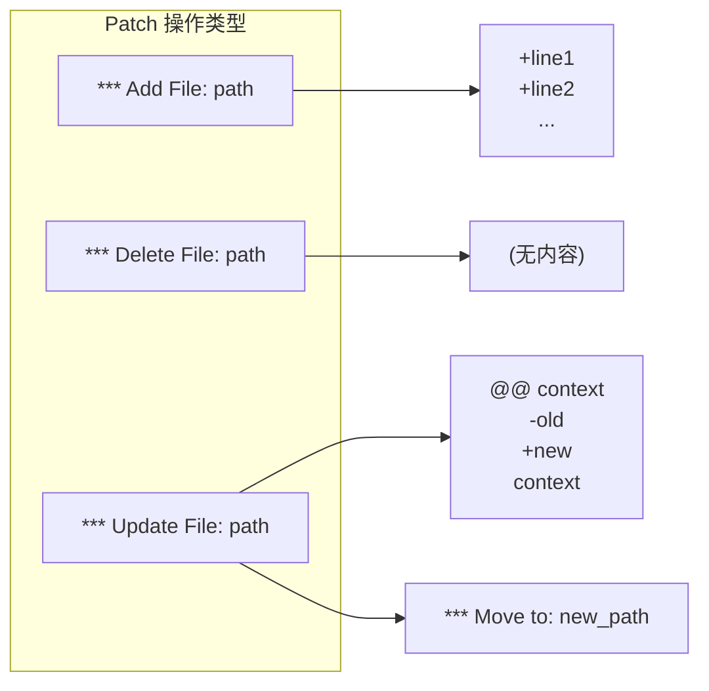
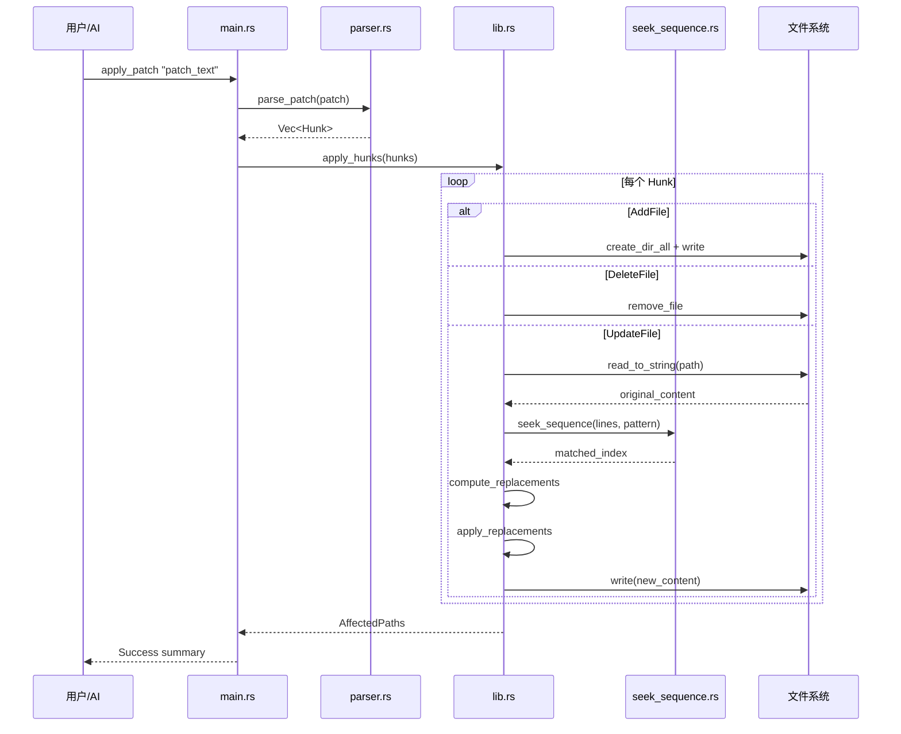
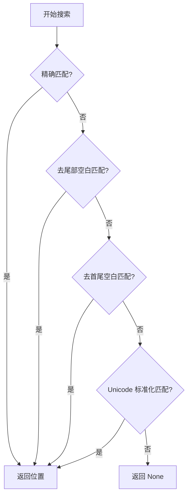
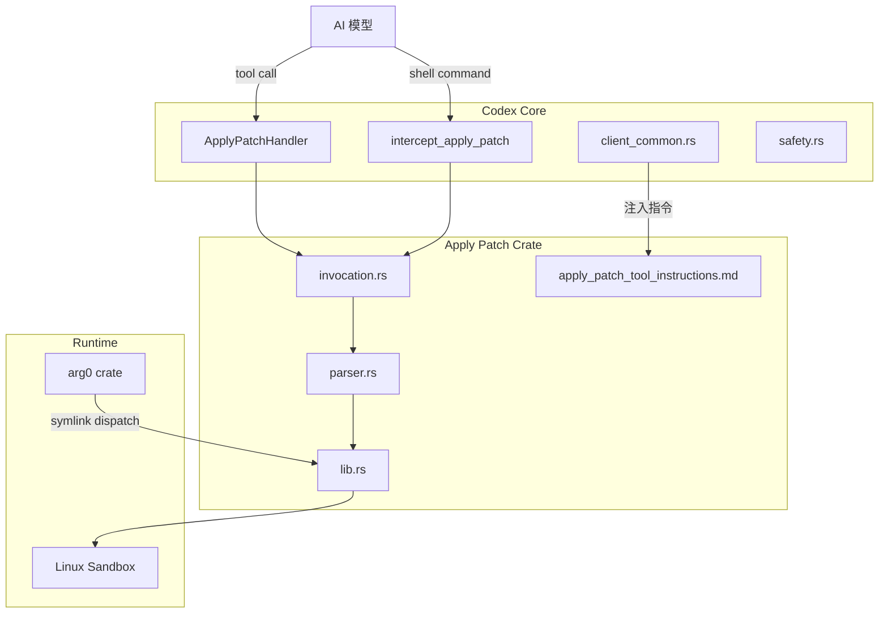
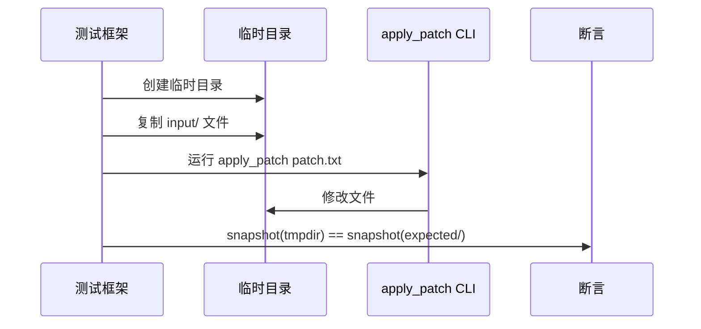
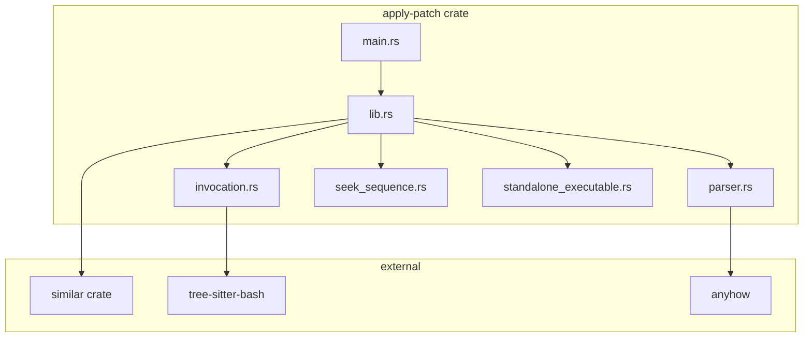

# Codex Apply-Patch 工具详解

> 本文档详细解读 `codex-rs/apply-patch` crate 的原理、使用方式、实现细节及其与 Codex 系统的集成方式。

## 目录

1. [概述](#概述)
2. [Patch 格式语法](#patch-格式语法)
3. [核心实现原理](#核心实现原理)
4. [使用方式](#使用方式)
5. [与 Codex 系统的集成](#与-codex-系统的集成)
6. [apply_patch_tool_instructions.md 的作用](#apply_patch_tool_instructionsmd-的作用)
7. [测试机制](#测试机制)
8. [关键代码路径](#关键代码路径)

---

## 概述

`apply_patch` 是 Codex (OpenAI 代码生成助手) 中用于**安全地修改文件系统**的核心工具。与传统的 Unix `patch` 命令不同，它采用了一种专门为 AI 代码生成设计的简化 diff 格式，具有以下特点：

- **文件级操作**: 支持添加、删除、更新和移动文件
- **上下文匹配**: 使用模糊匹配算法定位代码位置，容忍空白差异和 Unicode 变体
- **验证机制**: 在实际应用 patch 前预先验证变更的正确性
- **安全控制**: 集成到 Codex 的权限审批流程中

### Crate 结构

```
apply-patch/
├── Cargo.toml                          # 依赖配置
├── apply_patch_tool_instructions.md    # AI 模型使用说明
├── src/
│   ├── lib.rs                          # 库入口，导出公共 API
│   ├── main.rs                         # CLI 入口
│   ├── standalone_executable.rs        # 独立可执行文件逻辑
│   ├── parser.rs                       # Patch 语法解析器
│   ├── invocation.rs                   # 命令调用解析 (支持 shell heredoc)
│   └── seek_sequence.rs                # 行序列模糊匹配算法
└── tests/
    ├── all.rs                          # 集成测试入口
    ├── suite/                          # 测试模块
    └── fixtures/scenarios/             # 场景测试数据
```

---

## Patch 格式语法

### 语法规范 (Lark Grammar)

```lark
start: begin_patch hunk+ end_patch
begin_patch: "*** Begin Patch" LF
end_patch: "*** End Patch" LF?

hunk: add_hunk | delete_hunk | update_hunk
add_hunk: "*** Add File: " filename LF add_line+
delete_hunk: "*** Delete File: " filename LF
update_hunk: "*** Update File: " filename LF change_move? change?

filename: /(.+)/
add_line: "+" /(.*)/ LF -> line

change_move: "*** Move to: " filename LF
change: (change_context | change_line)+ eof_line?
change_context: ("@@" | "@@ " /(.+)/) LF
change_line: ("+" | "-" | " ") /(.*)/ LF
eof_line: "*** End of File" LF
```

### 三种文件操作



### 示例

#### 1. 添加新文件
```
*** Begin Patch
*** Add File: hello.txt
+Hello, world!
+This is a new file.
*** End Patch
```

#### 2. 删除文件
```
*** Begin Patch
*** Delete File: obsolete.txt
*** End Patch
```

#### 3. 更新文件 (带上下文)
```
*** Begin Patch
*** Update File: src/app.py
@@ def greet():
 def greet():
-    print("Hi")
+    print("Hello, world!")

*** End Patch
```

#### 4. 移动并修改文件
```
*** Begin Patch
*** Update File: old_name.py
*** Move to: new_name.py
@@
-old_content
+new_content
*** End Patch
```

---

## 核心实现原理

### 处理流程



### 核心数据结构

```rust
/// 解析后的 Hunk 类型
pub enum Hunk {
    AddFile { path: PathBuf, contents: String },
    DeleteFile { path: PathBuf },
    UpdateFile {
        path: PathBuf,
        move_path: Option<PathBuf>,
        chunks: Vec<UpdateFileChunk>,
    },
}

/// 更新文件的变更块
pub struct UpdateFileChunk {
    pub change_context: Option<String>,  // @@ 后的上下文行
    pub old_lines: Vec<String>,          // - 和空格开头的行
    pub new_lines: Vec<String>,          // + 和空格开头的行
    pub is_end_of_file: bool,            // *** End of File 标记
}
```

### 模糊匹配算法 (seek_sequence)

`seek_sequence` 是定位代码位置的核心算法，采用**渐进式放宽匹配**策略：



**Unicode 标准化映射**：
- 各种 Unicode 破折号 → ASCII `-`
- 花式引号 → ASCII `'` 或 `"`
- 各种空格字符 → 普通空格

这确保了 AI 生成的 patch (通常使用 ASCII 字符) 能够正确应用到包含 Unicode 字符的源代码上。

---

## 使用方式

### 1. 命令行使用

```bash
# 直接传入 patch 内容
apply_patch '*** Begin Patch
*** Add File: hello.txt
+Hello world
*** End Patch'

# 从 stdin 读取
echo '*** Begin Patch...' | apply_patch

# 通过 heredoc
apply_patch <<'EOF'
*** Begin Patch
*** Update File: src/main.rs
@@
-fn main() {}
+fn main() { println!("Hello"); }
*** End Patch
EOF
```

### 2. 作为库使用

```rust
use codex_apply_patch::{apply_patch, parse_patch};

fn main() {
    let patch = r#"*** Begin Patch
*** Add File: test.txt
+content
*** End Patch"#;

    let mut stdout = std::io::stdout();
    let mut stderr = std::io::stderr();

    apply_patch(patch, &mut stdout, &mut stderr).unwrap();
}
```

### 3. 预验证变更

```rust
use codex_apply_patch::maybe_parse_apply_patch_verified;
use std::path::Path;

let argv = vec!["apply_patch".to_string(), patch_content];
let cwd = Path::new("/project");

match maybe_parse_apply_patch_verified(&argv, cwd) {
    MaybeApplyPatchVerified::Body(action) => {
        // action.changes() 包含所有将要执行的变更
        for (path, change) in action.changes() {
            match change {
                ApplyPatchFileChange::Add { content } => { /* ... */ },
                ApplyPatchFileChange::Delete { content } => { /* ... */ },
                ApplyPatchFileChange::Update { unified_diff, new_content, .. } => { /* ... */ },
            }
        }
    },
    MaybeApplyPatchVerified::CorrectnessError(e) => { /* patch 解析或验证失败 */ },
    _ => { /* 非 apply_patch 调用 */ },
}
```

---

## 与 Codex 系统的集成

### 集成架构



### 关键集成点

#### 1. Tool Handler (`core/src/tools/handlers/apply_patch.rs`)

Codex 将 `apply_patch` 注册为工具 (Tool)，当 AI 调用该工具时：

```rust
impl ToolHandler for ApplyPatchHandler {
    async fn handle(&self, invocation: ToolInvocation) -> Result<ToolOutput, FunctionCallError> {
        // 1. 解析工具参数
        let patch_input = match payload {
            ToolPayload::Function { arguments } => { /* JSON 格式 */ },
            ToolPayload::Custom { input } => input,  // Freeform 格式
        };

        // 2. 验证并解析 patch
        let command = vec!["apply_patch".to_string(), patch_input];
        match codex_apply_patch::maybe_parse_apply_patch_verified(&command, &cwd) {
            MaybeApplyPatchVerified::Body(changes) => {
                // 3. 应用变更 (可能需要用户审批)
                apply_patch::apply_patch(session, turn, &call_id, changes).await
            },
            // ...错误处理
        }
    }
}
```

#### 2. 命令拦截 (`intercept_apply_patch`)

即使 AI 通过 `exec_command` (shell) 调用 `apply_patch`，系统也会拦截并走安全流程：

```rust
pub async fn intercept_apply_patch(
    command: &[String],
    cwd: &Path,
    // ...
) -> Result<Option<ToolOutput>, FunctionCallError> {
    match codex_apply_patch::maybe_parse_apply_patch_verified(command, cwd) {
        MaybeApplyPatchVerified::Body(changes) => {
            session.record_model_warning(
                "apply_patch was requested via shell. Use the apply_patch tool instead.",
                turn,
            ).await;
            // 仍然正常处理...
        },
        // ...
    }
}
```

#### 3. Arg0 Dispatch (`arg0/src/lib.rs`)

Codex CLI 使用 "arg0 trick" 支持多入口点：

```rust
pub fn arg0_dispatch() -> Option<TempDir> {
    let exe_name = /* 获取 argv[0] 的文件名 */;

    if exe_name == "apply_patch" || exe_name == "applypatch" {
        codex_apply_patch::main();  // 直接执行，不返回
    }

    // 创建临时目录，symlink apply_patch -> codex
    prepend_path_entry_for_codex_aliases()
}
```

这允许将单个 `codex` 二进制文件同时作为 `apply_patch` 命令使用。

---

## apply_patch_tool_instructions.md 的作用

### 功能说明

该文件是给 **AI 模型** 的使用说明，通过 `include_str!` 宏嵌入到代码中：

```rust
// lib.rs
pub const APPLY_PATCH_TOOL_INSTRUCTIONS: &str =
    include_str!("../apply_patch_tool_instructions.md");
```

### 注入时机

在 `client_common.rs` 中，根据模型类型决定是否注入：

```rust
impl Prompt {
    pub fn get_full_instructions(&self, model: &ModelFamily) -> Cow<str> {
        if model.needs_special_apply_patch_instructions && !is_apply_patch_tool_present {
            // 对于 gpt-4.1 等需要特殊指令的模型
            Cow::Owned(format!("{base}\n{APPLY_PATCH_TOOL_INSTRUCTIONS}"))
        } else {
            Cow::Borrowed(base)
        }
    }
}
```

### 指令内容摘要

```markdown
## `apply_patch`

Use the `apply_patch` shell command to edit files.
Your patch language is a stripped‑down, file‑oriented diff format...

*** Begin Patch
[ one or more file sections ]
*** End Patch

### 文件操作头
- *** Add File: <path>
- *** Delete File: <path>
- *** Update File: <path>

### 上下文规则
- 默认显示 3 行上下文
- 使用 @@ 指定类/函数上下文
- 支持多级 @@ 嵌套定位

### 调用方式
shell {"command":["apply_patch","*** Begin Patch\n..."]}
```

---

## 测试机制

### 测试结构

```
tests/
├── all.rs                      # 入口
├── suite/
│   ├── mod.rs
│   ├── scenarios.rs            # 场景测试
│   ├── cli.rs                  # CLI 测试
│   └── tool.rs                 # 工具集成测试
└── fixtures/scenarios/
    ├── 001_add_file/
    │   ├── patch.txt           # 输入 patch
    │   └── expected/           # 期望的最终状态
    ├── 002_multiple_operations/
    │   ├── input/              # 初始文件状态
    │   ├── patch.txt
    │   └── expected/
    └── ...
```

### 场景测试流程



### 测试场景列表

| 场景 | 描述 |
|------|------|
| 001_add_file | 添加新文件 |
| 002_multiple_operations | 多种操作组合 |
| 003_multiple_chunks | 单文件多处修改 |
| 004_move_to_new_directory | 移动文件到新目录 |
| 005_rejects_empty_patch | 拒绝空 patch |
| 006_rejects_missing_context | 拒绝缺少上下文的 patch |
| 007_rejects_missing_file_delete | 删除不存在的文件失败 |
| 008_rejects_empty_update_hunk | 拒绝空的更新块 |
| 009_requires_existing_file_for_update | 更新需要文件存在 |
| 010_move_overwrites_existing_destination | 移动覆盖已存在的目标 |
| 011_add_overwrites_existing_file | 添加覆盖已存在的文件 |
| 012_delete_directory_fails | 删除目录失败 |
| 013_rejects_invalid_hunk_header | 拒绝无效的块头 |
| 014_update_file_appends_trailing_newline | 更新文件自动添加尾部换行 |
| 015_failure_after_partial_success | 部分成功后失败保留已做更改 |
| 016_pure_addition_update_chunk | 纯添加的更新块 |

### 运行测试

```bash
cd venders/codex/codex-rs/apply-patch
cargo test
```

---

## 关键代码路径

### 主要模块依赖



### 重要函数

| 函数 | 位置 | 描述 |
|------|------|------|
| `parse_patch` | parser.rs:106 | 解析 patch 文本为 Hunk 列表 |
| `apply_patch` | lib.rs:174 | 主入口，解析并应用 patch |
| `apply_hunks` | lib.rs:207 | 应用已解析的 hunks |
| `apply_hunks_to_files` | lib.rs:270 | 执行文件系统操作 |
| `compute_replacements` | lib.rs:377 | 计算行替换位置 |
| `seek_sequence` | seek_sequence.rs:12 | 模糊匹配行序列 |
| `maybe_parse_apply_patch_verified` | invocation.rs:132 | 验证并预解析 patch |
| `extract_apply_patch_from_bash` | invocation.rs:239 | 从 shell heredoc 提取 patch |

### 错误类型

```rust
pub enum ApplyPatchError {
    ParseError(ParseError),           // 语法解析错误
    IoError(IoError),                 // 文件 I/O 错误
    ComputeReplacements(String),      // 无法定位修改位置
    ImplicitInvocation,               // 缺少显式 apply_patch 调用
}

pub enum ParseError {
    InvalidPatchError(String),        // patch 格式无效
    InvalidHunkError {                // hunk 格式无效
        message: String,
        line_number: usize,
    },
}
```

---

## 总结

`apply_patch` 是 Codex 生态系统中至关重要的基础设施组件，它：

1. **定义了专用的 patch 格式** - 比 unified diff 更简洁，专为 AI 代码生成优化
2. **实现了健壮的模糊匹配** - 容忍空白和 Unicode 差异，提高 patch 成功率
3. **深度集成到 Codex 安全模型** - 支持变更预览和用户审批
4. **提供灵活的调用方式** - CLI、库、tool call、shell heredoc 多种接入点

通过这套设计，AI 可以安全、可靠地修改用户代码，同时保持用户对变更的完全控制。
