# OpenAI Codex CLI 架构分析文档

> 本文档基于 Codex CLI 代码库深度分析，详细阐述其架构设计、核心组件、数据流和安全机制。

## 1. 项目概述

### 1.1 项目定位

**Codex CLI** 是 OpenAI 官方开源的本地 AI 编程代理平台，采用 Apache-2.0 许可证。项目结合了 ChatGPT 级别的推理能力与本地代码执行，支持在隔离沙箱中安全地运行命令。

### 1.2 技术栈概览

| 类别 | 技术选型 |
|------|----------|
| 主要语言 | Rust (2024 Edition) |
| 遗留实现 | TypeScript (已弃用) |
| 异步运行时 | Tokio |
| TUI 框架 | Ratatui |
| CLI 解析 | Clap 4 |
| 序列化 | Serde, serde_json |
| HTTP 客户端 | Reqwest |
| 错误处理 | anyhow, thiserror |

### 1.3 项目结构

```
codex/
├── codex-cli/                 # TypeScript CLI (已弃用)
├── codex-rs/                  # Rust 实现 (主要)
│   ├── cli/                   # CLI 入口点 (Multitool)
│   ├── core/                  # 核心业务逻辑库
│   ├── tui/                   # TUI v1 (Ratatui)
│   ├── tui2/                  # TUI v2 (实验性)
│   ├── exec/                  # 非交互式执行
│   ├── protocol/              # 协议定义
│   ├── mcp-server/            # MCP 服务器
│   ├── mcp-types/             # MCP 类型定义
│   ├── login/                 # 认证流程
│   ├── linux-sandbox/         # Linux 沙箱
│   └── utils/                 # 工具库
├── sdk/typescript/            # TypeScript SDK
├── shell-tool-mcp/            # Shell Tool MCP 服务器
└── docs/                      # 文档
```

## 2. 高层架构

### 2.1 整体架构图

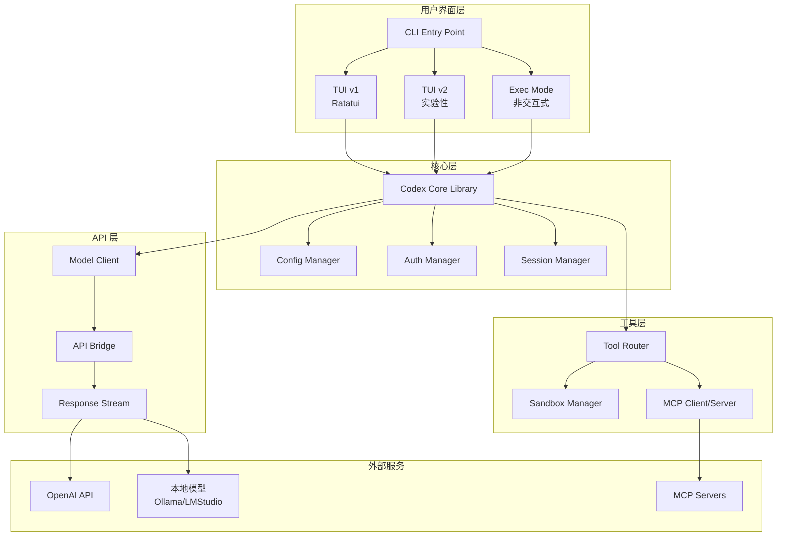
```mermaid
graph TB
    subgraph "用户界面层"
        CLI[CLI Entry Point]
        TUI1[TUI v1<br/>Ratatui]
        TUI2[TUI v2<br/>实验性]
        EXEC[Exec Mode<br/>非交互式]
    end

    subgraph "核心层"
        CORE[Codex Core Library]
        CONFIG[Config Manager]
        AUTH[Auth Manager]
        SESSION[Session Manager]
    end

    subgraph "工具层"
        TOOLS[Tool Router]
        SANDBOX[Sandbox Manager]
        MCP[MCP Client/Server]
    end

    subgraph "API 层"
        CLIENT[Model Client]
        BRIDGE[API Bridge]
        STREAM[Response Stream]
    end

    subgraph "外部服务"
        OPENAI[OpenAI API]
        LOCAL[本地模型<br/>Ollama/LMStudio]
        MCPSRV[MCP Servers]
    end

    CLI --> TUI1 & TUI2 & EXEC
    TUI1 & TUI2 & EXEC --> CORE
    CORE --> CONFIG & AUTH & SESSION
    CORE --> TOOLS
    TOOLS --> SANDBOX & MCP
    CORE --> CLIENT
    CLIENT --> BRIDGE --> STREAM
    STREAM --> OPENAI & LOCAL
    MCP --> MCPSRV
```

### 2.2 模块依赖关系

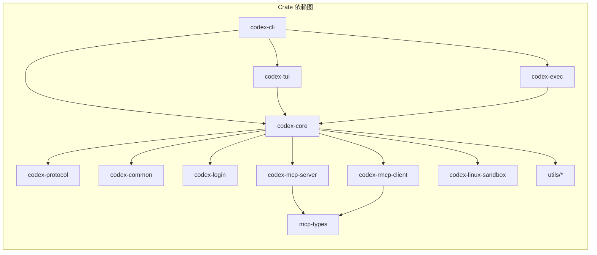
```mermaid
graph LR
    subgraph "Crate 依赖图"
        CLI[codex-cli] --> TUI[codex-tui]
        CLI --> EXEC[codex-exec]
        CLI --> CORE[codex-core]

        TUI --> CORE
        EXEC --> CORE

        CORE --> PROTOCOL[codex-protocol]
        CORE --> COMMON[codex-common]
        CORE --> LOGIN[codex-login]
        CORE --> MCP[codex-mcp-server]
        CORE --> RMCP[codex-rmcp-client]

        MCP --> MCPTYPES[mcp-types]
        RMCP --> MCPTYPES

        CORE --> SANDBOX_L[codex-linux-sandbox]
        CORE --> UTILS[utils/*]
    end
```

## 3. 核心组件详解

### 3.1 CLI 入口点 (`cli/src/main.rs`)

CLI 采用 **Multitool** 设计模式，通过 Clap 解析命令行参数，分发到不同的子命令处理器。

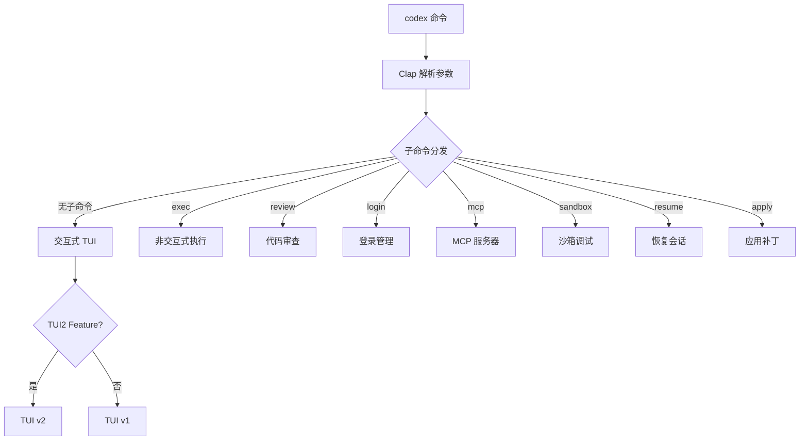
```mermaid
flowchart TD
    START[codex 命令] --> PARSE[Clap 解析参数]
    PARSE --> DISPATCH{子命令分发}

    DISPATCH -->|无子命令| INTERACTIVE[交互式 TUI]
    DISPATCH -->|exec| HEADLESS[非交互式执行]
    DISPATCH -->|review| REVIEW[代码审查]
    DISPATCH -->|login| LOGIN[登录管理]
    DISPATCH -->|mcp| MCP_CMD[MCP 服务器]
    DISPATCH -->|sandbox| SANDBOX[沙箱调试]
    DISPATCH -->|resume| RESUME[恢复会话]
    DISPATCH -->|apply| APPLY[应用补丁]

    INTERACTIVE --> TUI1_CHECK{TUI2 Feature?}
    TUI1_CHECK -->|是| TUI2[TUI v2]
    TUI1_CHECK -->|否| TUI1[TUI v1]
```

**关键设计点**：
- 使用 `arg0_dispatch_or_else` 支持通过可执行文件名进行命令分发
- 配置覆盖优先级：子命令参数 > 根级参数 > 配置文件
- Feature Toggle 系统支持实验性功能的动态启用/禁用

### 3.2 核心库 (`core/src/lib.rs`)

核心库是整个系统的业务逻辑中心，包含以下主要模块：

| 模块 | 职责 |
|------|------|
| `codex.rs` | Codex Agent 主实现 |
| `config/` | 配置加载与验证 |
| `auth.rs` | 认证管理 |
| `client.rs` | API 客户端 |
| `sandboxing/` | 沙箱抽象 |
| `mcp/` | MCP 协议支持 |
| `tools/` | 工具路由与执行 |
| `rollout/` | 会话持久化 |

### 3.3 Codex Agent (`core/src/codex.rs`)

Agent 是系统的核心，采用 **SQ/EQ (Submission Queue/Event Queue)** 模式进行异步通信：

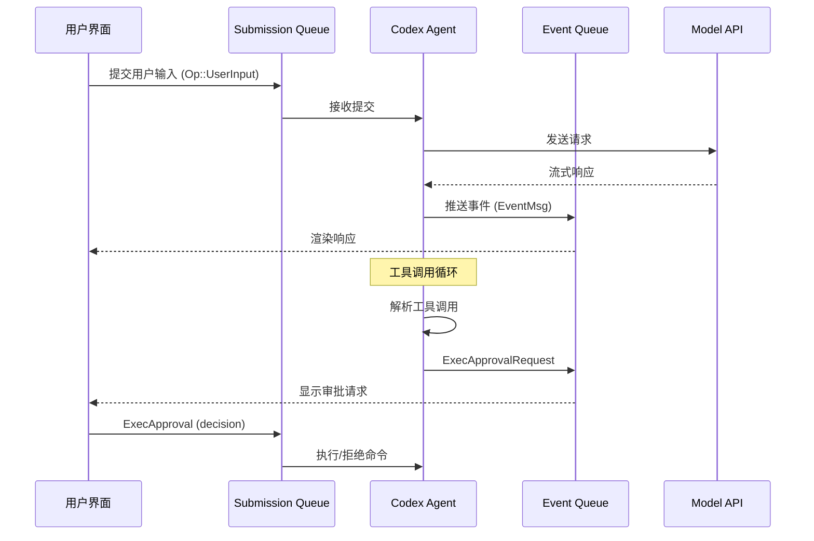
```mermaid
sequenceDiagram
    participant UI as 用户界面
    participant SQ as Submission Queue
    participant AGENT as Codex Agent
    participant EQ as Event Queue
    participant MODEL as Model API

    UI->>SQ: 提交用户输入 (Op::UserInput)
    SQ->>AGENT: 接收提交
    AGENT->>MODEL: 发送请求
    MODEL-->>AGENT: 流式响应
    AGENT->>EQ: 推送事件 (EventMsg)
    EQ-->>UI: 渲染响应

    Note over AGENT: 工具调用循环
    AGENT->>AGENT: 解析工具调用
    AGENT->>EQ: ExecApprovalRequest
    EQ-->>UI: 显示审批请求
    UI->>SQ: ExecApproval (decision)
    SQ->>AGENT: 执行/拒绝命令
```

**Codex 结构体**：

```rust
pub struct Codex {
    pub(crate) next_id: AtomicU64,        // 提交 ID 生成器
    pub(crate) tx_sub: Sender<Submission>, // 提交队列发送端
    pub(crate) rx_event: Receiver<Event>,  // 事件队列接收端
}
```

**会话配置**：

```rust
struct SessionConfiguration {
    provider: ModelProviderInfo,           // 模型提供商
    model: String,                         // 模型 ID
    developer_instructions: Option<String>,// 开发者指令
    user_instructions: UserInstructions,   // 用户指令 (AGENTS.md)
    approval_policy: AskForApproval,       // 审批策略
    sandbox_policy: SandboxPolicy,         // 沙箱策略
    cwd: AbsolutePathBuf,                  // 工作目录
}
```

### 3.4 协议层 (`protocol/src/protocol.rs`)

协议定义了 Client 与 Agent 之间的通信契约：

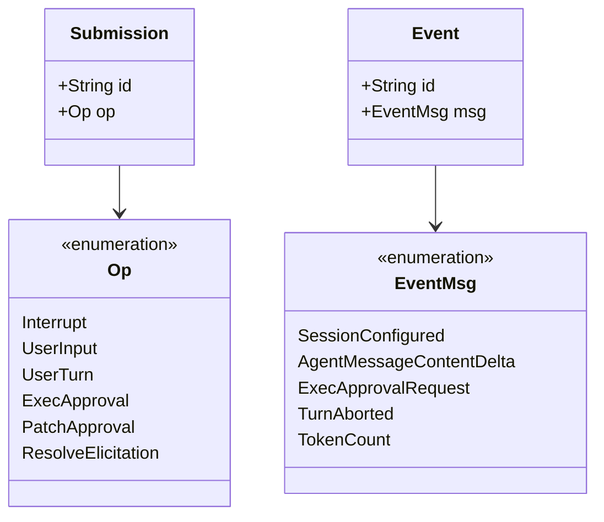
```mermaid
classDiagram
    class Submission {
        +String id
        +Op op
    }

    class Op {
        <<enumeration>>
        Interrupt
        UserInput
        UserTurn
        ExecApproval
        PatchApproval
        ResolveElicitation
    }

    class Event {
        +String id
        +EventMsg msg
    }

    class EventMsg {
        <<enumeration>>
        SessionConfigured
        AgentMessageContentDelta
        ExecApprovalRequest
        TurnAborted
        TokenCount
    }

    Submission --> Op
    Event --> EventMsg
```

**主要操作类型**：

| Op 类型 | 描述 |
|---------|------|
| `UserInput` | 用户文本/图片输入 |
| `UserTurn` | 完整的对话轮次 (含上下文) |
| `ExecApproval` | 命令执行审批响应 |
| `PatchApproval` | 代码补丁审批响应 |
| `Interrupt` | 中断当前任务 |
| `ResolveElicitation` | MCP 请求响应 |

## 4. 安全架构

### 4.1 沙箱策略

Codex 实现了三级沙箱策略以保护系统安全：

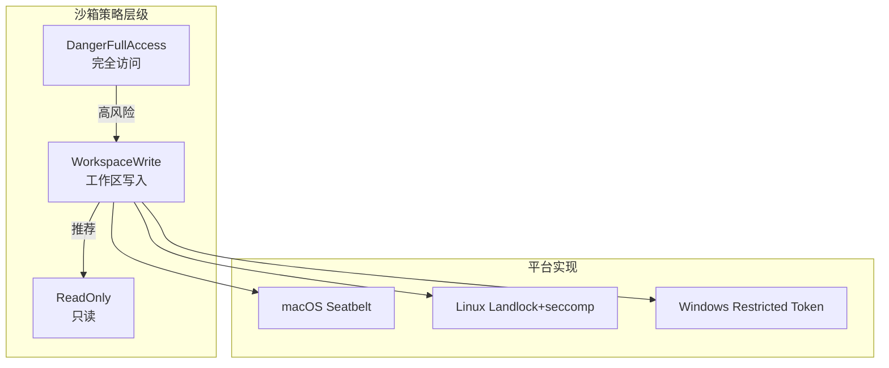
```mermaid
graph TD
    subgraph "沙箱策略层级"
        FULL[DangerFullAccess<br/>完全访问]
        WORKSPACE[WorkspaceWrite<br/>工作区写入]
        READONLY[ReadOnly<br/>只读]
    end

    FULL -->|高风险| WORKSPACE
    WORKSPACE -->|推荐| READONLY

    subgraph "平台实现"
        MACOS[macOS Seatbelt]
        LINUX[Linux Landlock+seccomp]
        WINDOWS[Windows Restricted Token]
    end

    WORKSPACE --> MACOS & LINUX & WINDOWS
```

**SandboxPolicy 枚举**：

```rust
pub enum SandboxPolicy {
    /// 完全磁盘和网络访问 (危险)
    DangerFullAccess,

    /// 只读文件系统访问
    ReadOnly { network_access: bool },

    /// 工作区写入访问
    WorkspaceWrite {
        writable_roots: Vec<WritableRoot>,
        network_access: bool,
        exclude_tmpdir_env_var: bool,
        exclude_slash_tmp: bool,
    },
}
```

### 4.2 macOS Seatbelt 实现

```mermaid
flowchart LR
    CMD[Shell 命令] --> SEATBELT[/usr/bin/sandbox-exec]
    SEATBELT --> POLICY[SBPL Policy]

    subgraph "策略组件"
        BASE[基础策略]
        FILE_READ[文件读取策略]
        FILE_WRITE[文件写入策略]
        NETWORK[网络策略]
    end

    POLICY --> BASE
    POLICY --> FILE_READ
    POLICY --> FILE_WRITE
    POLICY --> NETWORK

    FILE_WRITE --> WRITABLE_ROOTS[可写目录列表]
    FILE_WRITE --> RO_SUBPATHS[只读子路径<br/>.git, .codex]
```

**安全特性**：
- 固定使用 `/usr/bin/sandbox-exec` 防止 PATH 注入攻击
- 自动保护 `.git` 和 `.codex` 目录不被写入
- 支持细粒度的目录权限控制

### 4.3 Linux Landlock 实现

```rust
pub async fn spawn_command_under_linux_sandbox(
    codex_linux_sandbox_exe: P,
    command: Vec<String>,
    command_cwd: PathBuf,
    sandbox_policy: &SandboxPolicy,
    sandbox_policy_cwd: &Path,
    stdio_policy: StdioPolicy,
    env: HashMap<String, String>,
) -> std::io::Result<Child>
```

使用独立的 `codex-linux-sandbox` 可执行文件，通过 JSON 传递沙箱策略：

```
codex-linux-sandbox \
    --sandbox-policy-cwd /path/to/cwd \
    --sandbox-policy '{"WorkspaceWrite":{...}}' \
    -- bash -c "echo hello"
```

### 4.4 审批策略

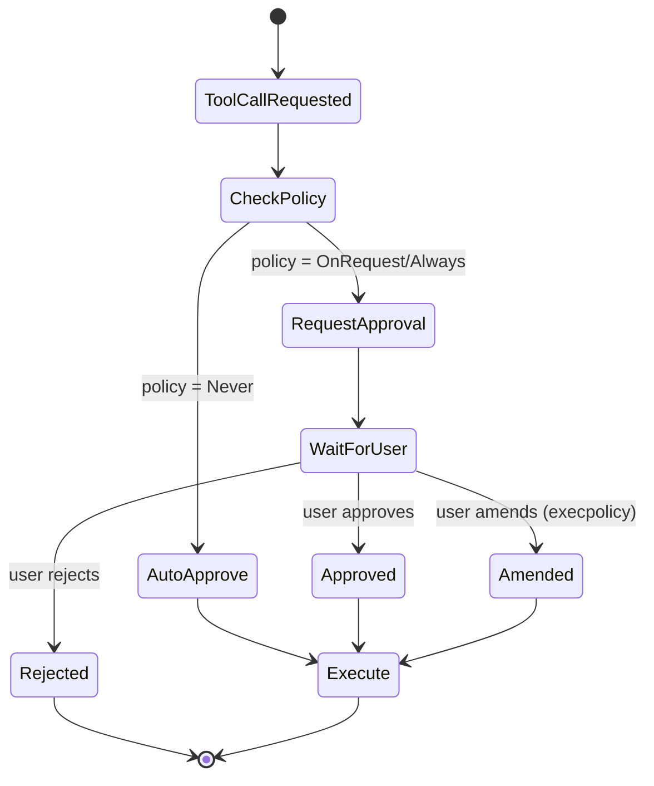
```mermaid
stateDiagram-v2
    [*] --> ToolCallRequested

    ToolCallRequested --> CheckPolicy

    CheckPolicy --> AutoApprove: policy = Never
    CheckPolicy --> RequestApproval: policy = OnRequest/Always

    RequestApproval --> WaitForUser
    WaitForUser --> Approved: user approves
    WaitForUser --> Rejected: user rejects
    WaitForUser --> Amended: user amends (execpolicy)

    AutoApprove --> Execute
    Approved --> Execute
    Amended --> Execute

    Rejected --> [*]
    Execute --> [*]
```

**AskForApproval 枚举**：

```rust
pub enum AskForApproval {
    /// 从不请求审批 (危险)
    Never,
    /// 仅在工具请求时审批
    OnRequest,
    /// 每次都审批
    Always,
}
```

## 5. TUI 架构

### 5.1 TUI v1 模块结构

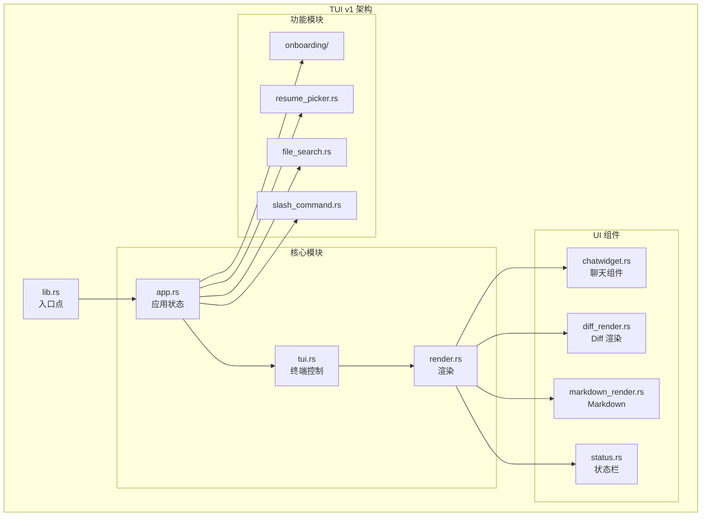
```mermaid
graph TB
    subgraph "TUI v1 架构"
        LIB[lib.rs<br/>入口点]

        subgraph "核心模块"
            APP[app.rs<br/>应用状态]
            TUI_MOD[tui.rs<br/>终端控制]
            RENDER[render.rs<br/>渲染]
        end

        subgraph "UI 组件"
            CHAT[chatwidget.rs<br/>聊天组件]
            DIFF[diff_render.rs<br/>Diff 渲染]
            MD[markdown_render.rs<br/>Markdown]
            STATUS[status.rs<br/>状态栏]
        end

        subgraph "功能模块"
            ONBOARD[onboarding/]
            RESUME[resume_picker.rs]
            SEARCH[file_search.rs]
            SLASH[slash_command.rs]
        end
    end

    LIB --> APP
    APP --> TUI_MOD --> RENDER
    RENDER --> CHAT & DIFF & MD & STATUS
    APP --> ONBOARD & RESUME & SEARCH & SLASH
```

### 5.2 TUI 生命周期

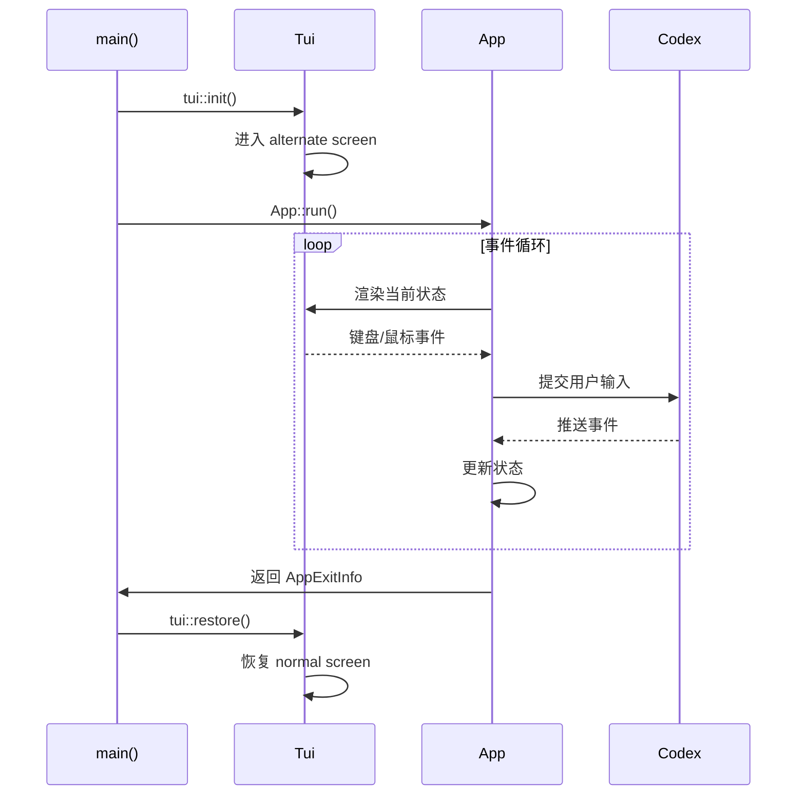
```mermaid
sequenceDiagram
    participant MAIN as main()
    participant TUI as Tui
    participant APP as App
    participant CODEX as Codex

    MAIN->>TUI: tui::init()
    TUI->>TUI: 进入 alternate screen
    MAIN->>APP: App::run()

    loop 事件循环
        APP->>TUI: 渲染当前状态
        TUI-->>APP: 键盘/鼠标事件
        APP->>CODEX: 提交用户输入
        CODEX-->>APP: 推送事件
        APP->>APP: 更新状态
    end

    APP->>MAIN: 返回 AppExitInfo
    MAIN->>TUI: tui::restore()
    TUI->>TUI: 恢复 normal screen
```

## 6. MCP (Model Context Protocol) 集成

### 6.1 MCP 架构

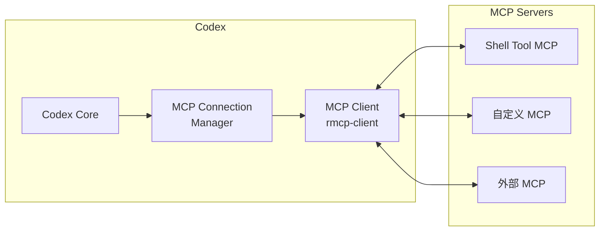
```mermaid
graph LR
    subgraph "Codex"
        CORE[Codex Core]
        MCP_CLIENT[MCP Client<br/>rmcp-client]
        MCP_MGR[MCP Connection<br/>Manager]
    end

    subgraph "MCP Servers"
        SHELL[Shell Tool MCP]
        CUSTOM[自定义 MCP]
        EXTERNAL[外部 MCP]
    end

    CORE --> MCP_MGR
    MCP_MGR --> MCP_CLIENT
    MCP_CLIENT <--> SHELL
    MCP_CLIENT <--> CUSTOM
    MCP_CLIENT <--> EXTERNAL
```

### 6.2 MCP Server 实现

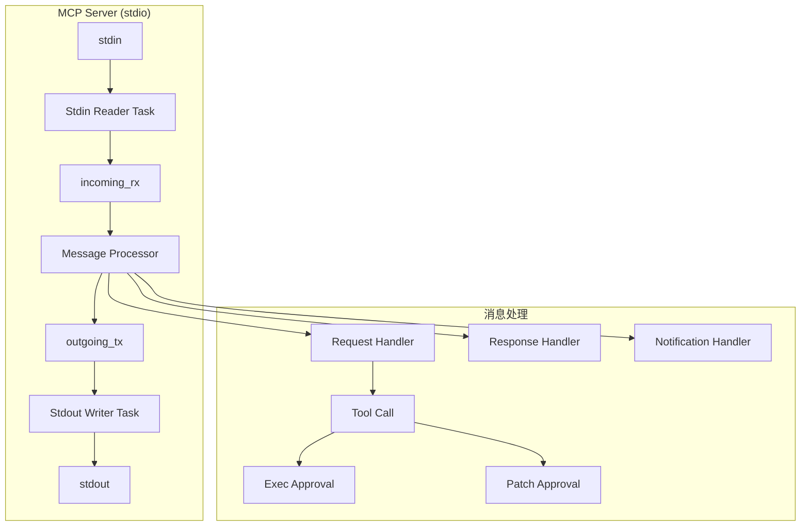
```mermaid
flowchart TD
    subgraph "MCP Server (stdio)"
        STDIN[stdin] --> READER[Stdin Reader Task]
        READER --> INCOMING[incoming_rx]
        INCOMING --> PROCESSOR[Message Processor]
        PROCESSOR --> OUTGOING[outgoing_tx]
        OUTGOING --> WRITER[Stdout Writer Task]
        WRITER --> STDOUT[stdout]
    end

    subgraph "消息处理"
        PROCESSOR --> REQ[Request Handler]
        PROCESSOR --> RESP[Response Handler]
        PROCESSOR --> NOTIF[Notification Handler]

        REQ --> TOOL_CALL[Tool Call]
        TOOL_CALL --> EXEC_APPROVAL[Exec Approval]
        TOOL_CALL --> PATCH_APPROVAL[Patch Approval]
    end
```

**消息格式**：JSON-RPC over stdio

```rust
pub async fn run_main(
    codex_linux_sandbox_exe: Option<PathBuf>,
    cli_config_overrides: CliConfigOverrides,
) -> IoResult<()> {
    let (incoming_tx, mut incoming_rx) = mpsc::channel::<JSONRPCMessage>(128);
    let (outgoing_tx, mut outgoing_rx) = mpsc::unbounded_channel::<OutgoingMessage>();

    // stdin -> incoming channel
    tokio::spawn(stdin_reader_task(incoming_tx));

    // incoming channel -> processor -> outgoing channel
    tokio::spawn(message_processor_task(incoming_rx, outgoing_tx));

    // outgoing channel -> stdout
    tokio::spawn(stdout_writer_task(outgoing_rx));
}
```

## 7. 配置系统

### 7.1 配置层级

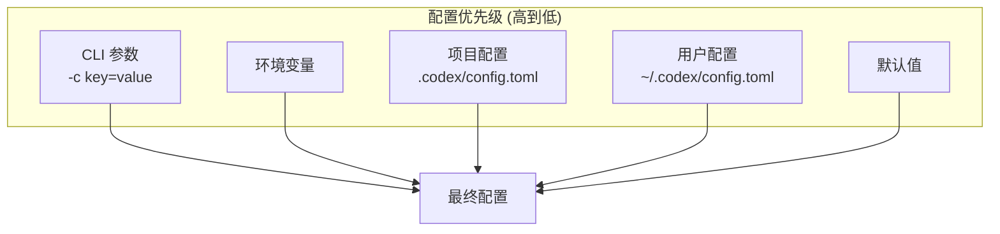
```mermaid
graph TD
    subgraph "配置优先级 (高到低)"
        CLI_ARGS[CLI 参数<br/>-c key=value]
        ENV_VARS[环境变量]
        PROJECT_CONFIG[项目配置<br/>.codex/config.toml]
        USER_CONFIG[用户配置<br/>~/.codex/config.toml]
        DEFAULTS[默认值]
    end

    CLI_ARGS --> MERGED[最终配置]
    ENV_VARS --> MERGED
    PROJECT_CONFIG --> MERGED
    USER_CONFIG --> MERGED
    DEFAULTS --> MERGED
```

### 7.2 Config 结构

```rust
pub struct Config {
    // 模型配置
    pub model: Option<String>,
    pub model_provider_id: String,
    pub model_provider: ModelProviderInfo,

    // 安全配置
    pub approval_policy: Constrained<AskForApproval>,
    pub sandbox_policy: Constrained<SandboxPolicy>,

    // Feature Flags
    pub features: Features,

    // 路径配置
    pub codex_home: PathBuf,
    pub cwd: AbsolutePathBuf,

    // MCP 配置
    pub mcp_servers: BTreeMap<String, McpServerConfig>,

    // 历史与会话
    pub history: History,
    // ...
}
```

### 7.3 Feature Flags 系统

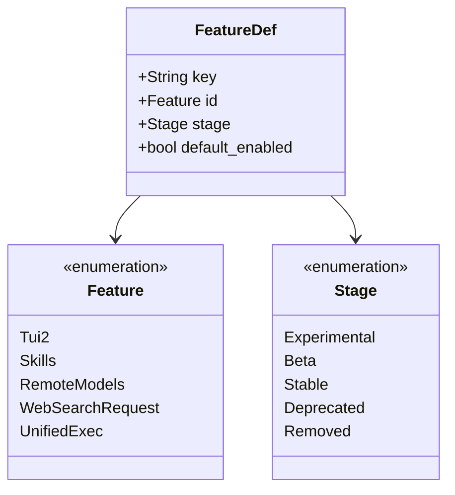
```mermaid
classDiagram
    class Feature {
        <<enumeration>>
        Tui2
        Skills
        RemoteModels
        WebSearchRequest
        UnifiedExec
    }

    class Stage {
        <<enumeration>>
        Experimental
        Beta
        Stable
        Deprecated
        Removed
    }

    class FeatureDef {
        +String key
        +Feature id
        +Stage stage
        +bool default_enabled
    }

    FeatureDef --> Feature
    FeatureDef --> Stage
```

## 8. 数据流分析

### 8.1 用户输入到响应的完整流程

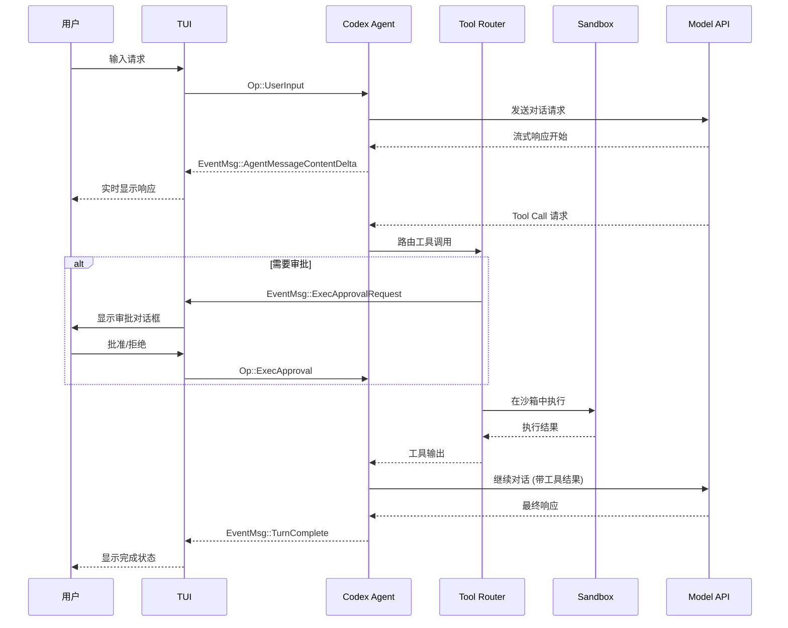
```mermaid
sequenceDiagram
    participant USER as 用户
    participant TUI as TUI
    participant CODEX as Codex Agent
    participant TOOLS as Tool Router
    participant SANDBOX as Sandbox
    participant MODEL as Model API

    USER->>TUI: 输入请求
    TUI->>CODEX: Op::UserInput
    CODEX->>MODEL: 发送对话请求

    MODEL-->>CODEX: 流式响应开始
    CODEX-->>TUI: EventMsg::AgentMessageContentDelta
    TUI-->>USER: 实时显示响应

    MODEL-->>CODEX: Tool Call 请求
    CODEX->>TOOLS: 路由工具调用

    alt 需要审批
        TOOLS->>TUI: EventMsg::ExecApprovalRequest
        TUI->>USER: 显示审批对话框
        USER->>TUI: 批准/拒绝
        TUI->>CODEX: Op::ExecApproval
    end

    TOOLS->>SANDBOX: 在沙箱中执行
    SANDBOX-->>TOOLS: 执行结果
    TOOLS-->>CODEX: 工具输出

    CODEX->>MODEL: 继续对话 (带工具结果)
    MODEL-->>CODEX: 最终响应
    CODEX-->>TUI: EventMsg::TurnComplete
    TUI-->>USER: 显示完成状态
```

### 8.2 会话持久化流程

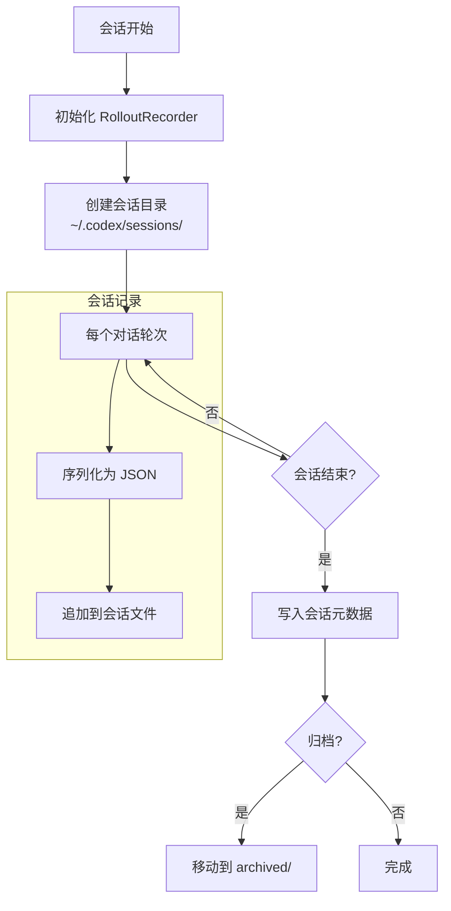
```mermaid
flowchart TD
    START[会话开始] --> INIT[初始化 RolloutRecorder]
    INIT --> CREATE_DIR[创建会话目录<br/>~/.codex/sessions/]

    subgraph "会话记录"
        TURN[每个对话轮次]
        TURN --> SERIALIZE[序列化为 JSON]
        SERIALIZE --> APPEND[追加到会话文件]
    end

    CREATE_DIR --> TURN

    TURN --> END{会话结束?}
    END -->|否| TURN
    END -->|是| FINALIZE[写入会话元数据]

    FINALIZE --> ARCHIVE{归档?}
    ARCHIVE -->|是| MOVE[移动到 archived/]
    ARCHIVE -->|否| DONE[完成]
```

## 9. 工具系统

### 9.1 工具路由架构

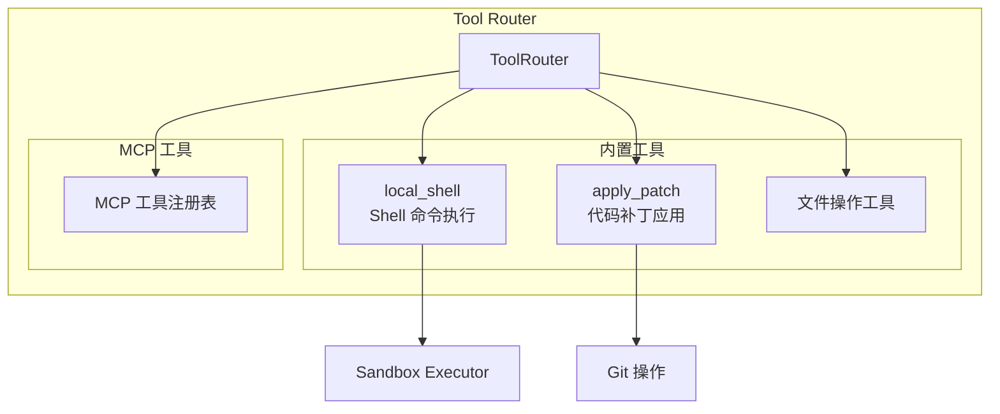
```mermaid
graph TB
    subgraph "Tool Router"
        ROUTER[ToolRouter]

        subgraph "内置工具"
            LOCAL_SHELL[local_shell<br/>Shell 命令执行]
            APPLY_PATCH[apply_patch<br/>代码补丁应用]
            FILE_OPS[文件操作工具]
        end

        subgraph "MCP 工具"
            MCP_TOOLS[MCP 工具注册表]
        end
    end

    ROUTER --> LOCAL_SHELL
    ROUTER --> APPLY_PATCH
    ROUTER --> FILE_OPS
    ROUTER --> MCP_TOOLS

    LOCAL_SHELL --> SANDBOX[Sandbox Executor]
    APPLY_PATCH --> GIT[Git 操作]
```

### 9.2 工具执行流程

```rust
pub mod tools {
    pub mod context;      // 工具执行上下文
    pub mod events;       // 工具事件
    pub mod handlers;     // 工具处理器
    pub mod orchestrator; // 工具编排
    pub mod parallel;     // 并行执行
    pub mod registry;     // 工具注册表
    pub mod router;       // 工具路由
    pub mod runtimes;     // 执行运行时
    pub mod sandboxing;   // 沙箱集成
    pub mod spec;         // 工具规范
}
```

## 10. 48 个 Rust Crates 概览

### 10.1 核心 Crates

| Crate | 描述 |
|-------|------|
| `codex-cli` | CLI 多工具入口点 |
| `codex-core` | 核心业务逻辑库 |
| `codex-protocol` | 协议类型定义 |
| `codex-common` | 共享类型和工具 |
| `codex-tui` | TUI v1 实现 |
| `codex-tui2` | TUI v2 实验性实现 |
| `codex-exec` | 非交互式执行引擎 |

### 10.2 集成 Crates

| Crate | 描述 |
|-------|------|
| `codex-mcp-server` | MCP 服务器实现 |
| `codex-rmcp-client` | 远程 MCP 客户端 |
| `codex-app-server` | 后端 API 服务器 |
| `codex-login` | 认证流程 |
| `codex-chatgpt` | ChatGPT 集成 |
| `codex-ollama` | Ollama 集成 |
| `codex-lmstudio` | LM Studio 集成 |

### 10.3 安全 Crates

| Crate | 描述 |
|-------|------|
| `codex-linux-sandbox` | Linux Landlock+seccomp |
| `codex-windows-sandbox-rs` | Windows 沙箱 |
| `codex-process-hardening` | 进程加固 |
| `codex-execpolicy` | 执行策略引擎 |

### 10.4 工具 Crates

| Crate | 描述 |
|-------|------|
| `codex-utils-absolute-path` | 绝对路径处理 |
| `codex-git` | Git 操作 |
| `codex-utils-cache` | 缓存工具 |
| `codex-utils-image` | 图像处理 |
| `codex-utils-pty` | PTY 管理 |
| `codex-utils-string` | 字符串工具 |

## 11. 构建与部署

### 11.1 构建配置

```toml
[profile.release]
lto = "fat"           # 全量链接时优化
strip = "symbols"     # 移除符号以减小体积
codegen-units = 1     # 单代码生成单元
```

### 11.2 目标平台

- macOS: arm64, x86_64
- Linux: x86_64, arm64 (musl/glibc)
- Windows: x86_64

### 11.3 发布渠道

- npm: `@openai/codex`
- GitHub Releases
- Homebrew Cask

## 12. 测试策略

### 12.1 测试类型

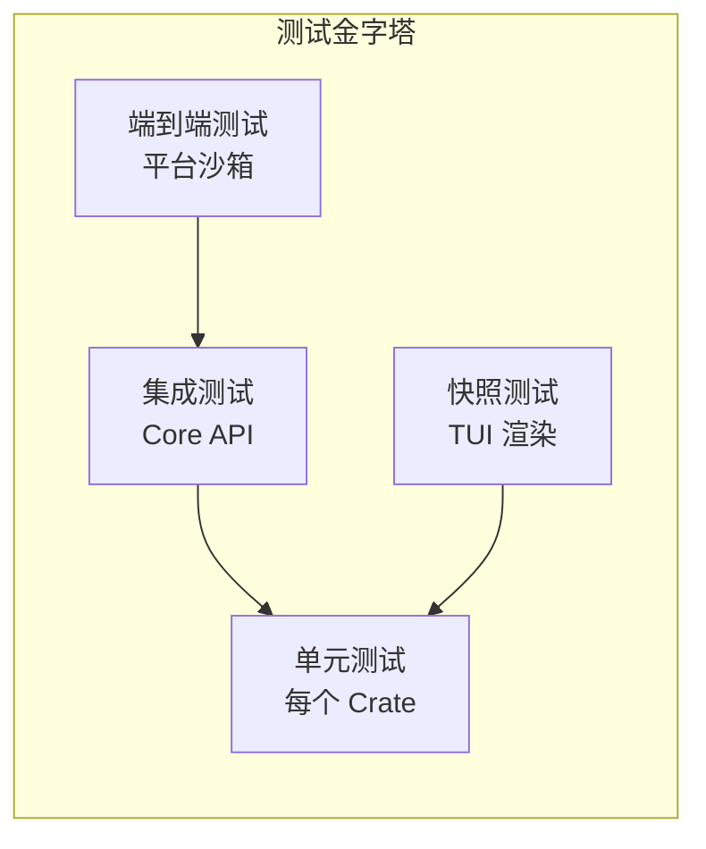
```mermaid
graph LR
    subgraph "测试金字塔"
        UNIT[单元测试<br/>每个 Crate]
        INTEGRATION[集成测试<br/>Core API]
        SNAPSHOT[快照测试<br/>TUI 渲染]
        E2E[端到端测试<br/>平台沙箱]
    end

    E2E --> INTEGRATION --> UNIT
    SNAPSHOT --> UNIT
```

### 12.2 测试工具

- `cargo-insta`: 快照测试
- `wiremock`: HTTP Mock
- `pretty_assertions`: 更好的断言输出
- `test-case`: 参数化测试

## 13. 关键设计模式

### 13.1 SQ/EQ 消息队列模式

用于解耦 UI 层与业务逻辑层，支持异步非阻塞通信。

### 13.2 策略模式

用于沙箱策略和审批策略的灵活配置。

### 13.3 工厂模式

用于创建不同平台的沙箱实现。

### 13.4 观察者模式

用于事件流的订阅与发布。

## 14. 扩展点

### 14.1 自定义 MCP Server

通过配置 `mcp_servers` 添加自定义工具：

```toml
[mcp_servers.my-tool]
command = "my-mcp-server"
args = ["--config", "path/to/config"]
```

### 14.2 自定义提示词 (AGENTS.md)

在项目根目录创建 `AGENTS.md` 文件注入自定义指令。

### 14.3 Execpolicy

创建 `.codex/execpolicy.star` 定义命令执行策略。

## 15. 总结

Codex CLI 是一个设计精良的 AI 编程代理系统，具有以下特点：

1. **模块化架构**: 48 个 Crates 分工明确，依赖关系清晰
2. **安全优先**: 多层沙箱机制、审批策略、进程加固
3. **可扩展性**: MCP 协议、Feature Flags、自定义提示词
4. **跨平台支持**: macOS/Linux/Windows 全覆盖
5. **异步设计**: 基于 Tokio 的高性能异步运行时

该架构展示了如何在保证安全性的前提下，构建一个功能强大的本地 AI Agent 系统。
