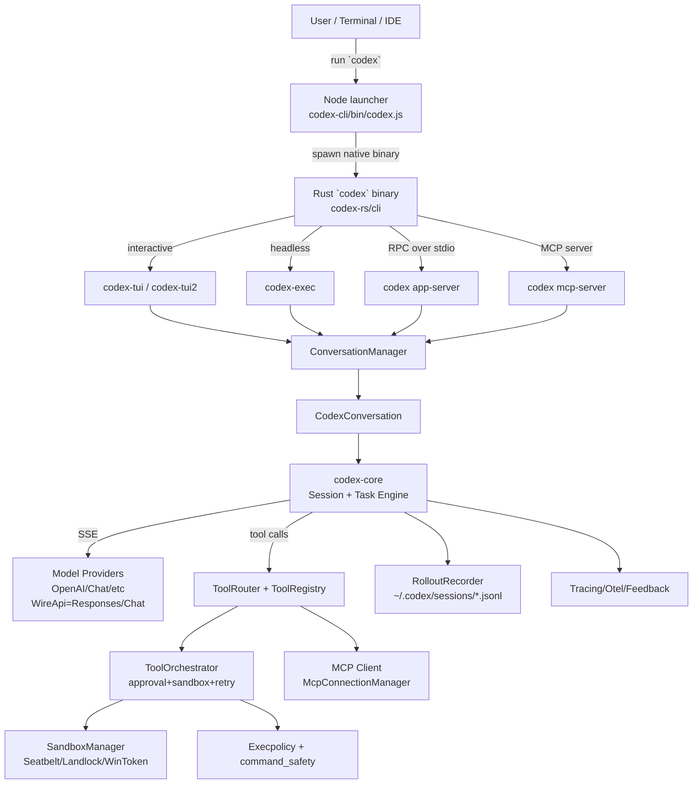
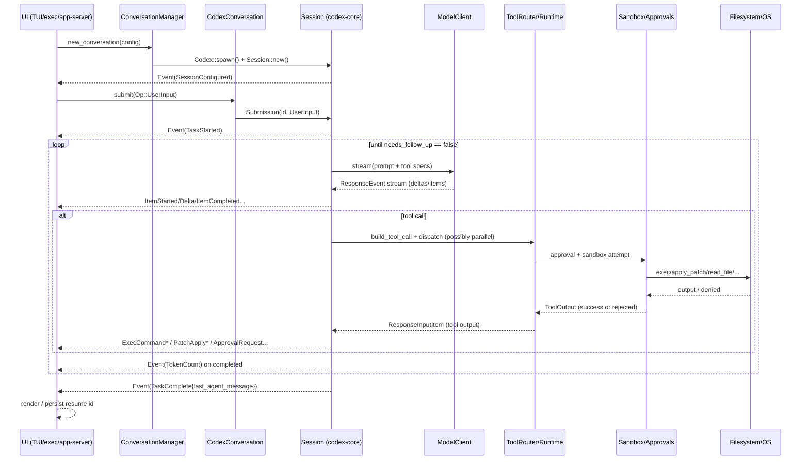
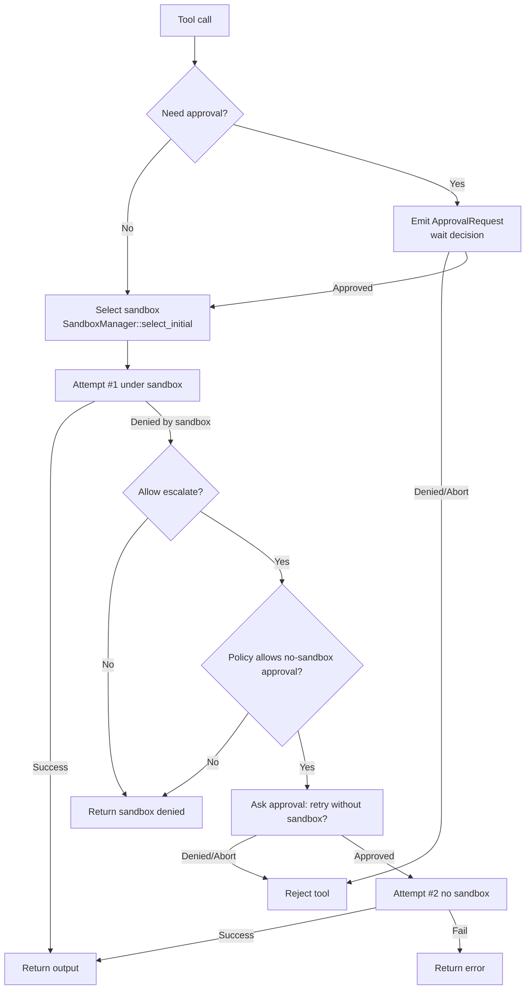

# Codex CLI 架构分析（基于 `./venders/codex` 源码）

> 范围：本文只基于当前仓库快照（`./venders/codex`）做“实现级”的架构梳理与推断；细节以代码为准。
> 目标：回答“Codex CLI 由哪些组件组成、如何启动、一次 turn 如何跑通模型与工具、沙箱/审批/扩展点如何串起来”。

---

## 0. 一句话总览

Codex CLI 是“**Node 分发壳 + Rust 原生主程序**”的组合：Node 负责选择并启动平台对应的 `codex` 原生二进制；Rust 侧通过一个**协议驱动的会话引擎**（`codex-core`，SQ/EQ 队列模型）把“UI/前端（TUI/exec/app-server/mcp-server）→ 模型流式输出 → 工具调用（含 MCP）→ 沙箱/审批/execpolicy → 事件回传与持久化（rollout）”串成端到端闭环。

---

## 1. 代码库结构（Monorepo 分层）

根目录 `./venders/codex` 主要包含四块：

1) **`codex-cli/`（Node 包壳）**
- npm 包名 `@openai/codex`，入口 `codex-cli/bin/codex.js`。
- 作用：根据 OS/CPU 选择 `vendor/<targetTriple>/codex/codex` 并 `spawn()` 执行（同时做 PATH/升级提示相关环境变量注入）。

2) **`codex-rs/`（Rust Cargo workspace：真正的 Codex CLI）**
- `cli/`：最终的 `codex` 多工具入口（`codex-rs/cli/src/main.rs`）。
- `core/`：业务核心引擎（`codex-rs/core/src/*`）。
- `tui/` + `tui2/`：交互式全屏 TUI（Ratatui），两套前端并存，`Feature::Tui2` 切换。
- `exec/`：非交互（headless）模式 `codex exec`。
- `app-server/`：IDE/富客户端使用的 JSON-RPC over stdio 服务端（类似 MCP 的“应用协议层”）。
- `mcp-server/`：让 Codex 自己作为 MCP Server（其他 MCP Client 可以把 Codex 当工具调用）。
- `linux-sandbox/`、`windows-sandbox-rs/`、`seatbelt`（在 `core` 内）：OS 级沙箱。
- `execpolicy/`：基于 Starlark 的规则引擎，用于判定命令 allow/prompt/forbidden，并可生成“建议 amendment”。

3) **`shell-tool-mcp/`（独立 MCP Server 示例/实现）**
- 用 TS 实现的 MCP server（提供 shell 工具），用于生态/示例。

4) **`sdk/`（TypeScript SDK 等）**
- 便于把 Codex 能力嵌入别的自动化脚本或产品。

---

## 2. 交付与启动链路：Node 壳如何拉起 Rust 核心

### 2.1 Node 包壳（npm 分发）
入口：`venders/codex/codex-cli/bin/codex.js`

关键点：
- 通过 `process.platform` 与 `process.arch` 选择 `targetTriple`（例如 macOS arm64 → `aarch64-apple-darwin`）。
- 二进制路径：`codex-cli/vendor/<triple>/codex/codex`（Windows 为 `codex.exe`）。
- 将 `vendor/<triple>/path`（若存在）追加到 `PATH`，用于提供额外依赖（如随包分发的辅助工具）。
- 注入环境变量：
  - `CODEX_MANAGED_BY_NPM=1` 或 `CODEX_MANAGED_BY_BUN=1`（用于后续“自升级”提示/命令选择）。
- 用异步 `spawn()`，并转发 `SIGINT/SIGTERM/SIGHUP` 给子进程，保证 Ctrl-C 等行为一致。

### 2.2 Rust 主入口（多工具 CLI）
入口：`venders/codex/codex-rs/cli/src/main.rs`

核心结构：
- Clap 解析 `MultitoolCli`：
  - 默认无子命令：进入交互式 TUI（`codex_tui::run_main` 或 `tui2::run_main`）。
  - 子命令：`exec`、`login/logout`、`mcp/mcp-server`、`app-server`、`sandbox`、`apply`、`resume` 等。
- `#[ctor::ctor]` 在 release 模式启用 `codex-process-hardening`（禁 core dump / 禁 ptrace attach / 清理 `LD_*`、`DYLD_*` 等）。

### 2.3 “单二进制多功能”的 Arg0/Arg1 分发技巧
入口：`venders/codex/codex-rs/arg0/src/lib.rs`

目标：在只发一个 `codex` 二进制的前提下，“模拟”多个可执行文件：
- 若 argv0 的文件名是 `codex-linux-sandbox` → 直接执行 Linux 沙箱逻辑（Landlock + seccomp）。
- 若 argv0 是 `apply_patch` / `applypatch` → 直接执行 `codex-apply-patch`。
- 若 argv1 是 `--codex-run-as-apply-patch`（`codex_core::CODEX_APPLY_PATCH_ARG1`）→ 以“内置子模式”运行 apply_patch。

实现方式：
- 进程启动非常早期创建临时目录，把当前 executable 做成 `apply_patch`（以及 linux 下的 `codex-linux-sandbox`）的 symlink（Windows 下写 `.bat`），并把该目录 prepend 到 `PATH`。
- 加载 `~/.codex/.env`，但**过滤掉**任何以 `CODEX_` 开头的变量（安全防线，避免影响内部控制变量）。

---

## 3. 核心运行时组件图



---

## 4. Codex 的“协议内核”：SQ/EQ（Submission Queue / Event Queue）

协议类型定义：`venders/codex/codex-rs/protocol/src/protocol.rs`

设计要点：
- **输入是 `Submission { id, op: Op }`**：前端把用户动作/控制指令编码成 `Op`，通过 channel 发给核心。
- **输出是 `Event { id, msg: EventMsg }`**：核心把模型 token 流、工具执行、审批请求、告警/错误等统一编码为事件流。
- 这是一个标准的 actor/队列模型：前端不直接调用“业务函数”，而是驱动 `Op` 并消费 `EventMsg`，天然适配 TUI、headless、RPC server 等多种外壳。

常见 `Op`（节选）：
- `UserInput { items }` / `UserTurn { items + 运行时上下文 }`
- `Interrupt` / `Shutdown`
- `ExecApproval { id, decision }` / `PatchApproval { ... }`
- `OverrideTurnContext { cwd/model/sandbox/approval/... }`
- `ListMcpTools` / `ListSkills` / `ListCustomPrompts`
- `Compact` / `Undo` / `Review { ... }`

常见 `EventMsg`（节选）：
- 会话：`SessionConfigured`、`ShutdownComplete`
- 任务：`TaskStarted`、`TaskComplete`、`TurnAborted`
- 内容流：`ItemStarted/ItemCompleted`、`AgentMessageContentDelta`、`Reasoning*Delta`
- 工具：`ExecCommandBegin/Delta/End`、`ApplyPatchApprovalRequest`、`McpToolCallBegin/End`
- 其他：`TokenCount`、`DeprecationNotice`、`PlanUpdate`

> 这套协议也是 `codex app-server` 与 `codex mcp-server` 做桥接的基础：它们本质上是把 `EventMsg` 再映射成各自的 JSON-RPC 通知/响应。

---

## 5. 会话与任务模型：`Codex::spawn → Session → submission_loop → Task`

核心入口：`venders/codex/codex-rs/core/src/codex.rs`

### 5.1 顶层 API：`Codex` 是一对队列句柄
`pub struct Codex { tx_sub, rx_event, next_id }`
- `submit(op)`：为 `op` 分配 id，送入 submission channel。
- `next_event()`：从 event channel 取下一条事件。

### 5.2 `Session::new` 做了哪些初始化
`Session::new(...)` 关键行为（强相关代码在 `core/src/codex.rs`）：
- 根据 `InitialHistory` 决定是新会话还是 resume（复用 conversation_id / rollout_path）。
- 并行初始化：
  - `RolloutRecorder`（持久化 JSONL 的 writer task）
  - `message_history` 元信息（跨会话历史）
  - MCP OAuth 状态计算
- 创建 `SessionServices`：
  - `McpConnectionManager`（读写锁包着的 manager）
  - `UnifiedExecSessionManager`（PTY 会话管理）
  - `UserNotifier`（通知脚本/Windows toast 等）
  - `ExecPolicyManager`（execpolicy）
  - `SkillsManager`
  - `OtelManager`
  - `tool_approvals`（`ApprovalStore`，用于“批准一次=会话内复用”）
- **先发出 `SessionConfigured`**（这是 `ConversationManager::finalize_spawn` 强校验的第一条事件），然后再继续初始化 MCP、record_initial_history 等可能产生额外事件的工作。

### 5.3 `submission_loop`：单点串行处理所有 Op
`async fn submission_loop(sess, config, rx_sub)`
- 在一个 Tokio task 中循环 recv submission，然后分发给 handlers：
  - 用户输入/turn：`handlers::user_input_or_turn`
  - `Interrupt/Shutdown`：取消当前 task
  - 审批结果：`exec_approval` / `patch_approval`
  - `Compact/Undo/Review/...`：spawn 对应任务

并发模型：
- Session “同一时刻最多一个 running task”（见 `Session::spawn_task`：会先 `abort_all_tasks` 再启动新任务）。
- 任务用 `CancellationToken` + `AbortOnDropHandle` 组合，保证可中断且资源可回收。

```mermaid
stateDiagram-v2
  [*] --> Idle
  Idle --> Running: Op::UserInput / UserTurn
  Running --> Running: Follow-up turn<br/>(tool calls need follow_up)
  Running --> Aborting: Op::Interrupt / Op::Shutdown
  Aborting --> Idle: TurnAborted/cleanup
  Running --> Idle: TaskComplete
```

---

## 6. 一次 Turn 的端到端序列（模型流 + 工具回路）

关键代码：
- `core/src/codex.rs`：`run_task` / `run_turn` / `try_run_turn`
- `core/src/tools/*`：工具路由/并发/审批/沙箱

### 6.1 逻辑分层
- **Task 层**（如 `RegularTask`）：决定“做什么工作流”（普通对话/compact/review/undo/...）。
- **Turn 层**（`run_turn/try_run_turn`）：执行一次模型 turn；解析流式事件；触发工具；决定是否需要 follow-up。
- **Tool 层**：把模型输出的 tool call 转为实际副作用，并把结果包装回 `ResponseInputItem` 供模型继续。

### 6.2 时序图（简化版）



### 6.3 follow-up 的来源
`try_run_turn` 的主循环在接收到 `ResponseEvent::OutputItemDone(...)` 时：
- 解析 `ResponseItem`（message/reasoning/function_call/local_shell_call/...）。
- 若是 tool call：把 tool future 放进 `in_flight`（`FuturesOrdered`），并标记 `needs_follow_up = true`。
- `ResponseEvent::Completed` 触发：
  - 更新 token usage；
  - drain 掉 `in_flight`，把工具输出作为下一轮 prompt 的输入（follow-up）；
  - 需要时发送 `TurnDiff`（从 `TurnDiffTracker` 生成 unified diff）。

---

## 7. 工具系统：声明（spec）→ 路由（router）→ 执行（runtime）

### 7.1 工具是“配置化生成”的
入口：`core/src/tools/spec.rs`

`ToolsConfig::new(model_family + features)` 决定是否启用：
- shell 工具：`shell` / `shell_command` / `unified_exec`（取决于 `Feature::ShellTool`、`Feature::UnifiedExec`、平台能力等）
- `apply_patch`（freeform 或 function 形态，取决于模型家族能力与 feature）
- `web_search_request`、`view_image` 等
- 同时会融合 MCP server 提供的 tools（见 `run_turn` 内 `mcp_connection_manager.list_all_tools()`）

工具 spec 的形态：
- 对 Responses API：构造 JSON Schema 参数定义（Function tool）。
- 对 Chat Completions：同样需要 tools JSON，但不支持 output_schema（代码里会拒绝）。

### 7.2 路由：从模型输出到具体 handler
入口：`core/src/tools/router.rs`

`ToolRouter::build_tool_call(session, ResponseItem)`：
- `ResponseItem::FunctionCall`：
  - 若 name 是 MCP 全限定名（`mcp__<server>__<tool>`）→ `ToolPayload::Mcp`
  - 否则 → `ToolPayload::Function`
- `ResponseItem::CustomToolCall` → `ToolPayload::Custom`
- `ResponseItem::LocalShellCall` → 标准化成 `tool_name="local_shell"` + `ShellToolCallParams`

`ToolRouter::dispatch_tool_call(...)`：
- 委托给 `ToolRegistry` 查找 `ToolHandler` 并执行。
- 非致命错误会返回 “failure_response” 给模型（而不是直接崩溃 session）。

### 7.3 并发：哪些 tool 可以并行
入口：`core/src/tools/parallel.rs`

`ToolCallRuntime` 内部维护一个 `RwLock<()>`：
- **支持并行的工具**：拿 `read()`，可以同时跑多个。
- **不支持并行的工具**：拿 `write()`，串行互斥（例如会修改共享状态或需要稳定输出的工具）。

这是一个“轻量并发闸门”，比在每个工具里手写互斥更可控。

### 7.4 典型内置工具（core 内）
对应 handler 在 `core/src/tools/handlers/*`：
- 文件只读：`read_file`、`list_dir`、`grep_files`
- 变更：`apply_patch`（内部会触发 patch 审批/预览流程）
- 执行：`shell` / `shell_command`、`unified_exec`
- 计划：`update_plan`（对接前端的 plan UI/状态）
- MCP 资源：`list_mcp_resources` / `read_mcp_resource` / `list_mcp_resource_templates`
- 图片：`view_image`

---

## 8. 审批 + 沙箱 + execpolicy：工具执行的安全主链路

这部分是 Codex CLI 的“安全架构骨架”，关键入口集中在：
- `core/src/tools/orchestrator.rs`
- `core/src/tools/sandboxing.rs`
- `core/src/sandboxing/mod.rs`
- `core/src/command_safety/*`
- `codex-rs/execpolicy/*`

### 8.1 两类策略：ApprovalPolicy 与 SandboxPolicy

1) `AskForApproval`（何时弹窗/询问用户）
- `Never`：绝不询问
- `OnFailure`：失败时才询问（但工具是否实现“失败→提权重试”也受控）
- `OnRequest`：当模型/工具明确请求“提权/无沙箱”时才询问（也是 Codex CLI 默认交互哲学之一）
- `UnlessTrusted`：更保守，默认询问（与 trust/workspace 机制配合）

2) `SandboxPolicy`（工具执行在哪个隔离级别）
- `ReadOnly`
- `WorkspaceWrite { writable_roots, network_access, ... }`
- `DangerFullAccess`
- `ExternalSandbox { network_access }`（认为外部环境已隔离，Codex 内不再强制平台沙箱）

### 8.2 ToolOrchestrator：统一编排“批准→执行→必要时升级重试”
入口：`core/src/tools/orchestrator.rs`

伪流程：
1. 决定是否需要 approval（默认逻辑在 `default_exec_approval_requirement`，工具也可自定义）。
2. 选择首次沙箱类型（`SandboxManager::select_initial`）：
   - 受 `SandboxPolicy`、工具 `SandboxablePreference`、平台能力影响。
3. 第一次尝试在沙箱中执行。
4. 若判定为 sandbox denial：
   - 若 policy/工具允许：发起“是否在无沙箱下重试”的二次 approval（`ApprovedForSession` 会写入 `ApprovalStore` 复用）。
   - 第二次尝试 `SandboxType::None` 执行。



### 8.3 SandboxManager：把“可移植命令”变成“平台执行环境”
入口：`core/src/sandboxing/mod.rs`

它把 `CommandSpec { program,args,cwd,env,expiration,sandbox_permissions,... }`
转换成 `ExecEnv { command, env, sandbox, arg0_override, ... }`：
- **macOS**：`/usr/bin/sandbox-exec` + seatbelt policy（见 `core/src/seatbelt*.sbpl`、`core/src/seatbelt.rs`）
- **Linux**：包装成 `codex-linux-sandbox ... <cmd>`（并把 arg0 覆写为 `codex-linux-sandbox`，配合 arg0 分发）
- **Windows**：restricted token（在 `exec.rs` 分支走 `codex-windows-sandbox`）
- 同时在 env 注入 `CODEX_SANDBOX_NETWORK_DISABLED` 等信号供子进程/工具链识别。

### 8.4 execpolicy 与危险命令启发式

1) 启发式：`core/src/command_safety/is_dangerous_command.rs`
- 在 `AskForApproval::OnRequest` 但 `DangerFullAccess/ExternalSandbox` 场景下，也会对 “明显危险命令” 强制提示（例如 `rm -rf`、`git reset --hard`）。
- 支持解析 `bash -lc "..."` 这类包装命令并深入检查内部子命令。

2) 规则引擎：`codex-rs/execpolicy`
- 使用 Starlark 语法的 `prefix_rule(pattern=[...], decision=allow|prompt|forbidden, match/not_match=...)`。
- `match/not_match` 在加载时校验（像内建单元测试），减少策略漂移。
- 核心会将 execpolicy 的结果折叠进 “是否需要 approval / 是否 forbidden / 建议 amendment”。

---

## 9. “指令注入”与可扩展技能（Skills）体系

这部分解决两类问题：
1) **项目/组织规则注入**（AGENTS.md / 环境上下文）
2) **可分发的技能包**（system/user/repo/admin 多级 skills）

### 9.1 AGENTS.md / Environment Context 的注入形式

核心实现见：
- `core/src/user_instructions.rs`：把 AGENTS.md 规则编码为一条 `ResponseItem::Message(role="user")`，文本以 `# AGENTS.md instructions for ...` 开头，并包裹 `<INSTRUCTIONS>...</INSTRUCTIONS>`。
- `core/src/environment_context.rs`：把 `cwd/approval_policy/sandbox_mode/network_access/writable_roots/shell` 编码为 `<environment_context>...</environment_context>` XML，并作为 user message 注入。

注入策略（从 `handlers::user_input_or_turn` 可见）：
- 只有当 turn 的环境发生变化（cwd/sandbox/approval 等）时，才追加 environment_context update，避免每次 turn 都占用上下文。

### 9.2 Skills 的发现与优先级
代码：`core/src/skills/loader.rs`

skills 根目录与优先级（按 name 去重，保留**最先出现**的那个）：
1. Repo：`<repo>/.codex/skills/**/SKILL.md`
2. User：`~/.codex/skills/**/SKILL.md`
3. System：system cache（由 `install_system_skills` 维护）
4. Admin（Unix）：`/etc/codex/skills/**/SKILL.md`

解析方式：
- 每个 skill 文件必须包含 YAML frontmatter（`---` 分隔），至少 `name` 与 `description`。
- 过滤隐藏文件、symlink，限制字段长度，尽量避免注入过大/异常内容。

### 9.3 Skills 的触发与注入（当前实现：显式选择）
代码：`core/src/skills/injection.rs`

当前 `build_skill_injections` 只会处理显式 `UserInput::Skill { name, path }`：
- TUI 会在用户选择 skill 后把它作为 `UserInput::Skill` 放进 `items`（见 `tui/src/chatwidget.rs` 的相关逻辑）。
- core 读取 `SKILL.md` 全文，并把内容包成 `<skill>...</skill>` 形式的 user message 注入到当次 turn。

> 这意味着：core 本身不做“自然语言匹配触发 skill”，而把触发逻辑留给前端（或未来扩展）。

---

## 10. MCP：Codex 同时是 Client 与 Server

### 10.1 MCP Client（连接外部工具服务器）
核心：`core/src/mcp_connection_manager.rs`

关键设计：
- 以配置中的 server name 为 key，维护多个 `RmcpClient`。
- 把所有 server 的 tools “扁平化”成一个 map，对模型暴露的工具名是：
  - `mcp__<server>__<tool>`（并保证只含 `[a-zA-Z0-9_-]`，长度超限会 hash 截断）。
- 启动阶段会初始化并 list tools，同时通过 `McpStartupUpdate/Complete` 事件向前端报告进度。

资源类工具（core 内置 function tools）：
- `list_mcp_resources`
- `list_mcp_resource_templates`
- `read_mcp_resource`

### 10.2 MCP Server（让别人把 Codex 当工具）
入口：`codex mcp-server` → `codex-rs/mcp-server/src/lib.rs`

实现方式：
- JSON-RPC message loop over stdio（读 stdin 行 → 解析 `JSONRPCMessage`；写 stdout 行）。
- 内部用 `ConversationManager` 启动/复用会话，把 MCP `tools/call` 请求映射成 `Op::UserInput`。
- 在事件流中遇到：
  - `ExecApprovalRequest` → 转成 MCP elicitation/approval 交互并回写 `Op::ExecApproval`
  - `ApplyPatchApprovalRequest` 同理
  - `TaskComplete` → 作为 MCP tool call 的最终 response 返回

这使得 MCP 客户端可以把 Codex 视为“可调用的工具型 agent”，同时仍复用 Codex 的沙箱/审批/execpolicy 机制。

---

## 11. App Server：给 IDE/富客户端的“稳定协议层”

入口：`codex app-server` → `codex-rs/app-server/*`（协议定义在 `codex-app-server-protocol`）

特点：
- 同样是 JSON-RPC 2.0 over stdio（但省略 `"jsonrpc":"2.0"` 字段）。
- 抽象为三层对象：`Thread`（会话）→ `Turn`（一次交互）→ `Item`（消息、reasoning、工具调用、patch 等）。
- 能生成与版本绑定的 schema：
  - `codex app-server generate-ts`
  - `codex app-server generate-json-schema`

从架构上看，它是一个“更产品化”的 RPC 外壳：比 TUI 更稳定可集成，比 MCP 更贴近 Codex 自身的 thread/turn/item 事件语义。

---

## 12. 持久化与可回放：Rollout JSONL

核心：`core/src/rollout/*`

机制：
- 每个会话在 `~/.codex/sessions/` 下生成一个 `.jsonl`，由 `RolloutRecorder` 的后台 writer task 负责写入。
- 文件通常包含：
  - `SessionMeta`（含 id/timestamp/cwd/originator/cli_version/instructions/source/model_provider）
  - `ResponseItem`（用户/助手/工具调用等）
  - `TurnContext`、`Compacted`、`EventMsg`（部分事件/状态也会入库，且有过滤策略）
- `codex resume`/TUI 恢复会话：通过读取 rollout 并构造 `InitialHistory::Resumed` 还原上下文。
- `thread/list/archive`（app-server）本质上也是对 rollout 文件的发现与移动/归档。

---

## 13. 可观测性（Tracing / OTEL / Feedback）

核心位置：
- `core/src/otel_init.rs` + `codex-otel`：构建 OTEL exporter/layers。
- 多个前端（tui/exec/mcp-server）都会安装 tracing subscriber，并按需叠加 OTEL layer。
- `ModelClient` 在处理 Responses/Chat SSE stream 时会将事件打点到 OTEL（例如 `record_responses`）。
- 工具输出为 telemetry 预览会做截断（`TELEMETRY_PREVIEW_MAX_BYTES/lines`），避免 log 过大影响模型预算与性能。

---

## 14. 安全性小结（从源码能看到的“防线”）

1) **进程硬化**：`codex-process-hardening`（release 默认启用）
- 禁用 core dump、禁 ptrace attach、清理 `LD_*`/`DYLD_*` 等高风险环境变量。

2) **dotenv 安全**：`arg0` 只允许 `~/.codex/.env` 注入非 `CODEX_` 变量。

3) **多层执行控制**
- 启发式危险命令识别（`command_safety`）
- execpolicy 规则引擎（允许组织/用户以规则方式声明 allow/prompt/forbidden）
- ToolOrchestrator 的审批+沙箱+必要时升级重试
- 平台沙箱（Seatbelt/Landlock/Windows restricted token）与网络禁用标志

4) **文件变更的显式通道**
- `apply_patch` 有独立解析/执行器（严格 patch grammar + 显式调用），并在核心侧可触发 patch approval 流程。

---

## 15. 读完源码后的“架构要点”总结

- **核心可复用**：`codex-core` 把“agent 引擎”抽成库，多个前端只是驱动 Op/消费 Event。
- **协议优先**：SQ/EQ 让交互、自动化、RPC server 统一语义，避免 UI 与业务强耦合。
- **工具执行是强架构主线**：工具→审批→沙箱→重试→事件，全部走 `ToolOrchestrator`，便于统一安全策略与审计。
- **MCP 双向集成**：作为 client 接入生态工具；作为 server 把 Codex 输出为“可调用 agent 工具”。
- **持久化默认开启**：rollout JSONL 是可回放/可审计的事实来源，也支撑 resume/列表/归档等体验。

---

## 附：关键入口速查

- Node 启动：`venders/codex/codex-cli/bin/codex.js`
- Rust 主 CLI：`venders/codex/codex-rs/cli/src/main.rs`
- Arg0 分发：`venders/codex/codex-rs/arg0/src/lib.rs`
- 核心引擎：`venders/codex/codex-rs/core/src/codex.rs`
- 协议类型：`venders/codex/codex-rs/protocol/src/protocol.rs`
- 工具编排：`venders/codex/codex-rs/core/src/tools/orchestrator.rs`
- 沙箱转换：`venders/codex/codex-rs/core/src/sandboxing/mod.rs`
- Skills：`venders/codex/codex-rs/core/src/skills/*`
- MCP：`venders/codex/codex-rs/core/src/mcp_connection_manager.rs`、`venders/codex/codex-rs/mcp-server/src/*`
- App Server：`venders/codex/codex-rs/app-server/*`
