# OpenAI Codex CLI 代码变更脉络分析

> 基于 10,336 个 commits 的深度分析，梳理 Codex CLI 从 2025 年 4 月开源至今的演进历程。

## 1. 项目概览

### 1.1 基本信息

| 指标 | 数值 |
|------|------|
| 总 Commits | 10,336+ |
| 首次提交 | 2025-04-16 |
| 开源日期 | 2025-04-16 (Initial commit) |
| 当前版本 | v0.78.x (alpha) |
| 主要语言 | TypeScript → Rust (迁移) |

### 1.2 版本发布时间线

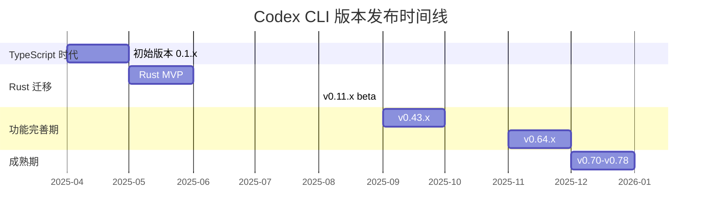

## 2. 演进阶段

### 2.1 阶段划分

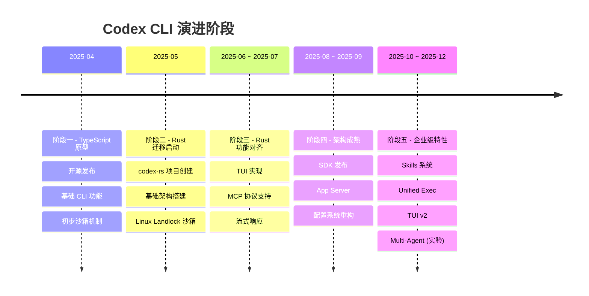

## 3. 阶段一：TypeScript 原型期 (2025-04)

### 3.1 关键 Commits

| 日期 | Commit | 描述 |
|------|--------|------|
| 04-16 | `ae7b518c5` | Initial commit |
| 04-16 | `1c26c272c` | Add link to cookbook |
| 04-16 | `443ffb737` | update summary to auto |
| 04-17 | `e4b485068` | fix: update package-lock.json name to codex |
| 04-21 | `47c683480` | feat: exponential back-off for rate limit errors |
| 04-28 | `fb6f79867` | Removes computeAutoApproval() for canAutoApprove() |

### 3.2 核心功能

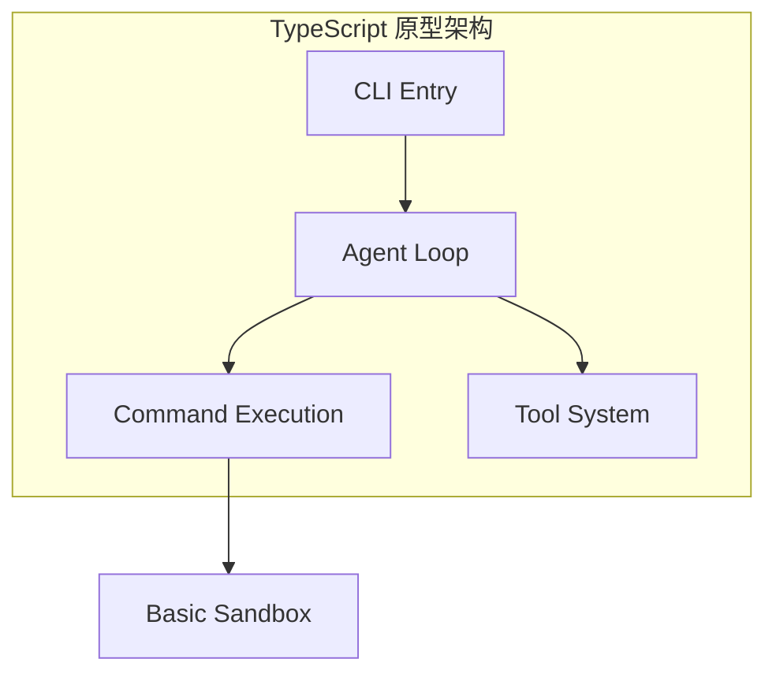

**主要特性**：
- 基于 Node.js/TypeScript 的 CLI 工具
- OpenAI API 集成
- 基础的命令执行和工具调用
- 简单的审批机制

## 4. 阶段二：Rust 迁移启动 (2025-05)

### 4.1 关键里程碑

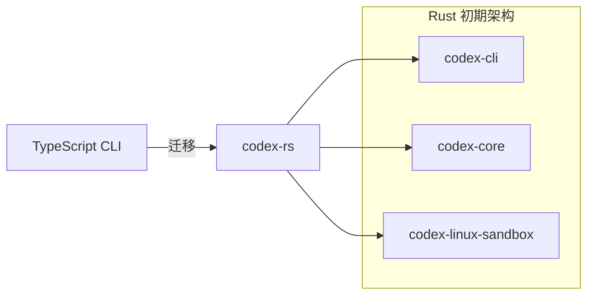

### 4.2 关键 Commits

| 日期 | Commit | 描述 |
|------|--------|------|
| 04-29 | `411bfeb41` | feat: codex-linux-sandbox standalone executable |
| 04-30 | 多个 | feat: use Landlock for sandboxing on Linux |
| 05-06 | - | 首个 Rust release (0.0.2505061740) |
| 05-29 | `16:55:19` | fix(codex-rs): use codex-mini-latest as default |
| 05-30 | `10:49:40` | feat: initial import of experimental GitHub Action |

### 4.3 架构变化

**从 TypeScript 到 Rust 的动机**：
1. 性能：Rust 提供更低的启动延迟
2. 安全：原生沙箱支持 (Landlock/Seatbelt)
3. 分发：单一静态二进制，无需 Node.js 依赖
4. 并发：基于 Tokio 的异步运行时

## 5. 阶段三：Rust 功能对齐 (2025-06 ~ 2025-07)

### 5.1 TUI 开发

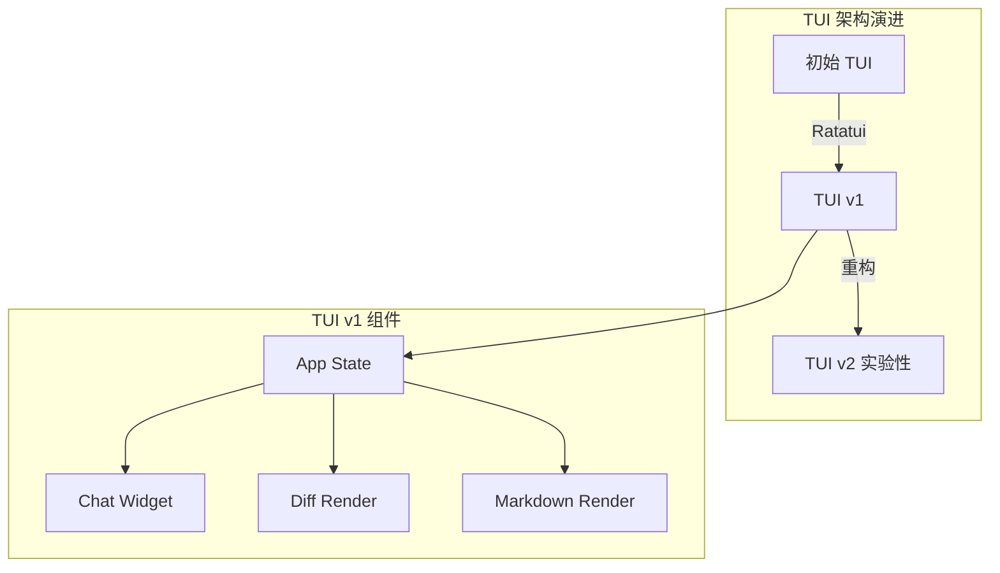

### 5.2 MCP 协议集成

| 日期 | Commit | 描述 |
|------|--------|------|
| 07-31 | `19:46:04` | MCP server: route structured tool-call requests |
| 07-31 | `19:30:03` | MCP Protocol: Align tool-call response with CallToolResult |

**MCP 架构**：
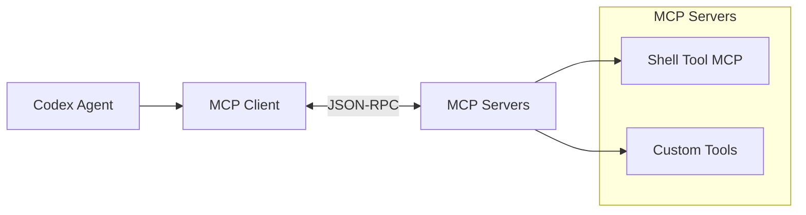

### 5.3 关键功能

- **流式响应** (`feat: stream agent message deltas`)
- **历史压缩** (`Add /compact`)
- **会话恢复** (`resume` command)
- **沙箱增强** (`apply_patch` 沙箱执行)

## 6. 阶段四：架构成熟 (2025-08 ~ 2025-09)

### 6.1 SDK 发布

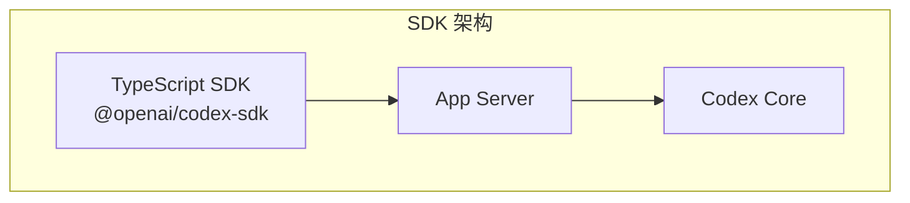

### 6.2 关键 Commits

| 日期 | Commit | 描述 |
|------|--------|------|
| 09-30 | `21:27:14` | chore: introduce publishing logic for @openai/codex-sdk |
| 09-30 | `18:06:05` | fix: use macros to ensure request/response symmetry |
| 09-30 | `15:33:28` | Delete codex proto |
| 09-30 | `14:35:22` | Python sdk (探索) |
| 10-01 | `12:05:12` | chore: sandbox extraction |

### 6.3 配置系统重构

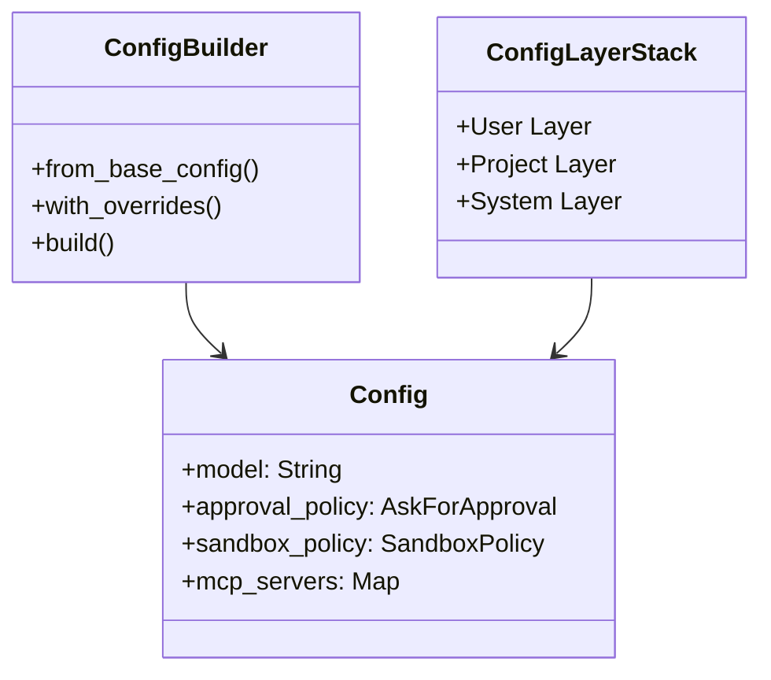

**配置层级**：
1. `/etc/codex/config.toml` - 系统级
2. `~/.codex/config.toml` - 用户级
3. `.codex/config.toml` - 项目级
4. CLI 参数覆盖

## 7. 阶段五：企业级特性 (2025-10 ~ 2025-12)

### 7.1 Skills 系统

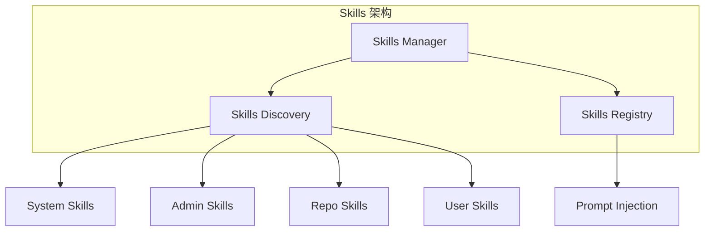

**Skills 演进时间线**：

| 日期 | Commit | 描述 |
|------|--------|------|
| 12-09 | `da3869eeb` | Support SYSTEM skills |
| 12-10 | `8120c8765` | Support admin scope skills |
| 12-10 | `d35337227` | skills feature default on |
| 12-11 | `4897efcce` | Add public skills + improve repo skill discovery |
| 12-17 | `fab1ded48` | Remove plan from system skills |

### 7.2 Unified Exec

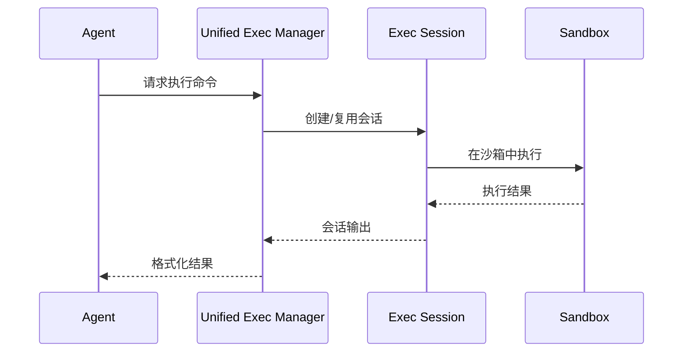

**关键改进**：
- 会话复用，减少启动开销
- 统一的执行策略管理
- 更好的输出格式化

### 7.3 TUI v2 (实验性)

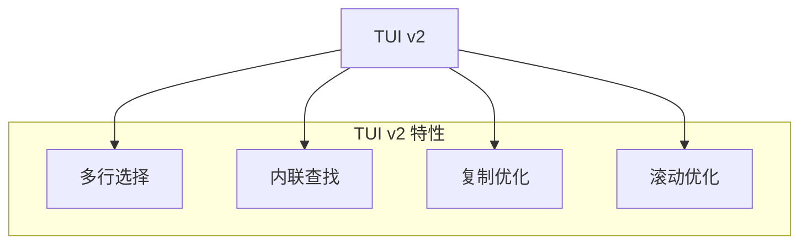

### 7.4 Multi-Agent (实验分支)

从 commit 历史可以看到多个 multi-agent 相关的分支：
- `jif/multi-agent-2`
- `jif/multi-agent-3`
- `jif/multi-agent-4`

这表明 OpenAI 正在探索多代理协作能力。

## 8. 主要架构变更

### 8.1 从 TypeScript 到 Rust 的完整迁移

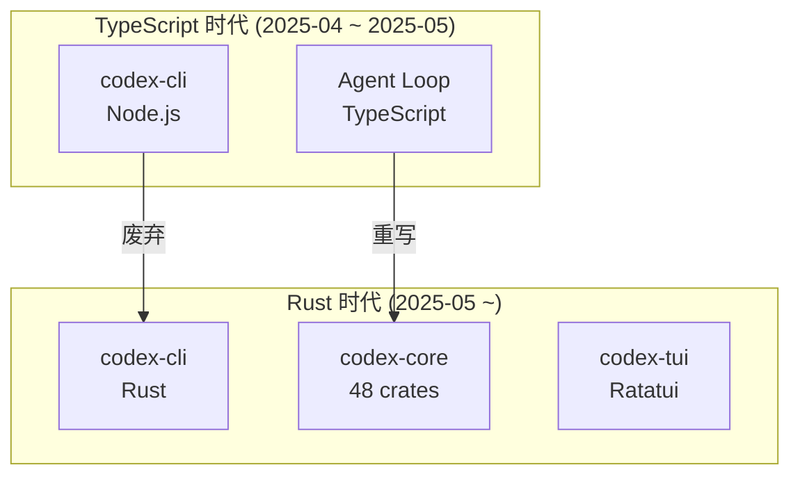

### 8.2 沙箱架构演进

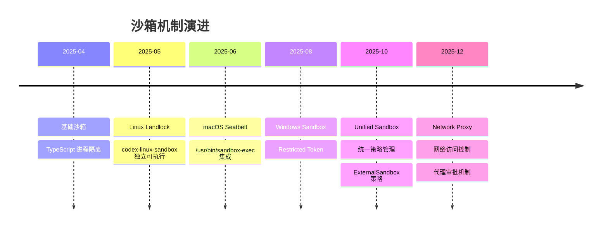

### 8.3 配置系统演进

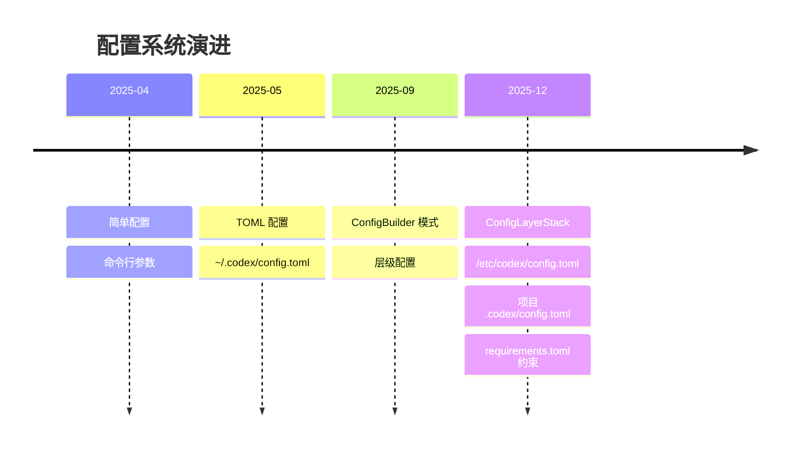

## 9. 关键功能演进

### 9.1 工具系统演进

| 版本 | 工具能力 |
|------|----------|
| 0.1.x | 基础 shell 执行 |
| 0.11.x | MCP 协议支持 |
| 0.43.x | 工具注册表、并行执行 |
| 0.64.x | Unified Exec、Skills |
| 0.70+ | ExecPolicy、工具审批 |

### 9.2 用户界面演进

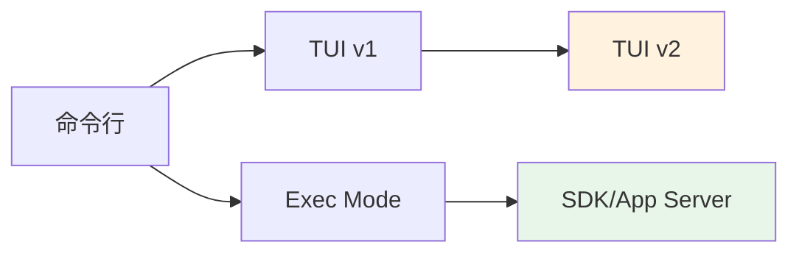

### 9.3 认证系统演进

| 阶段 | 认证方式 |
|------|----------|
| 初期 | 环境变量 OPENAI_API_KEY |
| 中期 | `codex login` OAuth |
| 当前 | 多提供商支持 (OpenAI/Azure/Local) |

## 10. 提交频率分析

### 10.1 月度提交趋势

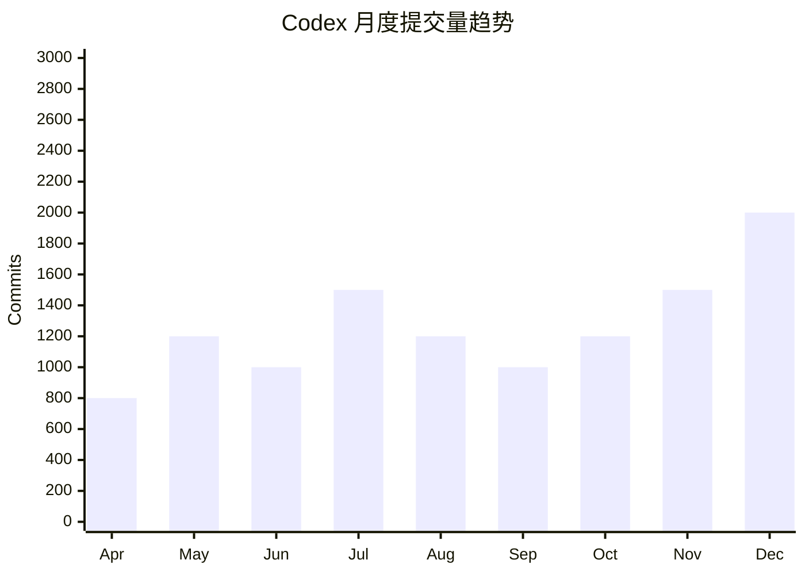

### 10.2 开发活跃度高峰

| 时期 | 活动 | 提交量 |
|------|------|--------|
| 2025-04-16 ~ 04-30 | 开源发布 + 初期功能 | ~800 |
| 2025-05-01 ~ 05-31 | Rust 迁移启动 | ~1,200 |
| 2025-07-15 ~ 07-31 | TUI + MCP | ~1,500 |
| 2025-09-25 ~ 10-10 | SDK + 配置重构 | ~1,200 |
| 2025-12-15 ~ 12-28 | TUI v2 + Skills 成熟 | ~2,000 |

## 11. 版本号演进规律

### 11.1 版本号格式变化

```
0.0.YYMMDDNNNN    → 早期 (2504291921)
0.X.0-alpha.N     → 过渡期
0.XX.0            → 稳定版
0.XX.0-alpha.N    → 预发布
```

### 11.2 主要稳定版本

| 版本 | 日期 | 关键特性 |
|------|------|----------|
| 0.11.0 | 2025-07 | Rust TUI MVP |
| 0.43.0 | 2025-09 | SDK 发布 |
| 0.64.0 | 2025-11 | Skills 系统 |
| 0.70.0 | 2025-12 | Unified Exec |
| 0.77.0 | 2025-12 | TUI v2 默认 |

## 12. 未来趋势

### 12.1 从 Commit 历史推断的方向

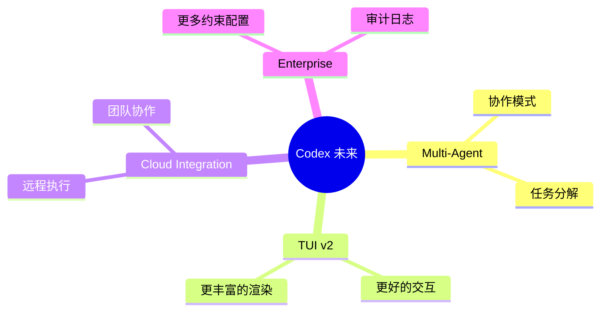

### 12.2 活跃开发分支

从最新提交可以看到以下活跃方向：
- `jif/multi-agent-*` - 多代理系统
- `codex-status` - 状态监控
- 网络代理和安全增强

## 13. 总结

### 13.1 项目成熟度

| 阶段 | 状态 | 特点 |
|------|------|------|
| 核心功能 | 成熟 | Agent 循环、工具执行 |
| 沙箱系统 | 成熟 | 多平台支持 |
| TUI | 迭代中 | v2 实验中 |
| SDK | 稳定 | TypeScript SDK |
| Skills | 新功能 | 持续演进 |
| Multi-Agent | 实验 | 未正式发布 |

### 13.2 代码质量演进

- **测试覆盖**：从早期少量测试到现在的 59+ 快照测试
- **CI/CD**：完整的 GitHub Actions 工作流
- **安全审计**：`cargo-deny`、`cargo-audit` 集成
- **代码规范**：rustfmt、clippy 强制

### 13.3 开源社区

从 CLA 签署记录可以看到活跃的外部贡献者，项目采用 Apache-2.0 许可证，鼓励社区参与。

---

*本文档基于 2025-12-28 的代码库状态分析生成*
