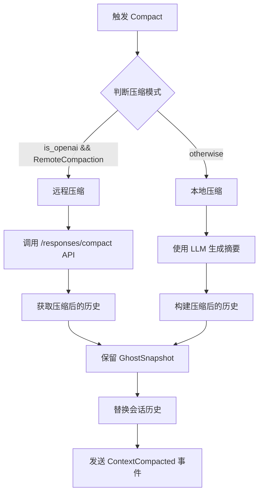
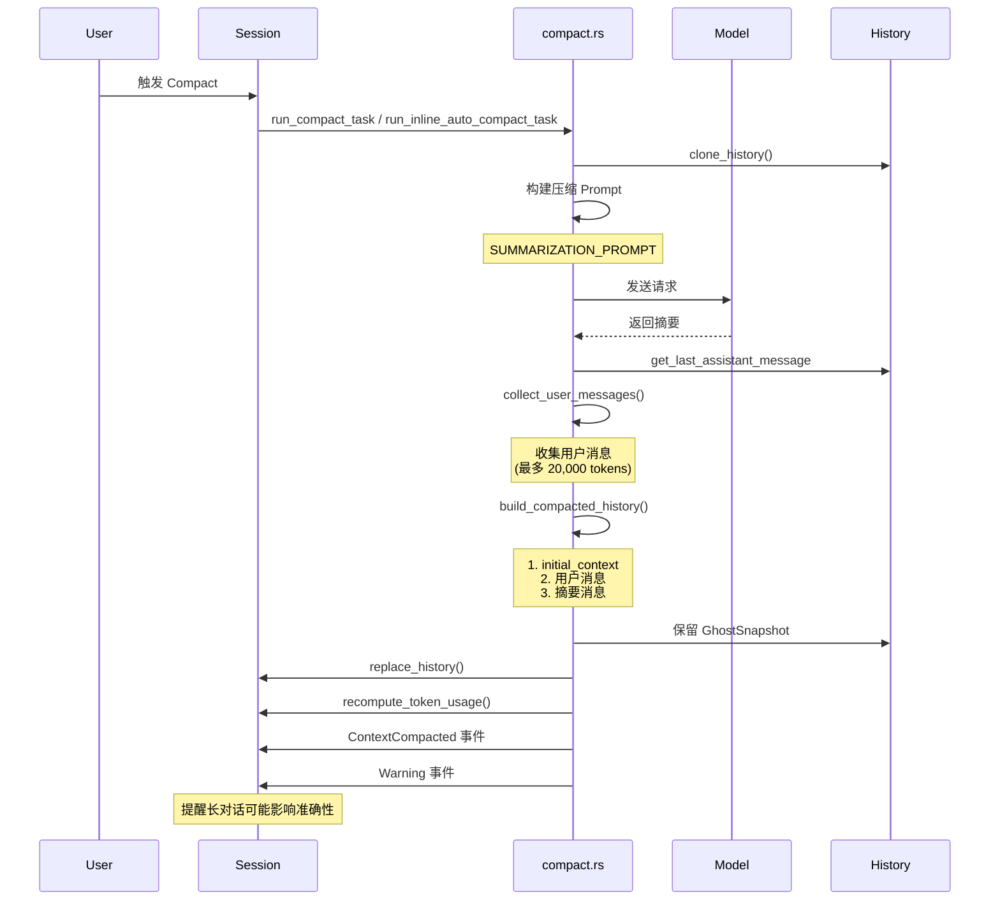
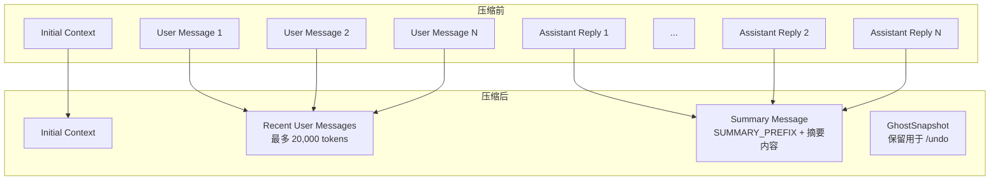
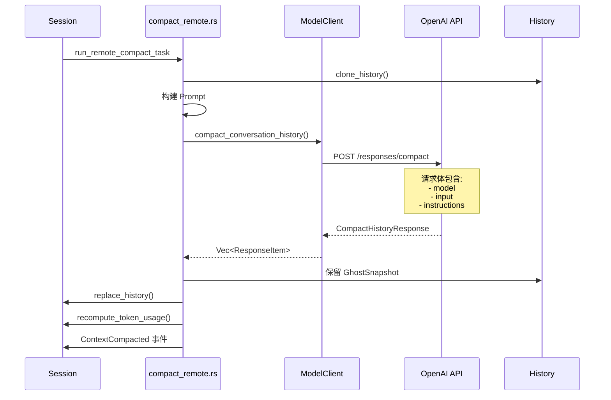
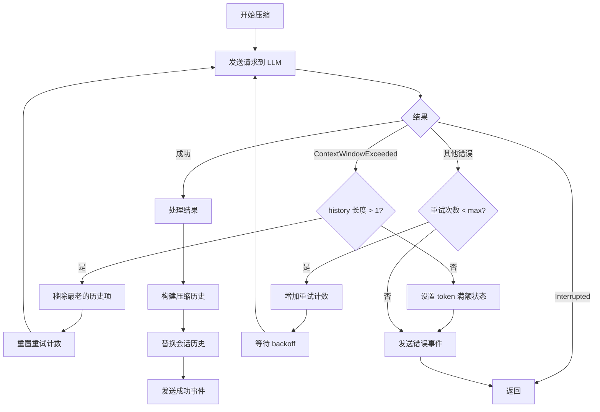
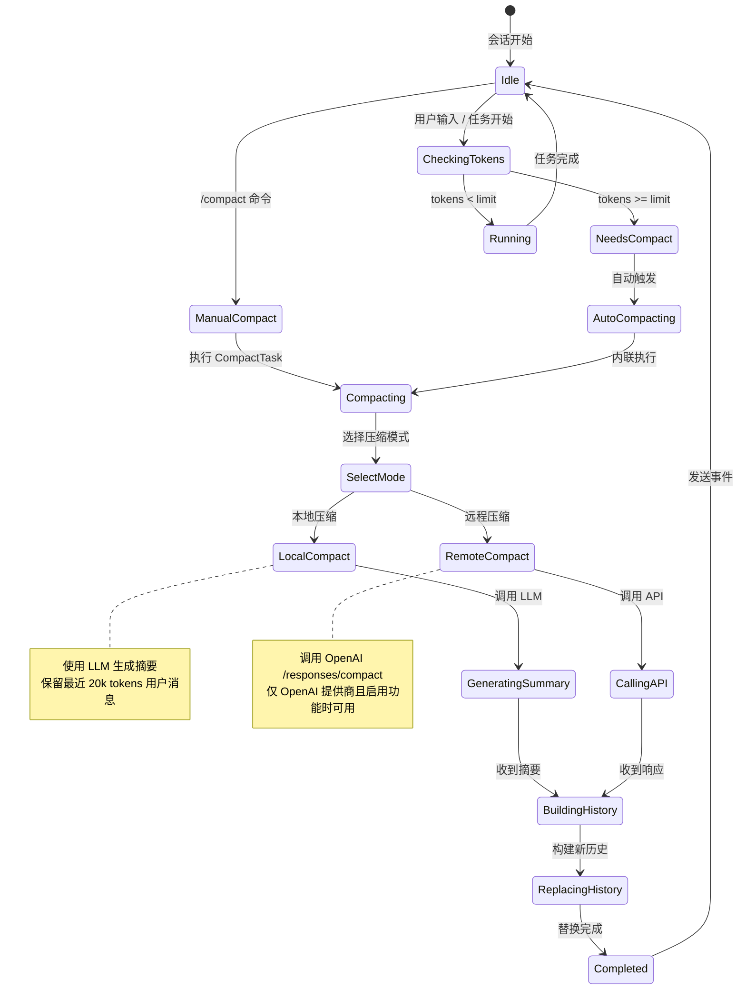

# Codex Compact 业务逻辑分析

## 概述

Codex 的 Compact 功能用于压缩对话历史，防止超出模型上下文窗口限制。当对话变得很长时，系统会通过生成摘要来"压缩"历史记录，从而释放上下文空间继续对话。

## 核心文件结构

```
codex-rs/
├── core/
│   ├── src/
│   │   ├── compact.rs           # 本地压缩核心逻辑
│   │   ├── compact_remote.rs    # 远程压缩逻辑
│   │   ├── codex.rs             # 主会话逻辑，包含自动压缩触发
│   │   ├── client.rs            # 模型客户端，含 compact_conversation_history
│   │   ├── features.rs          # 功能开关（RemoteCompaction）
│   │   ├── config/mod.rs        # 配置定义
│   │   ├── tasks/
│   │   │   └── compact.rs       # CompactTask 任务实现
│   │   └── state/
│   │       └── turn.rs          # TaskKind::Compact 定义
│   └── templates/compact/
│       ├── prompt.md            # 摘要生成提示词
│       └── summary_prefix.md    # 摘要前缀（用于交接）
├── codex-api/
│   └── src/endpoint/
│       └── compact.rs           # 远程压缩 API 客户端
└── tui/
    └── src/slash_command.rs     # /compact 命令定义
```

## 触发方式

Compact 可通过两种方式触发：

### 1. 手动触发 (`/compact` 命令)

用户在 TUI 中输入 `/compact` 命令，系统会执行 `CompactTask`：

```rust
// tui/src/slash_command.rs:23
pub enum SlashCommand {
    // ...
    Compact,  // "summarize conversation to prevent hitting the context limit"
    // ...
}
```

### 2. 自动触发

当 token 使用量达到阈值时自动触发。阈值计算逻辑：

```rust
// core/src/models_manager/model_family.rs:151-158
pub fn auto_compact_token_limit(&self) -> Option<i64> {
    self.auto_compact_token_limit
        .or(self.context_window.map(Self::default_auto_compact_limit))
}

const fn default_auto_compact_limit(context_window: i64) -> i64 {
    (context_window * 9) / 10  // 默认为上下文窗口的 90%
}
```

自动压缩在以下时机检查触发：

1. **任务开始前** - 在 `run_task` 开始时检查
2. **turn 执行后** - 当需要 follow-up 且达到 token 限制时

```rust
// core/src/codex.rs:2213-2221
let auto_compact_limit = turn_context.client
    .get_model_family()
    .auto_compact_token_limit()
    .unwrap_or(i64::MAX);
let total_usage_tokens = sess.get_total_token_usage().await;
if total_usage_tokens >= auto_compact_limit {
    run_auto_compact(&sess, &turn_context).await;
}
```

## 压缩模式选择



### 模式判断逻辑

```rust
// core/src/compact.rs:35-40
pub(crate) fn should_use_remote_compact_task(
    session: &Session,
    provider: &ModelProviderInfo,
) -> bool {
    provider.is_openai() && session.enabled(Feature::RemoteCompaction)
}
```

`RemoteCompaction` 功能默认启用：

```rust
// core/src/features.rs:375-380
FeatureSpec {
    id: Feature::RemoteCompaction,
    key: "remote_compaction",
    stage: Stage::Experimental,
    default_enabled: true,
}
```

## 本地压缩流程



### 摘要提示词

```markdown
<!-- templates/compact/prompt.md -->
You are performing a CONTEXT CHECKPOINT COMPACTION.
Create a handoff summary for another LLM that will resume the task.

Include:
- Current progress and key decisions made
- Important context, constraints, or user preferences
- What remains to be done (clear next steps)
- Any critical data, examples, or references needed to continue

Be concise, structured, and focused on helping the next LLM seamlessly continue the work.
```

### 摘要前缀（交接说明）

```markdown
<!-- templates/compact/summary_prefix.md -->
Another language model started to solve this problem and produced a summary
of its thinking process. You also have access to the state of the tools
that were used by that language model. Use this to build on the work that
has already been done and avoid duplicating work. Here is the summary
produced by the other language model, use the information in this summary
to assist with your own analysis:
```

### 压缩后历史结构



### 用户消息选择策略

从最近的消息开始向前选择，直到达到 token 限制：

```rust
// core/src/compact.rs:248-266
fn build_compacted_history_with_limit(...) -> Vec<ResponseItem> {
    let mut selected_messages: Vec<String> = Vec::new();
    let mut remaining = max_tokens;  // 默认 20,000 tokens

    for message in user_messages.iter().rev() {  // 从最近的开始
        if remaining == 0 { break; }
        let tokens = approx_token_count(message);
        if tokens <= remaining {
            selected_messages.push(message.clone());
            remaining = remaining.saturating_sub(tokens);
        } else {
            let truncated = truncate_text(message, TruncationPolicy::Tokens(remaining));
            selected_messages.push(truncated);
            break;
        }
    }
    selected_messages.reverse();  // 恢复时间顺序
    // ...
}
```

## 远程压缩流程



### API 客户端实现

```rust
// codex-api/src/endpoint/compact.rs:48-71
pub async fn compact(
    &self,
    body: serde_json::Value,
    extra_headers: HeaderMap,
) -> Result<Vec<ResponseItem>, ApiError> {
    let path = self.path()?;  // "responses/compact"
    // ... 发送请求
    let parsed: CompactHistoryResponse = serde_json::from_slice(&resp.body)?;
    Ok(parsed.output)
}
```

## 配置选项

### TOML 配置

```toml
# 手动设置 auto-compact 阈值（单位：tokens）
# 设为 0 可禁用自动压缩
model_auto_compact_token_limit = 200000

# 自定义压缩提示词文件
experimental_compact_prompt_file = "./custom_compact_prompt.txt"
```

### 功能开关

```toml
[features]
remote_compaction = true  # 启用远程压缩（默认启用）
```

## 错误处理与重试



## GhostSnapshot 保留

为了支持 `/undo` 功能，压缩时会保留所有 `GhostSnapshot`：

```rust
// core/src/compact.rs:166-171
let ghost_snapshots: Vec<ResponseItem> = history_snapshot
    .iter()
    .filter(|item| matches!(item, ResponseItem::GhostSnapshot { .. }))
    .cloned()
    .collect();
new_history.extend(ghost_snapshots);
```

## 事件通知

压缩完成后会发送两个事件：

1. **ContextCompacted** - 通知压缩完成
2. **Warning** - 提醒用户长对话可能影响准确性

```rust
// core/src/compact.rs:181-187
let event = EventMsg::ContextCompacted(ContextCompactedEvent {});
sess.send_event(&turn_context, event).await;

let warning = EventMsg::Warning(WarningEvent {
    message: "Heads up: Long conversations and multiple compactions can cause
              the model to be less accurate. Start a new conversation when
              possible to keep conversations small and targeted.".to_string(),
});
```

## 状态机总览



## 总结

Codex 的 Compact 功能是一个精心设计的上下文管理系统：

1. **双模式支持** - 本地 LLM 压缩和远程 API 压缩
2. **智能触发** - 手动命令和自动 token 阈值触发
3. **历史保留** - 保留最近的用户消息和 GhostSnapshot
4. **优雅交接** - 使用结构化摘要确保 LLM 能够无缝继续工作
5. **容错机制** - 支持重试和历史裁剪以处理上下文溢出
