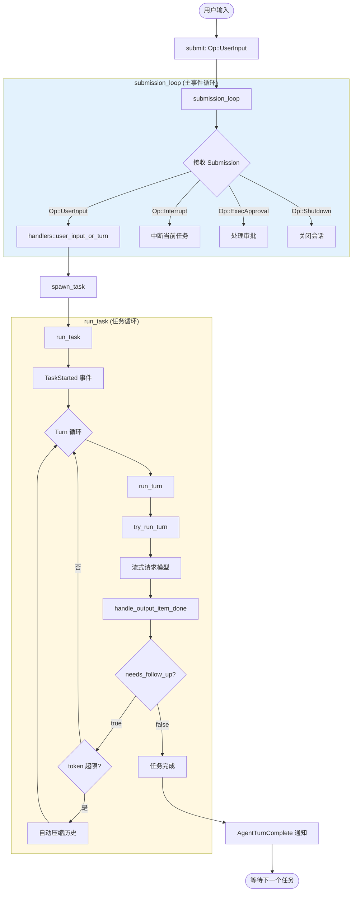
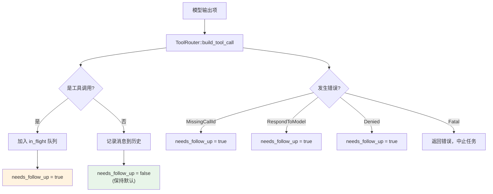
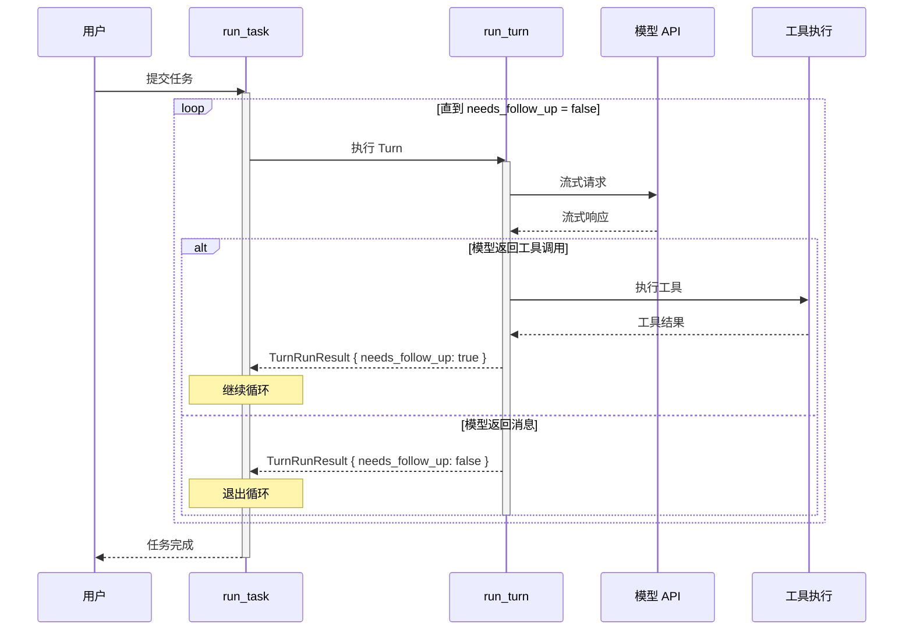
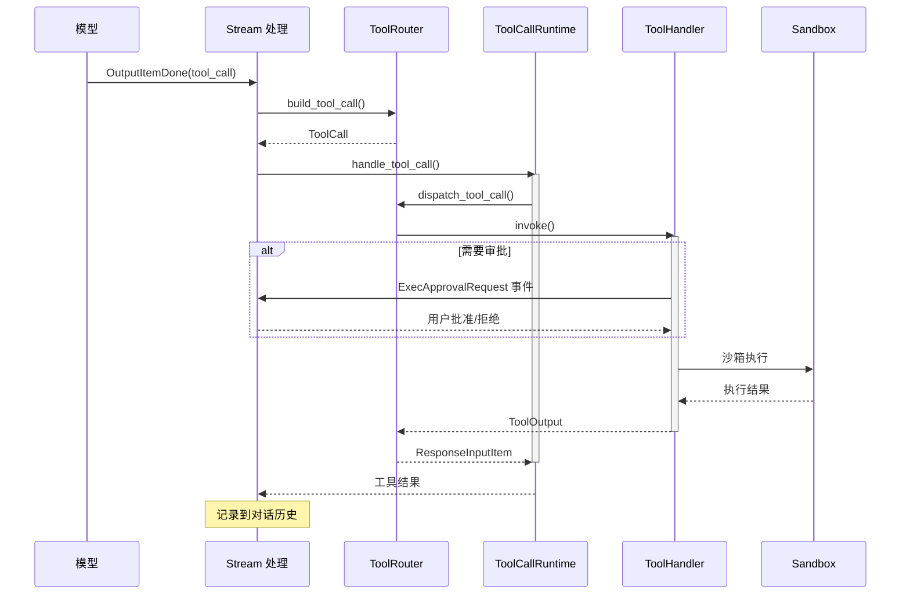
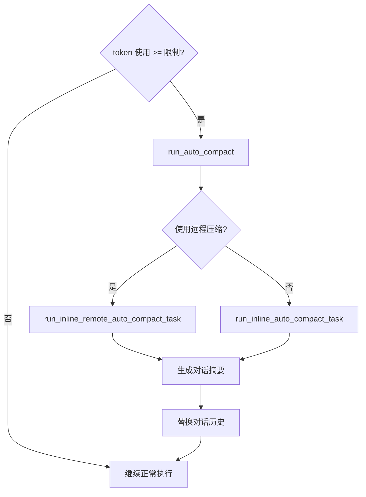
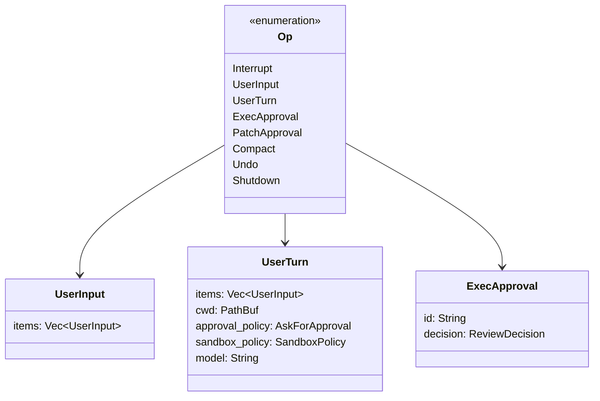
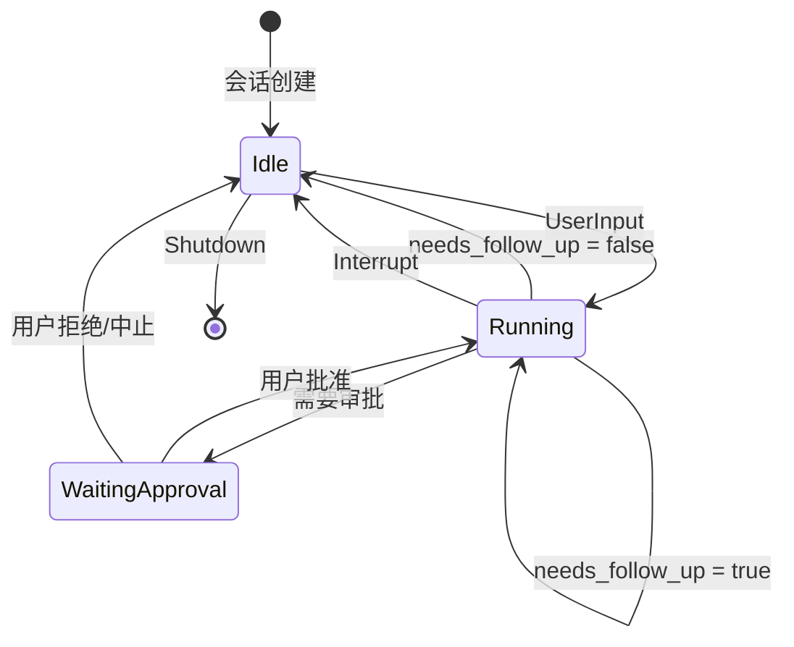

# Codex 事件循环与任务迭代机制详解

> 本文档深入分析 Codex CLI 的事件循环机制，详细解读用户任务从提交到完成的全过程，以及 Codex 如何判断任务是否需要继续迭代。

## 1. 核心概念

### 1.1 关键术语

| 术语 | 定义 |
|------|------|
| **Submission** | 用户向 Agent 发送的请求，包含操作类型 (Op) 和唯一 ID |
| **Event** | Agent 向 UI 发送的事件，包含事件消息 (EventMsg) 和对应的 Submission ID |
| **Task** | 一个完整的用户任务，可能包含多个 Turn |
| **Turn** | 一次模型调用及其响应处理，是任务执行的最小单元 |
| **Tool Call** | 模型请求执行的工具调用（如 shell 命令、文件操作） |
| **needs_follow_up** | 决定是否需要继续迭代的关键标志 |

### 1.2 SQ/EQ 模式

Codex 采用 **Submission Queue / Event Queue** 模式进行异步通信：

```mermaid
graph LR
    subgraph "用户界面 (TUI/Exec)"
        UI[UI Layer]
    end

    subgraph "Codex Agent"
        SQ[Submission Queue<br/>tx_sub / rx_sub]
        AGENT[Session<br/>Agent Logic]
        EQ[Event Queue<br/>tx_event / rx_event]
    end

    UI -->|submit()| SQ
    SQ -->|Op| AGENT
    AGENT -->|EventMsg| EQ
    EQ -->|next_event()| UI

    style SQ fill:#e1f5fe
    style EQ fill:#fff3e0
```

## 2. 事件循环总览

### 2.1 完整流程图



### 2.2 代码调用链

```
submission_loop()
  └── handlers::user_input_or_turn()
        └── sess.spawn_task(turn_context, items, RegularTask)
              └── run_task()
                    └── loop {
                          run_turn()
                            └── try_run_turn()
                                  └── stream = client.stream(prompt)
                                  └── loop {
                                        handle_output_item_done()
                                        // 设置 needs_follow_up
                                      }
                          if !needs_follow_up { break; }
                        }
```

## 3. 核心组件详解

### 3.1 submission_loop - 主事件循环

**位置**: `codex-rs/core/src/codex.rs:1576`

```rust
async fn submission_loop(sess: Arc<Session>, config: Arc<Config>, rx_sub: Receiver<Submission>) {
    let mut previous_context: Option<Arc<TurnContext>> = Some(sess.new_default_turn().await);

    // 主循环：持续接收用户提交
    while let Ok(sub) = rx_sub.recv().await {
        match sub.op.clone() {
            Op::Interrupt => {
                handlers::interrupt(&sess).await;
            }
            Op::UserInput { .. } | Op::UserTurn { .. } => {
                handlers::user_input_or_turn(&sess, sub.id, sub.op, &mut previous_context).await;
            }
            Op::ExecApproval { id, decision } => {
                handlers::exec_approval(&sess, id, decision).await;
            }
            Op::Shutdown => {
                if handlers::shutdown(&sess, sub.id).await {
                    break;  // 退出主循环
                }
            }
            // ... 其他操作
        }
    }
}
```

**关键点**：
- 这是一个永久运行的 async 循环
- 通过 `rx_sub.recv()` 阻塞等待用户提交
- 根据 `Op` 类型分发到不同的 handler
- 只有 `Op::Shutdown` 会退出循环

### 3.2 run_task - 任务执行循环

**位置**: `codex-rs/core/src/codex.rs:2203`

这是 Codex 任务迭代的核心，包含了**决定任务是否完成**的关键逻辑：

```rust
pub(crate) async fn run_task(
    sess: Arc<Session>,
    turn_context: Arc<TurnContext>,
    input: Vec<UserInput>,
    cancellation_token: CancellationToken,
) -> Option<String> {
    // 1. 检查是否需要自动压缩
    let auto_compact_limit = turn_context.client.get_model_family().auto_compact_token_limit();
    if sess.get_total_token_usage().await >= auto_compact_limit {
        run_auto_compact(&sess, &turn_context).await;
    }

    // 2. 发送 TaskStarted 事件
    sess.send_event(&turn_context, EventMsg::TaskStarted(...)).await;

    // 3. 记录用户输入到对话历史
    sess.record_response_item_and_emit_turn_item(&turn_context, response_item).await;

    let mut last_agent_message: Option<String> = None;

    // =============================================
    // 核心迭代循环
    // =============================================
    loop {
        // 获取待处理的额外输入（用户在模型运行时追加的）
        let pending_input = sess.get_pending_input().await;

        // 构建发送给模型的输入
        let turn_input = sess.clone_history().await.get_history_for_prompt();

        // 执行单个 Turn
        match run_turn(sess.clone(), turn_context.clone(), turn_input, cancellation_token.clone()).await {
            Ok(TurnRunResult { needs_follow_up, last_agent_message: msg }) => {
                // 检查 token 使用是否超限
                if sess.get_total_token_usage().await >= auto_compact_limit && needs_follow_up {
                    run_auto_compact(&sess, &turn_context).await;
                    continue;  // 压缩后继续
                }

                // ★ 关键判断：是否需要继续迭代
                if !needs_follow_up {
                    last_agent_message = msg;
                    break;  // 任务完成，退出循环
                }
                continue;  // 需要后续处理，继续循环
            }
            Err(CodexErr::TurnAborted) => break,  // 用户中断
            Err(e) => {
                sess.send_event(&turn_context, EventMsg::Error(e.to_error_event())).await;
                break;  // 发生错误，退出
            }
        }
    }

    last_agent_message
}
```

### 3.3 run_turn / try_run_turn - 单次模型调用

**位置**: `codex-rs/core/src/codex.rs:2363`

```rust
async fn run_turn(
    sess: Arc<Session>,
    turn_context: Arc<TurnContext>,
    input: Vec<ResponseItem>,
    cancellation_token: CancellationToken,
) -> CodexResult<TurnRunResult> {
    // 获取可用的 MCP 工具
    let mcp_tools = sess.services.mcp_connection_manager.read().await.list_all_tools().await?;

    // 构建工具路由器
    let router = Arc::new(ToolRouter::from_config(&turn_context.tools_config, Some(mcp_tools)));

    // 构建 Prompt
    let prompt = Prompt {
        input,
        tools: router.specs(),
        parallel_tool_calls: model_supports_parallel && sess.enabled(Feature::ParallelToolCalls),
        base_instructions_override: turn_context.base_instructions.clone(),
        output_schema: turn_context.final_output_json_schema.clone(),
    };

    // 带重试的 turn 执行
    let mut retries = 0;
    loop {
        match try_run_turn(router.clone(), sess.clone(), turn_context.clone(), &prompt, cancellation_token.clone()).await {
            Ok(output) => return Ok(output),
            Err(e) if retries < max_retries => {
                retries += 1;
                tokio::time::sleep(backoff(retries)).await;
            }
            Err(e) => return Err(e),
        }
    }
}
```

### 3.4 try_run_turn - 流式响应处理

**位置**: `codex-rs/core/src/codex.rs:2502`

```rust
async fn try_run_turn(
    router: Arc<ToolRouter>,
    sess: Arc<Session>,
    turn_context: Arc<TurnContext>,
    prompt: &Prompt,
    cancellation_token: CancellationToken,
) -> CodexResult<TurnRunResult> {
    // 1. 发起流式请求
    let mut stream = turn_context.client.clone().stream(prompt).await??;

    // 2. 创建工具执行运行时
    let tool_runtime = ToolCallRuntime::new(router.clone(), sess.clone(), turn_context.clone());

    let mut in_flight: FuturesOrdered<_> = FuturesOrdered::new();
    let mut needs_follow_up = false;
    let mut last_agent_message: Option<String> = None;

    // =============================================
    // 流式响应处理循环
    // =============================================
    loop {
        let event = stream.next().or_cancel(&cancellation_token).await??;

        match event {
            // 模型输出项完成
            ResponseEvent::OutputItemDone(item) => {
                let output_result = handle_output_item_done(&mut ctx, item).await?;

                // 收集工具执行 Future
                if let Some(tool_future) = output_result.tool_future {
                    in_flight.push_back(tool_future);
                }
                if let Some(msg) = output_result.last_agent_message {
                    last_agent_message = Some(msg);
                }

                // ★ 累积 needs_follow_up 标志
                needs_follow_up |= output_result.needs_follow_up;
            }

            // 响应完成
            ResponseEvent::Completed { token_usage, .. } => {
                sess.update_token_usage_info(&turn_context, token_usage.as_ref()).await;
                break Ok(TurnRunResult {
                    needs_follow_up,
                    last_agent_message,
                });
            }

            // 文本增量（流式输出）
            ResponseEvent::OutputTextDelta(delta) => {
                sess.send_event(&turn_context, EventMsg::AgentMessageContentDelta(event)).await;
            }

            // ... 其他事件处理
        }
    }

    // 3. 等待所有工具调用完成
    drain_in_flight(&mut in_flight, sess.clone(), turn_context.clone()).await?;

    outcome
}
```

## 4. 任务完成判断机制

### 4.1 needs_follow_up 的设置逻辑

**位置**: `codex-rs/core/src/stream_events_utils.rs:43`



**关键代码**：

```rust
pub(crate) async fn handle_output_item_done(
    ctx: &mut HandleOutputCtx,
    item: ResponseItem,
    previously_active_item: Option<TurnItem>,
) -> Result<OutputItemResult> {
    let mut output = OutputItemResult::default();  // needs_follow_up 默认为 false

    match ToolRouter::build_tool_call(ctx.sess.as_ref(), item.clone()).await {
        // ★ 情况 1：模型请求工具调用
        Ok(Some(call)) => {
            // 记录工具调用到历史
            ctx.sess.record_conversation_items(&ctx.turn_context, &[item]).await;

            // 创建工具执行 Future
            let tool_future = Box::pin(ctx.tool_runtime.clone().handle_tool_call(call, token));

            output.needs_follow_up = true;  // ★ 需要后续处理
            output.tool_future = Some(tool_future);
        }

        // ★ 情况 2：普通消息（非工具调用）
        Ok(None) => {
            ctx.sess.record_conversation_items(&ctx.turn_context, &[item]).await;
            output.last_agent_message = last_assistant_message_from_item(&item);
            // needs_follow_up 保持 false → 任务可能完成
        }

        // ★ 情况 3：错误需要反馈给模型
        Err(FunctionCallError::MissingLocalShellCallId) |
        Err(FunctionCallError::RespondToModel(_)) |
        Err(FunctionCallError::Denied(_)) => {
            // 构造错误响应并记录
            ctx.sess.record_conversation_items(&ctx.turn_context, &[error_response]).await;
            output.needs_follow_up = true;  // ★ 需要模型重新处理
        }

        // ★ 情况 4：致命错误
        Err(FunctionCallError::Fatal(message)) => {
            return Err(CodexErr::Fatal(message));  // 直接中止
        }
    }

    Ok(output)
}
```

### 4.2 完成判断流程图



### 4.3 任务完成的判断条件

| 条件 | needs_follow_up | 结果 |
|------|-----------------|------|
| 模型返回工具调用请求 | `true` | 继续迭代 |
| 模型返回纯文本消息 | `false` | 任务完成 |
| 工具调用被拒绝 | `true` | 继续迭代（让模型知道拒绝） |
| 发生可恢复错误 | `true` | 继续迭代（让模型处理错误） |
| Token 超限 | - | 自动压缩后继续 |
| 用户中断 (Op::Interrupt) | - | 立即终止 |
| 发生致命错误 | - | 立即终止 |

## 5. 工具调用处理

### 5.1 工具调用生命周期



### 5.2 ToolCallRuntime

**位置**: `codex-rs/core/src/tools/parallel.rs:24`

```rust
#[derive(Clone)]
pub(crate) struct ToolCallRuntime {
    router: Arc<ToolRouter>,
    session: Arc<Session>,
    turn_context: Arc<TurnContext>,
    tracker: SharedTurnDiffTracker,
    parallel_execution: Arc<RwLock<()>>,  // 控制并行/串行执行
}

impl ToolCallRuntime {
    pub(crate) fn handle_tool_call(
        self,
        call: ToolCall,
        cancellation_token: CancellationToken,
    ) -> impl Future<Output = Result<ResponseInputItem, CodexErr>> {
        let supports_parallel = self.router.tool_supports_parallel(&call.tool_name);

        // 异步执行工具调用
        tokio::spawn(async move {
            tokio::select! {
                // 用户取消
                _ = cancellation_token.cancelled() => {
                    Ok(Self::aborted_response(&call, elapsed))
                }
                // 工具执行
                res = async {
                    let _guard = if supports_parallel {
                        Either::Left(lock.read().await)   // 并行工具用读锁
                    } else {
                        Either::Right(lock.write().await) // 串行工具用写锁
                    };
                    router.dispatch_tool_call(session, turn, call).await
                } => res,
            }
        })
    }
}
```

## 6. 自动压缩机制

### 6.1 触发条件

当对话历史的 token 使用量超过模型的 `auto_compact_token_limit` 时，自动触发压缩：

```rust
let auto_compact_limit = turn_context.client.get_model_family().auto_compact_token_limit();

// 任务开始时检查
if sess.get_total_token_usage().await >= auto_compact_limit {
    run_auto_compact(&sess, &turn_context).await;
}

// 每次 Turn 后检查
if total_usage_tokens >= auto_compact_limit && needs_follow_up {
    run_auto_compact(&sess, &turn_context).await;
    continue;  // 压缩后继续循环
}
```

### 6.2 压缩流程



## 7. 事件类型详解

### 7.1 主要 Op 类型



### 7.2 主要 EventMsg 类型

| EventMsg | 触发时机 | 描述 |
|----------|----------|------|
| `SessionConfigured` | 会话初始化 | 会话配置完成 |
| `TaskStarted` | `run_task` 开始 | 任务开始执行 |
| `ItemStarted` | 模型开始生成 | 开始生成输出项 |
| `ItemCompleted` | 输出项完成 | 输出项生成完成 |
| `AgentMessageContentDelta` | 流式输出 | 文本增量 |
| `ExecApprovalRequest` | 工具需要审批 | 请求用户批准 |
| `TurnAborted` | 任务被中断 | Turn 被用户中断 |
| `TokenCount` | Token 更新 | Token 使用量变化 |
| `Error` | 发生错误 | 错误信息 |

## 8. 完整时序图

```mermaid
sequenceDiagram
    participant U as 用户
    participant TUI as TUI
    participant SL as submission_loop
    participant RT as run_task
    participant TURN as run_turn
    participant MODEL as 模型 API
    participant TOOL as 工具系统

    U->>TUI: 输入请求
    TUI->>SL: Op::UserInput

    SL->>RT: spawn_task()
    activate RT

    RT->>TUI: TaskStarted 事件

    loop Turn 循环
        RT->>TURN: run_turn()
        activate TURN

        TURN->>MODEL: 流式请求
        activate MODEL

        loop 流式响应
            MODEL-->>TURN: OutputTextDelta
            TURN->>TUI: AgentMessageContentDelta
        end

        alt 模型请求工具调用
            MODEL-->>TURN: OutputItemDone(tool_call)
            deactivate MODEL

            TURN->>TUI: ItemStarted(ToolCall)

            alt 需要审批
                TURN->>TUI: ExecApprovalRequest
                U->>TUI: 批准
                TUI->>SL: Op::ExecApproval
                SL->>TURN: 通知批准
            end

            TURN->>TOOL: 执行工具
            activate TOOL
            TOOL-->>TURN: 执行结果
            deactivate TOOL

            TURN->>TUI: ItemCompleted(ToolCall)
            TURN-->>RT: needs_follow_up: true
            deactivate TURN
            Note over RT: 继续循环

        else 模型返回消息
            MODEL-->>TURN: OutputItemDone(message)
            deactivate MODEL
            TURN->>TUI: ItemCompleted(Message)
            TURN-->>RT: needs_follow_up: false
            deactivate TURN
            Note over RT: 退出循环
        end
    end

    RT->>TUI: AgentTurnComplete 通知
    deactivate RT

    Note over U,TOOL: 任务完成，等待下一个任务
```

## 9. 关键设计模式

### 9.1 Actor 模式

- `Session` 作为 Actor，通过消息队列接收操作
- 避免共享状态的并发问题
- 支持异步非阻塞处理

### 9.2 状态机模式



### 9.3 Future 组合模式

- 使用 `FuturesOrdered` 管理并行工具调用
- 通过 `tokio::select!` 处理取消
- 支持超时和重试

## 10. 总结

### 10.1 核心迭代逻辑

```
用户输入
    ↓
┌─────────────────────────────────────┐
│  run_task 循环                       │
│  ┌───────────────────────────────┐  │
│  │ run_turn                      │  │
│  │   → 调用模型                   │  │
│  │   → 处理流式响应               │  │
│  │   → 执行工具调用               │  │
│  │   → 返回 needs_follow_up      │  │
│  └───────────────────────────────┘  │
│           ↓                         │
│     needs_follow_up?                │
│        ↓是         ↓否              │
│     继续循环      退出循环          │
└─────────────────────────────────────┘
    ↓
任务完成
```

### 10.2 关键判断条件

| 判断点 | 条件 | 结果 |
|--------|------|------|
| 模型输出 | 包含工具调用 | `needs_follow_up = true` |
| 模型输出 | 仅文本消息 | `needs_follow_up = false` |
| Token 使用 | 超过限制 | 自动压缩后继续 |
| 用户操作 | 发送 Interrupt | 立即终止 |
| 工具审批 | 用户拒绝 | 反馈给模型，继续迭代 |

### 10.3 设计优势

1. **解耦**：SQ/EQ 模式使 UI 与业务逻辑完全解耦
2. **可中断**：任何时刻都可响应用户中断
3. **可恢复**：支持会话恢复和历史重放
4. **可扩展**：工具系统支持 MCP 扩展
5. **安全**：所有工具调用都经过沙箱和审批机制
