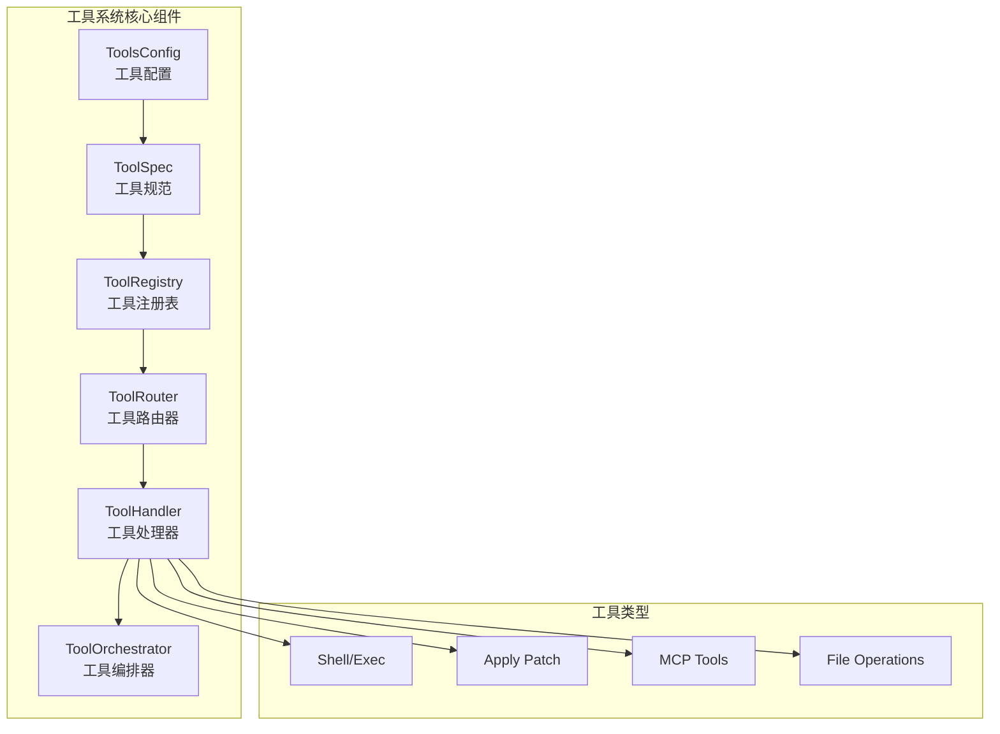
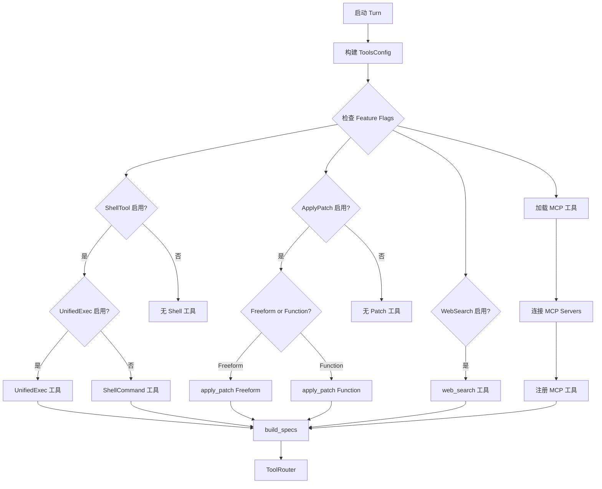
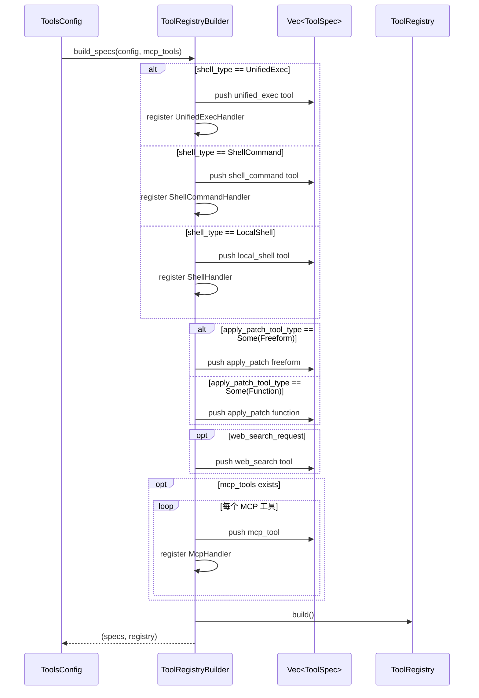
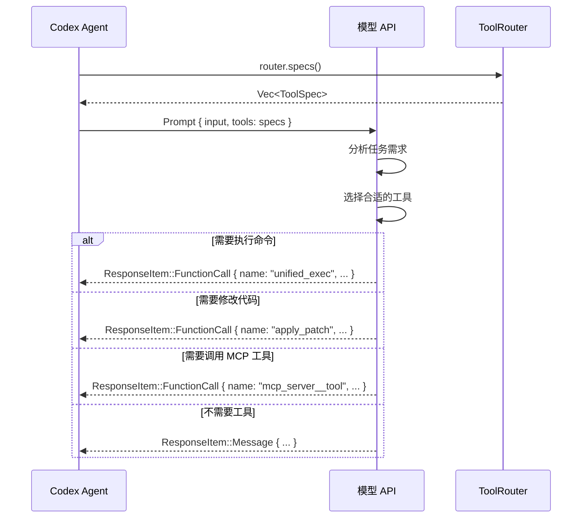
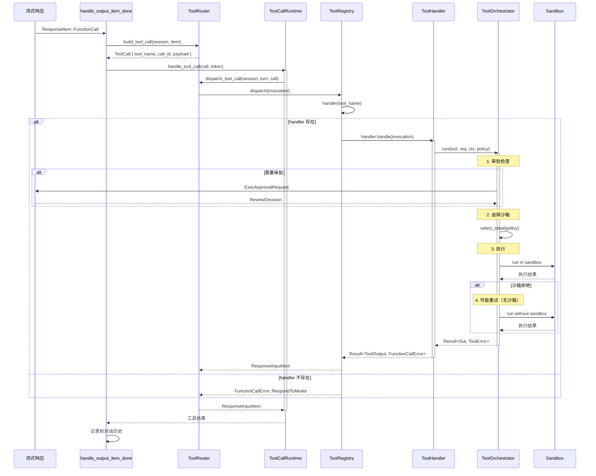
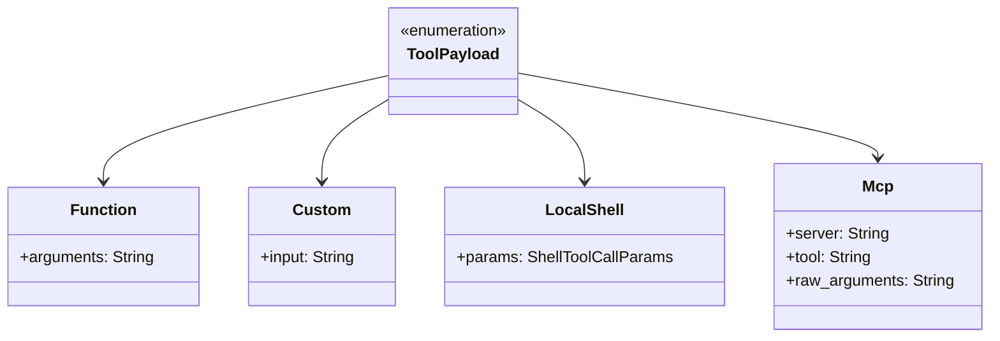
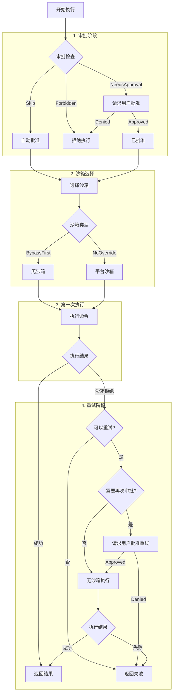
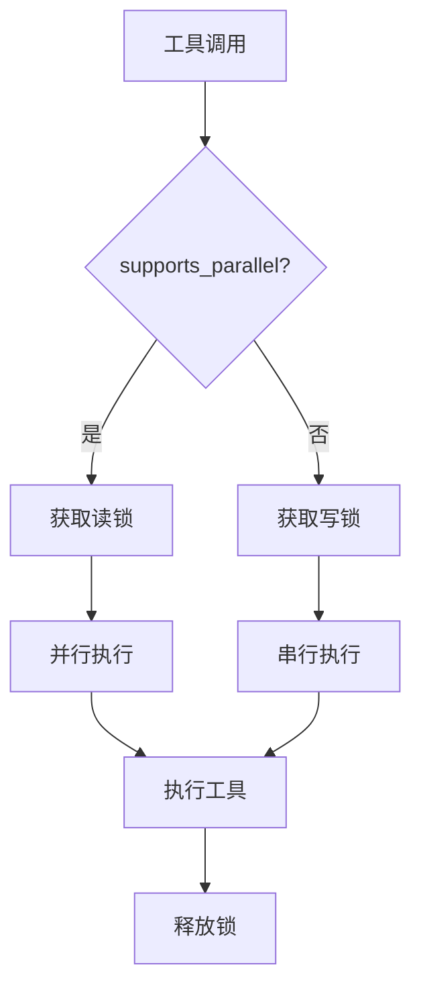
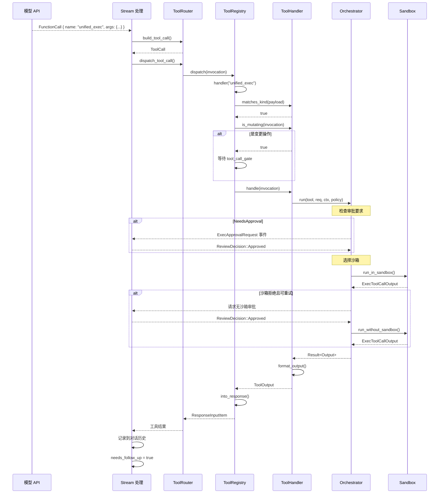

# Codex 工具调用机制详解

> 本文档深入分析 Codex CLI 的工具调用机制，包括工具发现、选择、执行、结果处理和成功/失败判断。

## 1. 工具系统概览

### 1.1 工具系统架构



### 1.2 工具模块结构

```
tools/
├── mod.rs           # 模块入口，格式化工具输出
├── spec.rs          # 工具规范定义 (ToolsConfig, JsonSchema)
├── registry.rs      # 工具注册表 (ToolRegistry, ToolHandler trait)
├── router.rs        # 工具路由器 (ToolRouter, ToolCall)
├── context.rs       # 工具上下文 (ToolInvocation, ToolOutput, ToolPayload)
├── orchestrator.rs  # 工具编排器 (审批 + 沙箱 + 重试)
├── parallel.rs      # 并行执行 (ToolCallRuntime)
├── events.rs        # 工具事件
├── sandboxing.rs    # 沙箱相关
├── runtimes/        # 执行运行时
└── handlers/        # 工具处理器实现
    ├── shell.rs
    ├── unified_exec.rs
    ├── apply_patch.rs
    ├── mcp.rs
    ├── read_file.rs
    └── ...
```

## 2. 工具发现机制

### 2.1 Codex 如何知道有哪些工具可用



### 2.2 ToolsConfig 配置

**位置**: `codex-rs/core/src/tools/spec.rs:20`

```rust
pub(crate) struct ToolsConfig {
    pub shell_type: ConfigShellToolType,           // Shell 工具类型
    pub apply_patch_tool_type: Option<ApplyPatchToolType>, // Patch 工具类型
    pub web_search_request: bool,                  // Web 搜索
    pub include_view_image_tool: bool,             // 图像查看
    pub experimental_supported_tools: Vec<String>, // 实验性工具
}
```

**工具类型枚举**：

```rust
pub enum ConfigShellToolType {
    Disabled,       // 禁用 Shell
    LocalShell,     // 本地 Shell
    ShellCommand,   // Shell 命令 (带 shell 参数)
    UnifiedExec,    // 统一执行 (PTY 模式)
}

pub enum ApplyPatchToolType {
    Freeform,   // 自由格式 (model tool)
    Function,   // 函数调用格式
}
```

### 2.3 工具规范构建

**位置**: `codex-rs/core/src/tools/spec.rs`



### 2.4 内置工具列表

| 工具名 | 处理器 | 描述 |
|--------|--------|------|
| `unified_exec` | UnifiedExecHandler | PTY 模式执行命令 |
| `shell_command` | ShellCommandHandler | Shell 命令执行 |
| `local_shell` | ShellHandler | 本地 Shell 执行 |
| `apply_patch` | ApplyPatchHandler | 应用代码补丁 |
| `web_search` | - | Web 搜索 (内置) |
| `view_image` | ViewImageHandler | 图像查看 |
| `list_dir` | ListDirHandler | 列目录 |
| `read_file` | ReadFileHandler | 读文件 |
| `grep_files` | GrepFilesHandler | 文件搜索 |
| `plan` | PlanHandler | 计划工具 |
| `mcp_*` | McpHandler | MCP 协议工具 |

## 3. 工具选择机制

### 3.1 模型如何选择工具

工具选择由 **模型** 完成，Codex 将可用工具的规范发送给模型：



### 3.2 工具规范格式

发送给模型的工具规范示例（`unified_exec`）：

```json
{
  "type": "function",
  "name": "unified_exec",
  "description": "Execute shell commands in a PTY session",
  "parameters": {
    "type": "object",
    "properties": {
      "cmd": {
        "type": "string",
        "description": "Shell command to execute."
      },
      "workdir": {
        "type": "string",
        "description": "Optional working directory..."
      },
      "sandbox_permissions": {
        "type": "string",
        "description": "Sandbox permissions..."
      }
    },
    "required": ["cmd"]
  }
}
```

## 4. 工具调用流程

### 4.1 完整调用流程



### 4.2 ToolRouter.build_tool_call

**位置**: `codex-rs/core/src/tools/router.rs:59`

```rust
pub async fn build_tool_call(
    session: &Session,
    item: ResponseItem,
) -> Result<Option<ToolCall>, FunctionCallError> {
    match item {
        // 标准函数调用
        ResponseItem::FunctionCall { name, arguments, call_id, .. } => {
            // 检查是否是 MCP 工具 (格式: mcp_server__tool)
            if let Some((server, tool)) = session.parse_mcp_tool_name(&name).await {
                Ok(Some(ToolCall {
                    tool_name: name,
                    call_id,
                    payload: ToolPayload::Mcp { server, tool, raw_arguments: arguments },
                }))
            } else {
                Ok(Some(ToolCall {
                    tool_name: name,
                    call_id,
                    payload: ToolPayload::Function { arguments },
                }))
            }
        }

        // 自定义工具调用 (model tools)
        ResponseItem::CustomToolCall { name, input, call_id, .. } => {
            Ok(Some(ToolCall {
                tool_name: name,
                call_id,
                payload: ToolPayload::Custom { input },
            }))
        }

        // 本地 Shell 调用 (LocalShellCall 是一种特殊格式)
        ResponseItem::LocalShellCall { id, call_id, action, .. } => {
            let call_id = call_id.or(id).ok_or(FunctionCallError::MissingLocalShellCallId)?;
            match action {
                LocalShellAction::Exec(exec) => {
                    let params = ShellToolCallParams { command: exec.command, ... };
                    Ok(Some(ToolCall {
                        tool_name: "local_shell".to_string(),
                        call_id,
                        payload: ToolPayload::LocalShell { params },
                    }))
                }
            }
        }

        // 非工具调用项
        _ => Ok(None),
    }
}
```

### 4.3 ToolPayload 类型



## 5. 工具执行机制

### 5.1 ToolHandler Trait

**位置**: `codex-rs/core/src/tools/registry.rs:21`

```rust
#[async_trait]
pub trait ToolHandler: Send + Sync {
    /// 工具类型 (Function 或 Mcp)
    fn kind(&self) -> ToolKind;

    /// 检查 payload 是否与 handler 类型匹配
    fn matches_kind(&self, payload: &ToolPayload) -> bool;

    /// 是否为变更操作 (影响审批和执行顺序)
    async fn is_mutating(&self, invocation: &ToolInvocation) -> bool {
        false
    }

    /// 执行工具调用
    async fn handle(&self, invocation: ToolInvocation) -> Result<ToolOutput, FunctionCallError>;
}
```

### 5.2 ToolOrchestrator 编排器

**位置**: `codex-rs/core/src/tools/orchestrator.rs`

编排器负责协调 **审批 → 沙箱选择 → 执行 → 重试** 的完整流程：



### 5.3 审批策略

```rust
pub enum ExecApprovalRequirement {
    /// 跳过审批，直接执行
    Skip { reason: Option<String> },

    /// 禁止执行
    Forbidden { reason: String },

    /// 需要用户批准
    NeedsApproval { reason: Option<String> },
}
```

**审批决策来源**：
1. `AskForApproval::Never` - 从不请求审批
2. `AskForApproval::OnRequest` - 仅在工具请求时审批
3. `AskForApproval::Always` - 每次都审批

### 5.4 ShellHandler 示例

**位置**: `codex-rs/core/src/tools/handlers/shell.rs`

```rust
#[async_trait]
impl ToolHandler for ShellHandler {
    fn kind(&self) -> ToolKind {
        ToolKind::Function
    }

    /// 检查命令是否为变更操作
    async fn is_mutating(&self, invocation: &ToolInvocation) -> bool {
        match &invocation.payload {
            ToolPayload::Function { arguments } => {
                serde_json::from_str::<ShellToolCallParams>(arguments)
                    .map(|params| !is_known_safe_command(&params.command))
                    .unwrap_or(true)
            }
            ToolPayload::LocalShell { params } => !is_known_safe_command(&params.command),
            _ => true,
        }
    }

    async fn handle(&self, invocation: ToolInvocation) -> Result<ToolOutput, FunctionCallError> {
        match invocation.payload {
            ToolPayload::Function { arguments } => {
                // 解析参数
                let params: ShellToolCallParams = serde_json::from_str(&arguments)?;
                let exec_params = Self::to_exec_params(params, turn.as_ref());

                // 执行命令
                Self::run_exec_like(tool_name, exec_params, session, turn, tracker, call_id, false).await
            }
            ToolPayload::LocalShell { params } => {
                let exec_params = Self::to_exec_params(params, turn.as_ref());
                Self::run_exec_like(tool_name, exec_params, session, turn, tracker, call_id, false).await
            }
            _ => Err(FunctionCallError::RespondToModel("unsupported payload".to_string())),
        }
    }
}
```

## 6. 结果处理机制

### 6.1 ToolOutput 类型

**位置**: `codex-rs/core/src/tools/context.rs:58`

```rust
#[derive(Clone)]
pub enum ToolOutput {
    /// 标准函数输出
    Function {
        content: String,                                    // 纯文本输出
        content_items: Option<Vec<FunctionCallOutputContentItem>>, // 结构化内容
        success: Option<bool>,                              // 是否成功
    },

    /// MCP 工具输出
    Mcp {
        result: Result<CallToolResult, String>,
    },
}
```

### 6.2 输出转换为响应

```rust
impl ToolOutput {
    pub fn into_response(self, call_id: &str, payload: &ToolPayload) -> ResponseInputItem {
        match self {
            ToolOutput::Function { content, content_items, success } => {
                if matches!(payload, ToolPayload::Custom { .. }) {
                    // Custom 工具返回 CustomToolCallOutput
                    ResponseInputItem::CustomToolCallOutput {
                        call_id: call_id.to_string(),
                        output: content,
                    }
                } else {
                    // 标准函数返回 FunctionCallOutput
                    ResponseInputItem::FunctionCallOutput {
                        call_id: call_id.to_string(),
                        output: FunctionCallOutputPayload {
                            content,
                            content_items,
                            success,
                        },
                    }
                }
            }
            ToolOutput::Mcp { result } => {
                ResponseInputItem::McpToolCallOutput {
                    call_id: call_id.to_string(),
                    result,
                }
            }
        }
    }
}
```

### 6.3 执行输出格式化

**位置**: `codex-rs/core/src/tools/mod.rs`

```rust
/// 格式化 exec 输出用于发送给模型
pub fn format_exec_output_for_model_freeform(
    exec_output: &ExecToolCallOutput,
    truncation_policy: TruncationPolicy,
) -> String {
    let duration_seconds = (exec_output.duration.as_secs_f32() * 10.0).round() / 10.0;
    let content = build_content_with_timeout(exec_output);

    let formatted_output = truncate_text(&content, truncation_policy);

    let mut sections = Vec::new();
    sections.push(format!("Exit code: {}", exec_output.exit_code));
    sections.push(format!("Wall time: {duration_seconds} seconds"));
    sections.push("Output:".to_string());
    sections.push(formatted_output);

    sections.join("\n")
}
```

输出示例：
```
Exit code: 0
Wall time: 1.2 seconds
Output:
... command output here ...
```

## 7. 成功/失败判断

### 7.1 判断维度

```mermaid
flowchart TD
    TOOL_CALL[工具调用] --> DISPATCH{dispatch 结果}

    DISPATCH -->|Ok| HANDLER_RESULT{Handler 结果}
    DISPATCH -->|Err| DISPATCH_FAIL[分发失败]

    HANDLER_RESULT -->|Ok(ToolOutput)| CHECK_OUTPUT{检查输出}
    HANDLER_RESULT -->|Err(Fatal)| HANDLER_FAIL[Handler 失败]
    HANDLER_RESULT -->|Err(其他)| CONVERT_FAIL[转换为失败响应]

    CHECK_OUTPUT --> EXIT_CODE{检查 exit_code}
    EXIT_CODE -->|0| SUCCESS[成功]
    EXIT_CODE -->|非0| EXEC_FAIL[执行失败]

    CHECK_OUTPUT --> SUCCESS_FIELD{检查 success 字段}
    SUCCESS_FIELD -->|Some(true)| SUCCESS
    SUCCESS_FIELD -->|Some(false)| TOOL_FAIL[工具报告失败]
    SUCCESS_FIELD -->|None| USE_DEFAULT[默认为成功]
```

### 7.2 FunctionCallError 类型

```rust
pub enum FunctionCallError {
    /// 致命错误，中止任务
    Fatal(String),

    /// 需要反馈给模型的错误
    RespondToModel(String),

    /// 工具调用被拒绝
    Denied(String),

    /// 缺少 LocalShellCall ID
    MissingLocalShellCallId,
}
```

### 7.3 ToolError 类型

```rust
pub enum ToolError {
    /// Codex 内部错误
    Codex(CodexErr),

    /// 工具被拒绝 (审批或沙箱)
    Rejected(String),

    /// 工具执行错误
    Execution(String),
}
```

### 7.4 失败响应生成

**位置**: `codex-rs/core/src/tools/router.rs:165`

```rust
fn failure_response(
    call_id: String,
    payload_outputs_custom: bool,
    err: FunctionCallError,
) -> ResponseInputItem {
    let message = err.to_string();
    if payload_outputs_custom {
        ResponseInputItem::CustomToolCallOutput {
            call_id,
            output: message,
        }
    } else {
        ResponseInputItem::FunctionCallOutput {
            call_id,
            output: FunctionCallOutputPayload {
                content: message,
                success: Some(false),  // ★ 明确标记为失败
                ..Default::default()
            },
        }
    }
}
```

### 7.5 日志记录的成功判断

```rust
impl ToolOutput {
    /// 用于日志记录的成功判断
    pub fn success_for_logging(&self) -> bool {
        match self {
            ToolOutput::Function { success, .. } => success.unwrap_or(true),
            ToolOutput::Mcp { result } => result.is_ok(),
        }
    }
}
```

## 8. MCP 工具处理

### 8.1 MCP 工具名解析

```mermaid
flowchart TD
    NAME[工具名: "mcp_my-server__search"] --> PARSE[parse_mcp_tool_name]

    PARSE --> SPLIT{包含 "__"?}
    SPLIT -->|是| EXTRACT[提取 server 和 tool]
    SPLIT -->|否| NOT_MCP[非 MCP 工具]

    EXTRACT --> CHECK{server 存在于配置?}
    CHECK -->|是| MCP[返回 (server, tool)]
    CHECK -->|否| NOT_MCP
```

### 8.2 McpHandler

```rust
pub struct McpHandler;

#[async_trait]
impl ToolHandler for McpHandler {
    fn kind(&self) -> ToolKind {
        ToolKind::Mcp
    }

    async fn handle(&self, invocation: ToolInvocation) -> Result<ToolOutput, FunctionCallError> {
        match invocation.payload {
            ToolPayload::Mcp { server, tool, raw_arguments } => {
                // 解析参数
                let arguments: serde_json::Value = serde_json::from_str(&raw_arguments)?;

                // 调用 MCP 服务器
                let result = invocation.session
                    .call_mcp_tool(&server, &tool, arguments)
                    .await;

                Ok(ToolOutput::Mcp { result })
            }
            _ => Err(FunctionCallError::RespondToModel("invalid payload".to_string())),
        }
    }
}
```

## 9. 并行工具执行

### 9.1 ToolCallRuntime

**位置**: `codex-rs/core/src/tools/parallel.rs`

```rust
pub(crate) struct ToolCallRuntime {
    router: Arc<ToolRouter>,
    session: Arc<Session>,
    turn_context: Arc<TurnContext>,
    tracker: SharedTurnDiffTracker,
    parallel_execution: Arc<RwLock<()>>,  // 并行控制锁
}
```

### 9.2 并行/串行控制



**代码实现**：

```rust
impl ToolCallRuntime {
    pub(crate) fn handle_tool_call(self, call: ToolCall, cancellation_token: CancellationToken) {
        let supports_parallel = self.router.tool_supports_parallel(&call.tool_name);

        tokio::spawn(async move {
            tokio::select! {
                // 取消处理
                _ = cancellation_token.cancelled() => {
                    Ok(Self::aborted_response(&call, elapsed))
                }
                // 工具执行
                res = async {
                    // 根据工具类型选择锁
                    let _guard = if supports_parallel {
                        Either::Left(lock.read().await)   // 读锁允许并行
                    } else {
                        Either::Right(lock.write().await) // 写锁强制串行
                    };
                    router.dispatch_tool_call(session, turn, call).await
                } => res,
            }
        })
    }
}
```

## 10. 工具调用完整时序



## 11. 总结

### 11.1 工具调用的关键阶段

| 阶段 | 组件 | 职责 |
|------|------|------|
| 发现 | ToolsConfig, build_specs | 根据配置和 Feature Flags 确定可用工具 |
| 选择 | 模型 | 根据工具规范和任务需求选择工具 |
| 解析 | ToolRouter.build_tool_call | 解析模型返回的工具调用 |
| 分发 | ToolRegistry.dispatch | 路由到正确的 Handler |
| 执行 | ToolHandler.handle | 实际执行工具逻辑 |
| 编排 | ToolOrchestrator.run | 协调审批、沙箱、重试 |
| 结果 | ToolOutput.into_response | 转换为模型可理解的响应 |

### 11.2 成功/失败判断总结

| 场景 | 判断方式 | 结果 |
|------|----------|------|
| 命令执行 exit_code = 0 | 检查 exit_code | success = true |
| 命令执行 exit_code ≠ 0 | 检查 exit_code | success = false |
| 沙箱拒绝 | SandboxErr::Denied | 可能重试或失败 |
| 用户拒绝审批 | ReviewDecision::Denied | success = false |
| Handler 抛出 Fatal | FunctionCallError::Fatal | 任务中止 |
| MCP 调用失败 | result.is_err() | success = false |

### 11.3 设计亮点

1. **Trait 抽象**：`ToolHandler` trait 统一所有工具的处理接口
2. **编排器模式**：`ToolOrchestrator` 集中处理审批和沙箱逻辑
3. **并行控制**：读写锁实现工具的并行/串行执行
4. **取消支持**：`CancellationToken` 支持随时中断工具执行
5. **错误分级**：`Fatal` 和 `RespondToModel` 区分致命错误和可恢复错误
